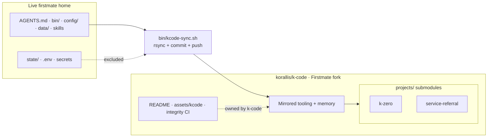

<p align="center">
  
</p>

<h1 align="center">k-code</h1>

<p align="center">
  <strong>The captain's Firstmate fork — every adjustment, every route, every project, in git.</strong>
</p>

<p align="center">
  <a href="https://github.com/korallis/k-code/blob/main/LICENSE"></a>
  <a href="https://github.com/korallis/k-code/commits/main"></a>
  <a href="https://github.com/korallis/k-code"></a>
  
  
</p>

<p align="center">
  <em>Not a passive mirror. A first-class public fork of
  <a href="https://github.com/kunchenguid/firstmate">firstmate</a>
  carrying this fleet's operating home.</em>
</p>

---

## What this is

**k-code** is the captain-controlled **Firstmate fork** for this fleet.

Upstream [firstmate](https://github.com/kunchenguid/firstmate) is the portable agent distro: instructions, skills, and scripts that turn a general-purpose coding agent into a supervising *first mate*. You talk to one agent; it runs the crew.

This repository is that distro **plus everything this captain's fleet actually runs with**:

| Layer | In this fork |
| --- | --- |
| **Core distro** | `AGENTS.md`, `bin/`, `.agents/skills/`, `docs/`, `tests/` |
| **Routing** | Full `config/crew-dispatch.json` (and related home config) |
| **Operating memory** | Durable `data/` — backlog, captain prefs, learnings, briefs, reports |
| **Dashboard** | Live validation TUI + herdr launcher (`bin/fm-validation-dashboard.sh`, `bin/fm-dashboard-launch.sh`) |
| **Projects** | Git submodules: **k-zero**, **service-referral** |
| **Presentation** | This README, Imagine art under `assets/kcode/`, fork-only integrity CI |

It stays synchronized from the live operating home via `bin/kcode-sync.sh`, but **“fork” is the primary identity** — not “upstream contribution dump” and not “read-only snapshot.”

**Delivery posture for this repo:** `no-mistakes +yolo` (routine green merges may proceed under firstmate judgment; destructive or security-sensitive steps still escalate).

---

## Upstream vs this fork

| | [kunchenguid/firstmate](https://github.com/kunchenguid/firstmate) | **korallis/k-code** (this repo) |
| --- | --- | --- |
| Role | Shared upstream agent distro | Captain's Firstmate fork + live operating home |
| Config / memory | Local, gitignored by design | **Tracked** here (`config/`, `data/`) for this fleet |
| Projects | Empty `projects/` at runtime | **Submodules** to product repos |
| README / CI | Upstream product docs & full distro gates | Fork landing page + **integrity-only** CI |
| Sync | N/A | `bin/kcode-sync.sh` from the live home |

If you want the stock distro, clone upstream. If you want **this fleet's adjusted Firstmate** — routing, memory, dashboard, projects — you are in the right place.

---

## Architecture

<p align="center">
  
</p>

```text
You (the captain)
      │  chat: requests, decisions, "merge it"
      ▼
┌──────────────────────────────────────────┐
│  firstmate  ·  the first mate            │
│  reads projects · routes · supervises    │
│  never writes product code itself        │
└──┬──────────────┬───────────────────┬────┘
   │              │                   │
   ▼              ▼                   ▼
 crewmate-1    crewmate-2   ...   crewmate-N
   │              │                   │
   ▼              ▼                   ▼
 isolated worktree  ·  ship → PR  ·  scout → data/<id>/report.md
```

**Prime rules** (full detail in [`AGENTS.md`](AGENTS.md)):

1. Firstmate **never writes product code** — crewmates change projects.
2. **No merge without authority** — captain approval (or project `+yolo` for routine green merges).
3. **No teardown of unlanded work**.
4. **Crewmates never address the captain** — communication flows through firstmate.
5. **Report outcomes faithfully**.

Verified harnesses: **claude**, **codex**, **grok**, **pi**, **opencode**. Session backends: **tmux** (reference), **herdr** (this fleet's preferred experimental surface), plus others under `docs/`.

---

## What's inside

| Path | Role |
| --- | --- |
| [`AGENTS.md`](AGENTS.md) | Full firstmate operating manual (instruction surface) |
| [`bin/`](bin/) | Fleet tooling — spawn, watch, teardown, session start, **kcode-sync**, validation dashboard, … |
| [`.agents/skills/`](.agents/skills/) | Firstmate-loaded internal skills |
| [`config/`](config/) | Routing & home config — especially complete `crew-dispatch.json` |
| [`data/`](data/) | Durable fleet memory (backlog, prefs, learnings, task briefs/reports) |
| [`docs/`](docs/) | Architecture, backends, configuration, scripts index |
| [`projects/`](projects/) | Product repos as **submodules** (k-zero, service-referral) |
| [`assets/kcode/`](assets/kcode/) | Fork-owned README art + [provenance](assets/kcode/PROVENANCE.md) |
| [`tests/`](tests/) | Shell/unit coverage for `bin/` and fleet contracts |
| [`.github/workflows/`](.github/workflows/) | Fork integrity only (Markdown / links / secrets) |

### Tooling highlights

- **`bin/kcode-sync.sh`** — mirrors the live firstmate working tree into this checkout, advances submodule pointers, commits, and pushes. Protects k-code-owned surfaces (README, gitignore, workflows, `assets/kcode/`, `docs/assets/`).
- **`bin/fm-validation-dashboard.sh`** — live TUI of in-flight tasks and validation state.
- **`bin/fm-dashboard-launch.sh`** — idempotent herdr-tab launcher for that dashboard.
- **`bin/fm-session-start.sh` / `bin/fm-spawn.sh` / `bin/fm-watch.sh`** — session lock + bootstrap; crewmate spawn; event-driven supervision.

---

## How sync works

Run from the **live firstmate home** (not from a random clone of this fork):

```sh
bin/kcode-sync.sh ["optional commit message"]
# default KCODE_DIR: ../k-code next to the firstmate home
# override: KCODE_DIR=/path/to/k-code bin/kcode-sync.sh
```



What the script does:

1. **`rsync -a --delete`** of the firstmate working tree into the k-code checkout.
2. **Leaves k-code-owned surfaces alone** — `README.md`, `.gitignore`, `.github/workflows/`, `assets/kcode/`, `docs/assets/`, plus secrets, `state/`, project clones, and other volatile paths.
3. **Rewrites k-code's `.gitignore`** so config/data stay trackable in the fork while runtime secrets stay out.
4. **Advances project submodule pointers** (`git submodule update --remote`).
5. **Commits and pushes** when the tree changed.

Edit presentation and CI **here**. Expect mirrored firstmate material to be overwritten on the next sync.

---

## Security boundaries

<p align="center">
  
</p>

| Included in the public fork | Never included |
| --- | --- |
| Firstmate tracked distro (`AGENTS.md`, `bin/`, skills, docs, tests) | `state/` (volatile runtime) |
| `config/` routing (e.g. crew-dispatch) | `.env`, `*.key`, `*credential*` |
| Durable `data/` memory | `config/x-mode.env`, `config/cmux-socket-password` |
| Project **submodule pointers** (SHAs) | `.no-mistakes/`, `.lavish/` local gate UI state |
| README art under `assets/kcode/` | GitHub tokens, pairing tokens, socket passwords |

Product repos (**k-zero**, **service-referral**) are **private**. Submodule URLs are recorded so authorized clones can fetch them; the public web UI of k-code only shows the gitlink SHAs, not private tree contents.

Keys and credentials live in the captain's vault (e.g. 1Password) and are pulled at task time — never committed. Integrity CI scans for common secret patterns and refuses tracked runtime paths.

---

## Projects in this fleet

From `data/projects.md`:

| Project | Mode | What it is | Access |
| --- | --- | --- | --- |
| **[k-zero](https://github.com/korallis/k-zero)** | `no-mistakes +yolo` | F-Zero-style anti-gravity battle racer; pivoting toward native Unity iOS/iPadOS (plan in progress) | Private submodule |
| **[service-referral](https://github.com/korallis/service-referral)** | `no-mistakes +yolo` | AI referral triage & staffing advisor for Muve Healthcare (Next.js + Neon + Vercel AI Gateway) | Private submodule |
| **k-code** (this repo) | `no-mistakes +yolo` | Captain's Firstmate fork + canonical version-controlled operating home | **Public** |

```sh
git clone --recurse-submodules git@github.com:korallis/k-code.git
cd k-code
# If you lack access to private product repos, submodules will fail to clone —
# the fork's firstmate surfaces and memory still work without them.
```

---

## Model routing

`config/crew-dispatch.json` holds natural-language rules that pick **harness / model / effort** per task class:

| Task class | Profile (this fleet) |
| --- | --- |
| Research / planning | Triad converge: Grok 4.5 · GPT-5.6 Sol · Claude Opus/Fable (high/max) |
| UI implementation & polish | GPT-5.6 Sol via Pi @ max |
| Complex non-UI work | GPT-5.6 Sol via Pi @ xhigh |
| Normal implementation | GPT-5.6 Sol via Pi @ medium |
| Quick / lightweight | Grok 4.5 via Pi @ low |
| Default | GPT-5.6 Sol via Pi @ medium |

Schema and semantics: [docs/configuration.md](docs/configuration.md) (“Crew dispatch profiles”). Treat the JSON file as the live policy; this table is a readable summary only.

---

## Live validation dashboard

```sh
# Prefer auto-spawn when already inside herdr (idempotent, --no-focus)
bin/fm-dashboard-launch.sh

# Or run the TUI in any terminal
bin/fm-validation-dashboard.sh          # default refresh
bin/fm-validation-dashboard.sh 2        # custom interval (seconds)
FM_DASH_ONCE=1 bin/fm-validation-dashboard.sh   # single frame
```

Disable auto-launch with `FM_DASHBOARD_DISABLE=1`. Authoritative flags live in the script headers under `bin/`.

---

## Clone & use

### Explore the fork

```sh
git clone --recurse-submodules git@github.com:korallis/k-code.git
cd k-code
```

### Stand up as a live firstmate home

Needs a verified harness, the toolchain from `bin/fm-bootstrap.sh` / [docs/configuration.md](docs/configuration.md) (“Toolchain”), and an optional session backend (e.g. herdr). Trust bootstrap's `MISSING:` lines over any frozen install list.

```sh
bin/fm-session-start.sh
# then launch your harness, e.g.:
#   claude
#   grok --trust
#   pi
#   codex
#   opencode
```

### Keep the fork honest after live-home changes

```sh
# from the live operating home
bin/kcode-sync.sh
```

---

## Repo layout

```text
k-code/
├── AGENTS.md                 # firstmate operating manual
├── CLAUDE.md                 # symlink → AGENTS.md
├── README.md                 # this file (k-code-owned)
├── LICENSE                   # MIT
├── CONTRIBUTING.md
├── .gitignore                # k-code-owned (rewritten by kcode-sync)
├── .gitmodules               # k-zero + service-referral
├── .tasks.toml               # tasks-axi backlog backend pin
├── .github/workflows/        # integrity CI only
├── .agents/skills/           # internal firstmate skills
├── assets/
│   ├── banner.png            # optional upstream art
│   └── kcode/                # fork-owned README art + PROVENANCE
├── bin/                      # fm-*.sh + kcode-sync.sh
├── config/                   # dispatch + home config (mirrored)
├── data/                     # durable fleet memory
├── docs/
│   ├── assets/               # copies of README art for docs paths
│   ├── architecture.md
│   ├── configuration.md
│   ├── scripts.md
│   └── *backend*.md
├── projects/
│   ├── k-zero/               # submodule
│   └── service-referral/     # submodule
├── skills/                   # public installer-facing skills
└── tests/
```

---

## Documentation map

| Doc | Contents |
| --- | --- |
| [`AGENTS.md`](AGENTS.md) | Full firstmate operating manual |
| [docs/architecture.md](docs/architecture.md) | Supervision, worktrees, secondmates, delivery modes |
| [docs/configuration.md](docs/configuration.md) | Env vars, backends, toolchain, X mode, dispatch schema |
| [docs/scripts.md](docs/scripts.md) | `bin/` toolbelt index |
| [docs/herdr-backend.md](docs/herdr-backend.md) | Herdr adapter facts |
| [docs/tmux-backend.md](docs/tmux-backend.md) | tmux reference backend |
| [docs/turnend-guard.md](docs/turnend-guard.md) | “No turn ends blind” hooks |
| [assets/kcode/PROVENANCE.md](assets/kcode/PROVENANCE.md) | Imagine asset provenance |
| [CONTRIBUTING.md](CONTRIBUTING.md) | Distro changes, lint, tests |

---

## CI policy

This fork runs **integrity-only** GitHub Actions (Markdown relative links, required surfaces, secret/runtime path scan). It does **not** restore upstream firstmate development unit-test / no-mistakes gates that are inappropriate for a synchronized operating-home fork.

---

## Contributing / license

- **Fleet adjustments** that belong in the live home land here via `kcode-sync`.
- **Presentation, art, and integrity CI** are maintained directly in this repository.
- Shared firstmate improvements that benefit everyone should still land upstream in [firstmate](https://github.com/kunchenguid/firstmate) when appropriate.

For distro contribution mechanics, see [CONTRIBUTING.md](CONTRIBUTING.md).

**License:** MIT — see [LICENSE](LICENSE).

---

<p align="center">
  <sub>One captain. One first mate. A whole fleet — forked, adjusted, and kept in git.</sub>
</p>
