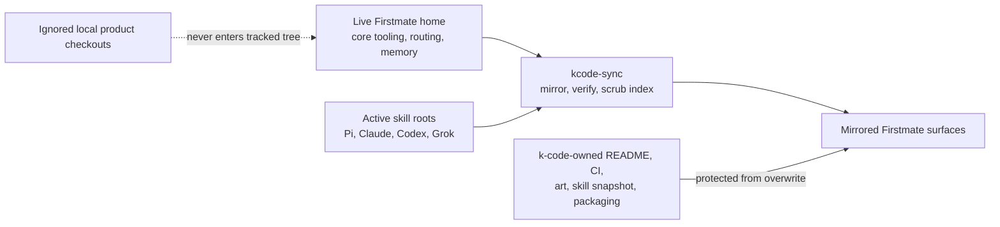
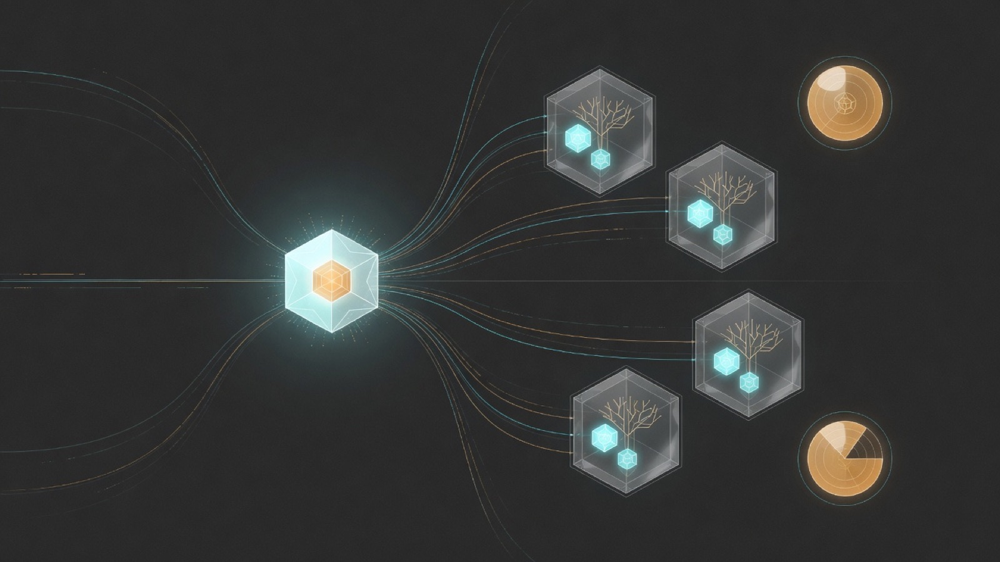
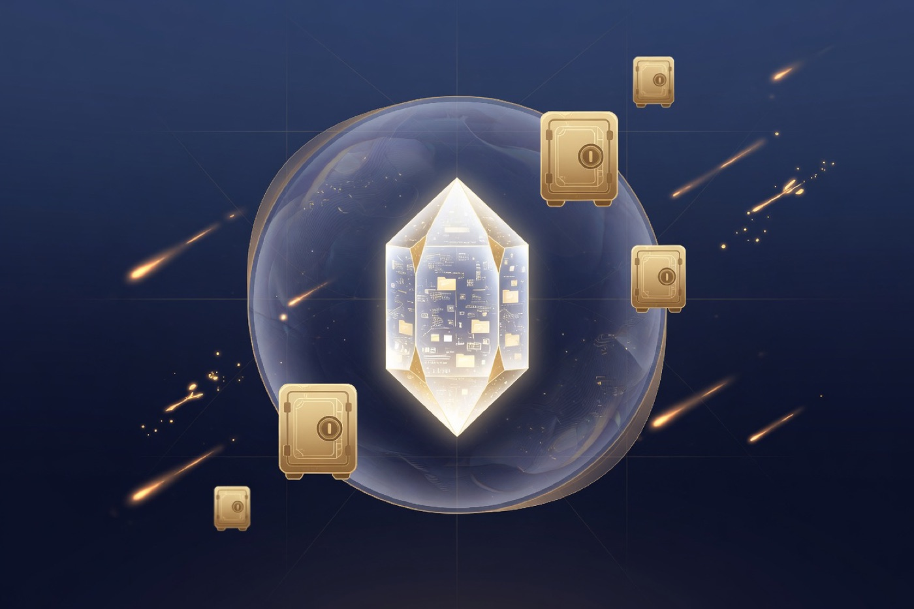

<p align="center">
  
</p>

<h1 align="center">k-code</h1>

<p align="center">
  <strong>A captain-controlled Firstmate operating home with reproducible skills, routing, and durable fleet memory.</strong>
</p>

<p align="center">
  <a href="https://github.com/korallis/k-code/blob/main/LICENSE"></a>
  <a href="https://github.com/korallis/k-code/commits/main"></a>
  <a href="https://github.com/korallis/k-code"></a>
  
</p>

<p align="center">
  <em>Built from <a href="https://github.com/kunchenguid/firstmate">kunchenguid/firstmate</a>, but maintained for one fleet's complete, public-safe operating setup.</em>
</p>

---

## What this repository is

Upstream [kunchenguid/firstmate](https://github.com/kunchenguid/firstmate) is the portable supervisor-agent distribution.

It provides the shared operating instructions, lifecycle scripts, internal skills, public installer skills, documentation, and tests that let one Firstmate coordinate isolated coding agents.

**k-code** is the captain-controlled operating-home fork built on that distribution.

It mirrors the Firstmate instruction and tooling surface, then adds the public-safe fleet material required to recreate how this captain actually runs it: model routing, durable memory, validation dashboards, harness integration, and the complete installed skill setup.

It is not a product monorepo and it is not an archive of product source.

Product checkouts belong only in each operator's ignored local `projects/` directory.

## k-code compared with upstream Firstmate

| Area | [kunchenguid/firstmate](https://github.com/kunchenguid/firstmate) | `korallis/k-code` |
| --- | --- | --- |
| Primary purpose | Reusable Firstmate distribution for any operator | Reproducible, captain-specific operating home for this fleet |
| Shared supervisor core | Owns `AGENTS.md`, core `bin/`, `.agents/skills`, public `skills`, docs, and tests | Mirrors upstream surfaces while protecting the fork's dispatch contract |
| Routing and local configuration | Kept local and ignored by the shared distribution | Tracks the public-safe routing policy and selected operating-home configuration under `config/` |
| Durable operating memory | Kept local and ignored by the shared distribution | Tracks curated captain preferences, learnings, backlog history, briefs, and reports under `data/` |
| Fleet additions | General upstream feature set | Adds the validation dashboard and launcher, fleet-specific routing, operating records, and fork packaging tools |
| Installed skills and providers | Versions Firstmate's own internal and public skills | Captures those skills plus the active Pi, Claude, Codex, and Grok skill setup, with reviewed Pi provider packages pinned project-locally |
| Product repositories | Local runtime checkouts only | Local runtime checkouts only, with `projects/` ignored and forbidden from the tracked tree |
| CI posture | Full upstream development and pull-request gates | Focused fork-integrity checks for packaging, links, secrets, skill restore, and tracked-tree boundaries |
| Update path | Develop and release shared Firstmate changes | Pull upstream into the live Firstmate home, review fleet adjustments, then synchronize into k-code |

Use upstream Firstmate when you want the stock portable distribution.

Use k-code when you need this fleet's routing, memory, dashboards, and reproducible skill environment.

## What is mirrored and what k-code owns

The distinction matters because synchronization deliberately overwrites mirrored material and deliberately preserves fork-owned material.

### Mirrored from the live Firstmate home

- `.tasks.toml`.
- Upstream-derived lifecycle tooling under `bin/`, except for protected packaging and dispatch files.
- Firstmate's project-local internal skills under `.agents/skills` and public installer skills under `skills`.
- Harness hooks and extensions under `.claude`, `.codex`, `.grok`, `.opencode`, and `.pi`.
- Shared documentation and test coverage under `docs/` and `tests/`, except for protected packaging and dispatch surfaces.
- Public-safe operating configuration under `config/` and durable operating records under `data/`.

### Owned by k-code

- This README, `CONTRIBUTING.md`, `docs/scripts.md`, and the fork's `.gitattributes` and `.gitignore` contracts.
- The focused `.no-mistakes.yaml` validation profile, [`.pi/settings.json`](.pi/settings.json) provider pins, and workflow under `.github/workflows/`.
- Fork artwork under `assets/kcode/` and `docs/assets/`.
- The complete skill snapshot under [`skill-snapshot/`](skill-snapshot/).
- [`bin/kcode-sync.sh`](bin/kcode-sync.sh), [`bin/kcode-skills.sh`](bin/kcode-skills.sh), [`bin/kcode-integrity.sh`](bin/kcode-integrity.sh), and their focused tests.
- The executable dispatch contract: `AGENTS.md`, `CLAUDE.md`, `config/crew-dispatch.json`, `bin/fm-bootstrap.sh`, `bin/fm-dispatch-select.sh`, `docs/configuration.md`, `tests/fm-bootstrap.test.sh`, and `tests/fm-dispatch-select.test.sh`.

The synchronization script excludes each owned surface explicitly so a later live-home mirror cannot erase or replace it.

## Complete skill capture

The initial rebuild versioned Firstmate's small project-local skill set but omitted most skills the active harnesses could actually use.

This repository now carries a read-only audited snapshot of every active skill root as of 2026-07-14.

The audit covered:

- Project-local `.agents/skills`, `.claude/skills`, and public `skills`.
- The generic `~/.agents/skills` root used by Pi and other Agent Skills clients.
- Pi's dedicated skill root and installed package resources.
- Claude's user skill root and enabled Vercel plugin.
- Codex's user and `.system` roots.
- Grok's user, bundled, Claude-compatible, and plugin roots.

Identical Claude, Codex, and Grok copies are deduplicated into one vendored source.

[`skill-snapshot/README.md`](skill-snapshot/README.md) owns the exact captured counts and explains the manifest-backed scope.
Every redistributable source includes its origin, exact matched revision, license, complete scripts and references, and SHA-256 coverage.

Version-coupled or non-redistributable harness skills are not silently dropped.

Their exact harness build, skill names, install source, available terms, and concrete reason for not vendoring are recorded in [`skill-snapshot/harness-managed.tsv`](skill-snapshot/harness-managed.tsv).

The full root audit and provenance are documented in [`skill-snapshot/README.md`](skill-snapshot/README.md).

Verify the captured source set:

```sh
bin/kcode-skills.sh verify
```

Inspect the deterministic manifests:

```sh
bin/kcode-skills.sh inventory
```

Restore captured user skills into an explicit clean home and verify the result:

```sh
bin/kcode-skills.sh restore --home /path/to/clean-home
bin/kcode-skills.sh verify-home --home /path/to/clean-home
```

Restore writes normal directories and never creates absolute links back to the machine that produced the snapshot.

### Pi provider packages

[`.pi/settings.json`](.pi/settings.json) declares two reviewed Pi packages at exact versions:

- `npm:pi-xai-oauth@1.3.3` registers the `xai-auth` provider, Grok models, and xAI tools.
- `npm:pi-claude-bridge@0.6.2` registers the `claude-bridge` provider and models plus the `AskClaude` tool.

After a clean clone is trusted, Pi installs missing project packages into its ignored `.pi/npm/` store.
Each package identity appears exactly once in project settings; Pi's project scope wins over an unpinned global entry, so the same provider is not registered twice.
Confirm the result with `pi list`.

The only provider-independent project extensions under `.pi/extensions/` are Firstmate's [`fm-primary-pi-watch.ts`](.pi/extensions/fm-primary-pi-watch.ts) and [`fm-primary-turnend-guard.ts`](.pi/extensions/fm-primary-turnend-guard.ts).
The xAI and Claude provider entrypoints come from their package stores, not duplicate copies under `.pi/extensions/`.
Do not copy `xai-oauth.ts`, `pi-claude-bridge`'s `src/index.ts`, `auth.json`, `~/.grok` credentials, Claude credentials, bridge logs, sessions, or user configuration into this repository.

Package installation does not copy authentication.
Authenticate xAI explicitly inside Pi:

```text
pi /login xai-auth
```

`pi-claude-bridge` uses the separately authenticated Claude Code installation on the operator's machine.
Run `claude` and complete Claude Code login (use `/login` when needed) before selecting a `claude-bridge/*` model or calling `AskClaude`.

## How synchronization works

Run synchronization from the live Firstmate operating home:

```sh
bin/kcode-sync.sh ["optional commit message"]
```

`KCODE_DIR` can point to a non-default k-code checkout, and `KCODE_SYNC_DRY_RUN=1` stages a verification run without committing or pushing.



The script performs six guarded steps:

1. It mirrors the live working tree with volatile runtime, secrets, product checkouts, and k-code-owned surfaces excluded.
2. It rewrites the fork's ignore contract so `projects/`, runtime state, credentials, and local gate state remain untracked.
3. It validates the captured skill snapshot and exact installed Pi package versions against every active project, user, plugin, and harness root.
4. It removes stale `projects/` entries from the destination index without deleting ignored local checkouts, removes stale `.gitmodules` metadata, and rejects every remaining gitlink.
5. It runs the complete fork integrity gate, including the project-local Pi package declarations, before delivery.
6. It commits and pushes only when the verified tracked tree changed.

A newly installed, removed, changed, or unclassified skill stops synchronization instead of producing an incomplete snapshot.

Update the reviewed inventory, origin, license, placement, and checksums before rerunning the sync.

## Why product repositories are absent

Firstmate needs local product clones to create isolated task worktrees, but k-code does not need to version those clones to reproduce its supervisor setup.

Tracking a product checkout would expose repository identity and commit metadata, couple this public operating home to private product history, and let stale pointers survive even when the source directory was excluded from synchronization.

The repository therefore enforces all of the following:

- `projects/` is ignored at the repository boundary.
- No path under `projects/` may be tracked.
- No `.gitmodules` file may be tracked.
- No gitlink may exist anywhere in the index.
- Synchronization removes stale index entries without deleting local product directories.
- Integrity checks enforce the same contract in a clean clone.

An operator who needs a product locally clones it separately under `projects/<name>` after cloning k-code.

That local clone remains outside k-code history for its entire lifetime.

## Architecture

<p align="center">
  
</p>

```text
Captain
  |
  v
Firstmate operating home
  |-- reads routing and durable memory
  |-- delegates implementation and investigation
  |-- supervises isolated task worktrees
  |-- validates delivery and reports outcomes
  `-- leaves local product clones outside this repository
```

The complete operating contract lives in [`AGENTS.md`](AGENTS.md).

The core safety rules are unchanged from upstream Firstmate: Firstmate delegates project work, never merges without authority, never discards unlanded work, keeps agent communication routed through the supervisor, and reports failures faithfully.

## Fleet-specific additions

### Model routing

[`config/crew-dispatch.json`](config/crew-dispatch.json) stores natural-language dispatch rules that select a harness, model, and effort profile for each task shape.

This fleet keeps every launch on Pi: [`config/crew-harness`](config/crew-harness) pins the general harness to `pi`, [`config/secondmate-harness`](config/secondmate-harness) routes secondmates through `claude-bridge/claude-fable-5` at max effort, and the research triad's executable quota guard uses that Fable route only while its fresh plan window remains above zero, otherwise selecting Pi `claude-bridge/claude-opus-4-8` rather than standalone Claude.
The JSON file is the authoritative policy, while [the configuration guide](docs/configuration.md) owns its schema and behavior.

### Durable memory

`data/` carries the public-safe operating records that upstream deliberately leaves local.

This includes backlog history, captain preferences, fleet learnings, task briefs, investigation reports, and handover material.

Runtime status, session locks, credentials, local histories, and generated supervisor state remain excluded.

### Validation dashboard

The dashboard summarizes current validation state without turning the fork into a product UI.
Firstmate owns its normal launch and lifecycle use; direct `bin/fm-dashboard-launch.sh` or `bin/fm-validation-dashboard.sh` invocation is reserved for development and troubleshooting.

### Harness integration

The repository preserves the active Claude, Codex, Grok, OpenCode, and Pi hook or extension surfaces that enforce Firstmate's primary-session safety rules.

Pi's two tracked Firstmate extensions are distinct from the packaged `xai-auth` and `claude-bridge` providers declared in `.pi/settings.json`.
The skill snapshot complements those project integrations by restoring user-level skill sources separately.

## Security boundary

<p align="center">
  
</p>

| Included | Excluded |
| --- | --- |
| Firstmate instructions, scripts, docs, tests, and project-local skills | Product repositories and worktrees |
| Public-safe routing and selected home configuration | `.env`, keys, credentials, tokens, and socket passwords |
| Curated durable fleet memory | Runtime `state/`, local histories, caches, and generated gate state |
| Redistributable user and plugin skill source | Proprietary or version-coupled harness skill files |
| Exact project-local Pi package declarations | Provider source copies, auth data, bridge logs, sessions, and user config |
| Fork artwork and packaging checks | PHI and any secret-bearing configuration |

The focused integrity workflow scans the tracked tree for forbidden paths and common credential shapes.

The skill snapshot adds its own checksums, root classification, license provenance, restore test, and absolute-link guard.

## Clone and use

Clone the operating-home repository without any product source:

```sh
git clone git@github.com:korallis/k-code.git
cd k-code
```

Verify the packaging and skill snapshot:

```sh
bin/kcode-integrity.sh
bin/kcode-skills.sh verify
tests/kcode-skills.test.sh
tests/kcode-sync.test.sh
```

Start the configured Firstmate agent from the repository root after installing the toolchain it reports.
Firstmate owns lifecycle operations; direct `bin/fm-*` invocation, including `bin/fm-session-start.sh`, is internal or for troubleshooting rather than the routine user workflow.

If this clone should reproduce user-level community skills, restore them into the intended home explicitly with `bin/kcode-skills.sh restore`.

Once the repository is trusted, Pi auto-installs the two exact packages from `.pi/settings.json`; run `pi list`, then authenticate xAI with `pi /login xai-auth`.
The Claude bridge uses a separately authenticated Claude Code installation and never receives credentials from this repository.

Harness-managed Codex and Grok skills still require the exact harness versions recorded in the manifest.

## Repository map

| Path | Role |
| --- | --- |
| [`AGENTS.md`](AGENTS.md) | Complete Firstmate operating contract |
| [`bin/`](bin/) | Mirrored fleet lifecycle tools plus protected k-code packaging commands |
| [`.agents/skills/`](.agents/skills/) | Firstmate-loaded internal skills |
| [`.pi/settings.json`](.pi/settings.json) | Exact project-local xAI and Claude bridge package declarations |
| [`skills/`](skills/) | Public installer-facing Firstmate skills |
| [`skill-snapshot/`](skill-snapshot/) | Deduplicated external skill source, provenance, checksums, and restore manifests |
| [`config/`](config/) | Public-safe dispatch and operating-home configuration |
| [`data/`](data/) | Durable fleet memory and task records |
| [`docs/`](docs/) | Firstmate architecture, configuration, and backend references |
| [`tests/`](tests/) | Mirrored Firstmate tests and focused k-code packaging regressions |
| [`.github/workflows/`](.github/workflows/) | Fork-integrity CI only |
| [`assets/kcode/`](assets/kcode/) | Fork-owned artwork and provenance |

## Upstream update strategy

k-code does not replace upstream Firstmate as the shared source of reusable supervisor behavior.

Shared improvements should be developed and reviewed in [kunchenguid/firstmate](https://github.com/kunchenguid/firstmate) when they benefit every operator.

The live Firstmate home then fast-forwards or otherwise reviews the upstream change, applies any fleet-specific adjustment, and runs `bin/kcode-sync.sh` to refresh the mirrored surfaces here.

Fork-owned presentation, packaging, skill inventory, dispatch contract, and integrity checks remain protected during that mirror.

This split keeps upstream broadly reusable while keeping this fleet reproducible.

## CI policy

This fork intentionally keeps a focused integrity workflow instead of reintroducing upstream Firstmate's full development workflows.

The workflow checks repository boundaries, secrets, required fork surfaces, Markdown links, exact Pi package declarations, clean-clone package/extension boundaries, skill snapshot and restore behavior, and the absence of product paths, `.gitmodules`, and gitlinks.

Shell changes still run through the repository's canonical [`bin/fm-lint.sh`](bin/fm-lint.sh) command locally and in the delivery pipeline.

Clean-clone skill restore is the runtime acceptance surface for this packaging change, so browser validation is not applicable.

## License and provenance

The Firstmate-derived repository is MIT licensed under [`LICENSE`](LICENSE).

Each vendored skill source keeps the license required by its origin and records its exact source revision in [`skill-snapshot/sources.tsv`](skill-snapshot/sources.tsv).

Fork artwork provenance is recorded in [`assets/kcode/PROVENANCE.md`](assets/kcode/PROVENANCE.md).

---

<p align="center">
  <sub>One captain, one Firstmate, a reproducible operating home, and no product source in the tracked tree.</sub>
</p>
