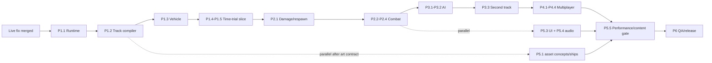

# K-ZERO: Phase 0 to AAA Anti-Gravity Combat Racer

**Implementation plan — 13 July 2026**  
**Repository audited:** `korallis/k-zero`, detached HEAD `f61aa75`  
**Deliverable scope:** planning only; no product code was changed.

## Summary

K-ZERO should become a **systems-led arcade racer**, not a graphics pass over the current demo. The shortest credible route is: (1) centralize the fixed-tick simulation and turn the current Neon Orbital prototype into a readable time-trial, (2) make the force-driven hover craft and chase camera genuinely fun, (3) add the shared energy/damage/one-second respawn contract, pickups and counterable weapons, (4) add spline-aware AI and a second track, (5) then harden the existing SpacetimeDB prototype into server-authoritative race/combat rules with client-authoritative movement as an explicitly non-secure v1 compromise, and (6) finish with authored ships, environments, audio, UI and measured performance work.

The architectural choice is **not a full ECS**. Use a small data-oriented runtime with stable entity IDs and ordered systems; React/R3F remains the presentation and lifecycle layer, Rapier remains the local dynamic collision/scene-query engine, and SpacetimeDB owns durable multiplayer rules. This is enough for 8 racers and tens—not tens of thousands—of active projectiles/pickups, while keeping the simulation extractable for deterministic tests.

The player promise is: **thread a lethal neon circuit at impossible speed, trade survival energy for boost, out-drive and out-think weapons, and turn a clean line or well-timed countermeasure into a last-corner win.** The first release target is desktop/laptop WebGL at a locked 60 fps; recent phones receive a reduced-quality best-effort mode, not a ranked-play promise.

### Current baseline and constraints

The README still calls the project Phase 0, but the checked-out code is materially further along:

| Existing capability | Evidence | Planning consequence |
| --- | --- | --- |
| Vite/React 19/R3F, Rapier, postprocessing and SpacetimeDB are installed | `package.json:7-30` | Evolve the stack; do not re-platform. |
| The default scene already builds Neon Orbital, mounts Rapier at `1/60`, adds scenery, HUD and Bloom | `src/game/Scene.tsx:75-129` | Separate runtime, world, render and UI ownership without discarding the scene. |
| A custom closed `CatmullRomCurve3` ribbon compiler already emits surface/walls/checkpoints/boosts/grid | `src/game/track/buildTrack.ts:74-409` | Promote this to a validated `TrackCompiler`; do not replace it with a generic tube. |
| The current craft is a dynamic Rapier cuboid with four suspension rays, lateral grip, torque steering, boost and a chase camera | `src/game/craft/PlayerCraft.tsx:148-440`, `442-507` | Preserve the dynamic contact feel, but extract a controller/system and remove direct transform/velocity edits where forces can do the job. |
| Local lap state and an eight-gate race controller exist | `src/game/race/raceState.ts:1-201`, `RaceController.tsx:14-160` | Replace wall-clock timers/globals with tick-based match state, retaining behavior through tests. |
| A HUD and dev-only Leva tuning panel exist | `src/hud/Hud.tsx:13-195`, `src/game/DebugPanel.tsx:1-202` | Keep tuning controls; redesign the player HUD and stop polling debug globals. |
| A SpacetimeDB module already has lobby/race/participant/transform rows, scheduled start/timeout, checkpoint validation and 15 Hz transform publication | `module/src/index.ts:8-281`, `src/net/transformSync.ts:45-103` | Treat it as multiplayer Phase 0: useful scaffolding, not finished authority or prediction. |
| Root production build passes | `pnpm build`: 647 modules; output includes a 2.26 MB minified Rapier chunk | Add bundle and lazy-loading gates early. The Spacetime module was not locally buildable because the `spacetime` CLI is absent. |
| Regenerable assets total about 86 MB; two HDRIs alone are about 14 MB | `public/assets/optimize-summary.json`; `du -sh public/assets` | Ship explicit per-track manifests and streaming; do not preload the whole asset lake. |

The already-assigned live fix for invisible track presentation, reversed steering and excessive/unsmoothed turn rate is a **roadmap entry gate, not work re-planned here**. All handling acceptance tests below run after that fix is merged and establish the next-generation controller rather than duplicating its patch.

### Research method and citation note

- **Exa MCP** was used for F-Zero GX/WipEout handling and production analyses, hover-racer writeups, racing AI/rubber-banding, weapon balance and cyberpunk art-direction references. Findings are cited inline as **Exa**.
- **Ref MCP** was used through `Manual("structure-a-plan")` and `Manual("read-code-or-docs")`; those findings drove the PR-sized roadmap, concrete file ownership and verification-first format (**Ref-plan**). Its manual instructed use of `ref_search_documentation`/`ref_read_url`, but those technical calls were not exposed in this worker's tool inventory. Rather than falsely attributing searches to Ref, the required R3F/Rapier/Three.js/SpacetimeDB/postprocessing research was completed against the primary official documentation and is cited inline as **Docs fallback**. This is a tooling-evidence limitation for cross-review, not an unresearched area.

---

## 1. Architecture

### 1.1 Game design and core-loop contract

**Design brief**

- **Player promise:** pilot a weaponized anti-gravity craft on roller-coaster circuits where mastery is visible in line choice, controlled slip, energy management and defensive reads.
- **Target feeling:** blistering, precise, dangerous and recoverable; the craft should feel heavy enough to collide but authored enough to obey intent.
- **Primary verb:** steer a racing line at speed.
- **Secondary verbs:** throttle/brake, drift and counter-steer, boost by spending energy, collect/aim/fire, shield or spoof, side-scrape rivals, recover in air.
- **Five-to-thirty-second loop:** read the next corner/pickup branch → choose line and resource risk → execute steering/boost/combat → receive time/position/energy feedback → adapt.
- **One-to-five-minute loop:** build a race story across three laps, with early positioning, mid-race resource pressure, and a final-lap energy spend.
- **Failure/retry:** energy reaches zero or the craft leaves the course; destruction is readable, the craft respawns exactly 60 simulation ticks later at the kill transform, and the player immediately re-enters with brief collision grace.
- **Skill expression:** lower slip losses, later but controlled turn-in, energy-pad routing, drift exits, projectile leading, target choice, countermeasure timing, opponent prediction and shortcut risk.
- **Readability promise:** the next 1.5-2.5 seconds of road, corner severity, pickup family, incoming locks and energy risk are readable without looking away from the racing line.
- **Non-goals for v1:** open world, career/story mode, 30-player grids, a user-facing track editor, ranked anti-cheat, full mobile parity, ship construction, destructible cities and fully server-simulated Rapier.

**Core-loop contract:** the player steers, boosts and fights to finish three laps first while curvature, rivals, weapons and a shared boost/health energy reserve create risk; clean sectors, overtakes, eliminations and pickups improve position/options, while a mistake costs speed/energy and destruction costs exactly one second plus re-acceleration.

F-Zero GX's own developers described sense of speed, improvement and detailed vehicle-specific sound as the series' center, while the strongest mechanical analysis identifies shared boost/health energy as a legible risk-reward decision rather than a free speed button. Those are direct pillars here, but K-ZERO adds WipEout-style ranged counterplay rather than copying GX's near-exclusive body attacks. ([Exa: F-Zero GX/AX developer interviews](https://shmuplations.com/fzero/), [Exa: F-Zero GX mechanics analysis](https://johannessmidelov.wordpress.com/2013/08/05/f-zero-gx-analysis-multiplayer-game-mechanics/))

### 1.2 Chosen runtime model: small system registry, not ECS

Use a `GameRuntime` created once per match. It owns plain TypeScript state and an explicitly ordered list of systems. Entities have stable integer IDs and component-shaped records, but there is no archetype/query framework:

```text
GameRuntime
  MatchState       phase, tick, seed, mode, trackId
  RacerStore       pose, velocity, energy, inventory, lap, status, controller kind
  ProjectileStore  type, owner, pose, velocity, ttl, target
  PickupStore      socket, availability, respawnTick, rolled item
  EventQueue       tick-stamped gameplay events consumed once
  Systems[]        ordered fixed-tick logic
```

**Why:** there are 8 launch racers, at most 64 live projectiles/traps and roughly 30 pickup sockets. A full ECS such as bitecs would add schema, query and React-bridging overhead before scale warrants it. A React-state-only game would be worse: fast state would trigger reconciliation and violate R3F's guidance to mutate hot-loop objects and avoid `setState` in `useFrame`. ([Docs fallback: R3F performance pitfalls](https://r3f.docs.pmnd.rs/advanced/pitfalls))

**Upgrade seam:** stores use packed arrays/maps behind interfaces so a future ECS can replace them if profiling—not taste—shows system iteration is the bottleneck.

### 1.3 Scene and module organization

Proposed ownership:

```text
src/
  app/                 boot, route/mode selection, loading/reconnect boundaries
  game/
    runtime/           GameRuntime, FixedClock, EventQueue, seeded RNG, snapshots
    match/             phase machine, race rules, lap/position, respawn
    vehicle/           CraftController, suspension, movement, damage, configs
    combat/            inventory, projectiles, targeting, damage resolution
    pickups/           socket compiler, loot tables, spawn/claim logic
    ai/                racing line, planner, steering, combat utility, director
    track/             definitions, TrackCompiler, spatial lookup, validation
  scene/
    WorldScene.tsx     R3F composition only
    entities/          RacerView, ProjectileView, PickupView
    environment/       track chunks, props, lighting, sky
    effects/           pooled VFX and render pipeline
    camera/            ChaseCameraRig
  state/               low-rate external UI store/selectors
  hud/                 HUD/menu DOM components
  audio/               AudioSystem, manifest, event mapping
  net/                 Spacetime adapter, prediction buffer, clock sync
  assets/              manifests, registries, diagnostics, attribution
  test/                hooks and deterministic fixtures
module/src/            authoritative SpacetimeDB tables/reducers/schedules
packages/sim-contract/ shared enums, quantization, event and validation types only
```

R3F components never decide damage, laps or inventory. They subscribe to stable runtime objects and interpolate views. React owns mounting, loading, menus and low-frequency HUD snapshots; runtime systems own gameplay.

### 1.4 Fixed simulation versus render loop

Keep one R3F render loop and one Rapier world. Do **not** start a second ad hoc `requestAnimationFrame` loop. Configure `<Physics timeStep={1/60} interpolate updateLoop="follow">`; register one central `SimulationDriver` with `useBeforePhysicsStep`/`useAfterPhysicsStep`, and order systems as:

```text
sample buffered intents
→ pre-physics status/respawn/input gates
→ suspension + movement forces + AI intents
→ Rapier fixed step
→ contacts/sensors/projectile hits
→ damage/destruction/pickups/laps
→ emit event snapshot
→ visual interpolation/VFX/camera
→ throttled UI snapshot
→ render
```

`@react-three/rapier` documents a numeric fixed timestep, interpolation, before/after-step hooks and manual stepping; its separate `independent` loop is meant for on-demand canvases, which this continuously animated racer is not. ([Docs fallback: `PhysicsProps`](https://pmndrs.github.io/react-three-rapier/interfaces/PhysicsProps.html), [Docs fallback: react-three-rapier advanced hooks](https://github.com/pmndrs/react-three-rapier))

Rules:

- Clamp accumulated wall time to 100 ms and execute at most five catch-up steps; if still behind, drop time and record `simulationOverrun` rather than creating a death spiral.
- Gameplay uses integer `tick`; 60 ticks = exactly one second. UI converts ticks to display time. `performance.now()`/`Date.now()` stay in clock sync and presentation only.
- Input devices write normalized intents into a ring buffer; the tick consumes exactly one intent. Steering smoothing therefore advances by fixed `dt`, not the current getter's wall-clock delta (`src/game/craft/useInput.ts:74-148`).
- Physics callbacks cannot update React state. UI publishes selectors at 10-20 Hz and immediately on critical events.
- VFX/camera/audio envelopes use render delta so feedback stays smooth during simulation hit-pause, but their random seeds and event origins are tick-stamped.

### 1.5 Determinism and replay posture

Target **repeatable local simulation**, not network lockstep:

- Fixed 60 Hz, a match seed, stable entity insertion order, stable system order, no `Math.random`, and quantized serialized intents.
- Precompile track frames/curvature/width into arrays; gameplay indexes those arrays instead of evaluating splines with platform-sensitive trigonometry each tick.
- Hash a canonical snapshot every 60 ticks for tests/replays: racer pose/velocity/energy/status, projectile and pickup state, RNG cursor and lap state.
- Pin Rapier and Three.js versions per release. Rapier WASM/JS can be cross-platform deterministic with identical initial conditions and insertion order, but its docs warn that host operations such as `Math.sin`/`Math.cos` can break that guarantee. ([Docs fallback: Rapier determinism](https://rapier.rs/docs/user_guides/javascript/determinism/))
- Record input streams plus authoritative events for ghost/replay debugging. Replays are valid only against their recorded simulation-version hash; no promise of cross-version playback.

This determinism supports regression tests, AI benchmarking and reconciliation investigation. It does **not** make an untrusted browser authoritative.

### 1.6 Rejected alternatives

- **Kinematic player body:** rejected. Rapier kinematic bodies follow user commands and ignore contact forces, so wall/racer impacts would need a bespoke collision solver and would feel one-way. Keep a dynamic body with authored forces. ([Docs fallback: Rapier rigid-body types](https://rapier.rs/docs/user_guides/javascript/rigid_body_type/))
- **Full ECS now:** rejected for entity count and team complexity; retain an upgrade seam.
- **React/Zustand as the 60 Hz simulation:** rejected; use an external low-rate UI projection.
- **Two independent loops:** rejected due to ordering and pause/restart races.
- **Deterministic lockstep multiplayer:** rejected for v1 because browser inputs are untrusted, track/physics initialization is large, late inputs are common and SpacetimeDB does not currently run the same Rapier world.

---

## 2. Track system

### 2.1 Authoring and compilation

Retain closed `CatmullRomCurve3` centerlines, but replace the current single `buildTrack` result with a versioned `TrackDefinition` → `CompiledTrack` pipeline.

**Authoring data**

- Control point: position, half-width left/right, bank degrees, tension, optional explicit up hint, surface/material zone and semantic tags.
- Authored markers: start grid, checkpoint, sector, pickup row/socket, boost strip, energy pit, hazard, landmark, camera cue and respawn-safe frame.
- Metadata: `trackVersion`, target lap range, max grid, weather/lighting profile, music set and asset manifest.
- Store runtime definitions as JSON validated by Zod or a small explicit validator; keep a TypeScript loader for editor autocomplete. Add a CLI `track:validate` and SVG/PNG top-down preview. Do not build a full user-facing editor in v1.

The WipEout Pure postmortem is decisive here: its team prioritized a spline pipeline that could produce a playable track in minutes, including AI/reset data, after a custom editor/export process had become a multi-hour bottleneck. K-ZERO should make definition-to-play turnaround under ten seconds and put AI/checkpoint/reset/minimap data in the same compile product. ([Exa: WipEout Pure GDC postmortem](https://www.gamedeveloper.com/design/postcard-from-gdc-europe-2005-postmortem-scee-s-i-wipeout-pure-i-))

**Frame generation**

1. Set `curve.arcLengthDivisions` high enough for kilometer tracks and build a distance→parameter LUT.
2. Sample every 2 m for gameplay data and 1-3 m adaptively for rendering (more samples where curvature/bank gradient is high).
3. Generate rotation-minimizing/parallel-transport frames, then apply authored bank. Do not recompute `right = tangent × worldUp` independently as current code does (`buildTrack.ts:102-125`), because near-vertical or inflection sections can flip.
4. Apply asymmetric widths and cross-section crown/curb profiles.
5. Close and twist-correct the frame seam gradually over the lap.
6. Output frame arrays: position, tangent, right, up, curvature, grade, bank, widths, cumulative distance, nearest checkpoint and safe reset transform.

Three.js exposes arc-length curves and Frenet frames, and `TubeGeometry`/`ExtrudeGeometry` can follow a curve; however, a tube has a constant circular radius and path extrusion does not support bevels, while K-ZERO needs width variation, asymmetric shoulders, banking, material lanes and independent collision proxies. Therefore use the docs as mathematical/reference primitives but keep a custom ribbon/cross-section builder. ([Docs fallback: Three.js `Curve.computeFrenetFrames`](https://threejs.org/docs/pages/Curve.html), [`TubeGeometry`](https://threejs.org/docs/pages/TubeGeometry.html), [`ExtrudeGeometry`](https://threejs.org/docs/pages/ExtrudeGeometry.html))

### 2.2 Compiled outputs and spatial queries

`CompiledTrack` emits:

- Render chunks of 40-80 m with surface, shoulder, curb, underside and rail geometry, material group IDs and bounds.
- Static Rapier surface trimeshes per chunk and overlapping oriented wall cuboids/convex rails. Keep the craft hull collision-filtered away from the surface; suspension queries surface only, as the current collision-group design already intends (`src/game/physicsGroups.ts:3-20`).
- Checkpoint sensor boxes, sector sensors, pickup sockets, energy pits, boost pads and start grid.
- Center and 3-5 racing-line candidates sampled every 2 m, plus per-sample target speed.
- A nearest-track spatial index: coarse grid/BVH over sample segments returning distance, signed lateral offset, frame, progress and surface eligibility.
- Minimap polyline normalized to a unit box with elevation/bank annotations.
- Prop sockets and visibility zones for chunk streaming.
- Validation metrics: length, minimum width/radius/clearance, max bank/grade/bank-rate, seam errors, self-intersection clearance, spawn/checkpoint order and unreachable sockets.

### 2.3 Readability at speed

At 60-95 m/s the player has only 1-2 seconds to parse a corner. Geometry and lighting must convey course shape before decoration:

- Continuous contrasting left/right edge ribbons; right edge gets a repeating amber dash and left edge cyan so orientation survives color and motion.
- 10 m longitudinal seam/tick rhythm, 50 m large numerals, chevron density proportional to curvature and three corner-severity bands.
- A dark matte driving surface with non-emissive value contrast; bloom belongs to rails/signals, never the road itself.
- Barrier caps at a stable height, wider/brighter on dangerous exits; wall-hit sparks point along the recoverable tangent.
- Landmark and horizon composition gives one dominant anchor per sector. No billboard may occlude the next 2 seconds of track.
- A 60-120 m “readability corridor” with restrained fog, particles and lights; density can increase behind/outside it.
- Early tracks are 15-18 m wide. WipEout 2048's senior designer explicitly linked wider urban tracks to accessibility and more ship-to-ship combat; narrow technical lanes belong later or on optional skill cuts. ([Exa: WipEout 2048 senior-designer interview](https://www.pushsquare.com/news/2012/01/interview_sony_studios_liverpool_wipeout_2048))

### 2.4 Boundaries, shortcuts and recovery

- Default sides use 2.2 m energy rails: glancing contact preserves at least 80% tangent speed and deals impulse-scaled energy damage; head-on impact is costly but never a zero-velocity snag.
- Selected “open edge” segments expose risk/reward shortcuts. Off-surface detection starts only after all suspension rays miss for 6 ticks; air control remains available.
- A kill plane is a fallback, not normal recovery. In time trial, falling respawns after one second at the last safe frame; combat destruction always uses the exact kill location rule.
- Skill cuts are authored parallel splines with narrower width, no energy pit and 5-10% distance gain; add them only after AI and checkpoint validation support route IDs.
- Prevent shortcut cheating with ordered gate groups and progress monotonicity tolerances, not just one huge finish sensor.

### 2.5 Checkpoints, laps, position and minimap

- 10-14 logical gate groups per track, each a complete cross-section volume. A crossing is valid only from its forward side and within the racer’s expected group/route branch.
- Lap completes on forward crossing of gate 0 after all mandatory groups. Store `lapStartTick`, sector splits, best lap and penalty ticks.
- Race position sorts by completed laps, gate ordinal, then projected distance along current segment; resolve near-equal progress by signed distance to next gate, not Euclidean world distance.
- Minimap is DOM/SVG, not a second Three camera. Render the compiled polyline once; update racer dots at 15 Hz. Dashed/bright sections indicate elevation and skill cuts, while incoming weapon markers remain world/HUD indicators.

### 2.6 Launch tracks

| Track | Role and target | Signature sequence | Combat/resource decisions | Art kit |
| --- | --- | --- | --- | --- |
| **Neon Orbital v2** | Accessible launch/time-trial circuit; 2.3-2.5 km, 15-18 m wide, 35-43 s expert lap, max bank 38°, elevation range ~70 m | 600 m skyline straight → broad double-apex orbital turn → energy-pit/boost fork → climbing S → elevated flyover → wide final carousel | Defensive outer pickup row versus faster inside boost line; one open-edge skill cut introduced after a safe rehearsal; generous recovery zones | Existing PM Aero/Transit and Quaternius CC0 kits, ambientCG track textures, Poly Haven night IBL, existing Grok skyline/billboards, generated landmark station later |
| **Black Rain Foundry** | Technical combat circuit; 2.6-2.9 km, 11-16 m wide, 44-53 s expert lap, max bank 68°, elevation range ~120 m | Wet industrial canyon → descending turbine helix → 65° mag-wall → furnace hall compression → split cooling-tower routes → long exposed dock sprint | Mine-friendly choke points have bypass lanes; shield row before furnace; energy pit is longer but off-line; risky upper route gives rare utility socket, not guaranteed offense | Existing PM Transit/Tomb industrial CC0 pieces, ambientCG metal/asphalt, procedural pipes/gantries/rain, generated foundry landmark and distant plates, amber/acid-green district palette |

Neon Orbital ships in Phase 1. Black Rain Foundry is greyboxed only after the compiler, AI racing line and combat sockets are stable; this prevents two content sets from masking core-system defects.

---

## 3. Vehicle physics and game feel

### 3.1 Body and hover suspension

Keep a **dynamic Rapier body** with a simple rounded cuboid/compound collider, explicit 900 kg mass and CCD. Four hover pads cast filtered rays along craft-local down; a fifth center shape/ray cast is an optional continuity probe at sharp crests. Rapier scene queries support ray/shape casts, collider-family filters, collision groups and excluding the querying body. ([Docs fallback: Rapier scene queries](https://rapier.rs/docs/user_guides/javascript/scene_queries/))

For each pad:

```text
compression = clamp((restLength - hitDistance) / travel, 0..1)
springForce = compression * k
damperForce = -dot(pointVelocity, hitNormal) * c
force = clamp(springForce + damperForce, 0..padForceMax) * hitNormal
```

Derive `k` and `c` from frequency/damping ratio rather than arbitrary values: `k = (2πf)^2 * sprungMassPerPad`, `c = 2ζ√(k*m)`. This makes mass changes predictable.

**Baseline tuning targets** (starting points, then playtest):

| Parameter | Target | Reason/acceptance intent |
| --- | ---: | --- |
| Body mass | 900 kg | Stable contact impulse and comprehensible SI-scale tuning. |
| Ride height / travel | 1.10 m / 0.75 m | Visible hover without floaty clearance. |
| Ray length | 2.1 m | Survives crests while not latching distant lower decks. |
| Spring frequency | 6.0 Hz | Settles quickly enough at speed without high-frequency chatter. |
| Damping ratio | 0.88 | Near-critical, with one small overshoot after a 0.5 m drop. |
| Pad force clamp | 2.8 g equivalent per pad | Prevents seam/corner impulses launching the craft. |
| Surface-align PD | 0.10 s time constant, 180°/s cap | Follows banking without snapping yaw. |
| Local downforce | 0.7 g grounded, 0.35 g in short air | Keeps contact while preserving jumps. |
| Full-air gravity | world -1.0 g after 0.25 s | Makes missed track decisive and predictable. |

Average normals with weights based on compression and reject discontinuities greater than 55° unless at least three pads agree. Smooth the target normal over 3 ticks, but apply forces at actual contact points so pitch/roll emerges physically. Avoid the current direct `setRotation` during a dynamic step (`PlayerCraft.tsx:276-303`) except for respawn/reset.

The independent hover-racer writeups found the same practical pattern—four rays, averaged normals, inverse hover force—and warn that unsmoothed local “down” can latch onto walls; their solution was a bounded, smoothed normal change. Use that as a failure-mode check, not copied constants. ([Exa: Velocity Glyph hover-racer postmortem](https://blog.foxtrotluna.social/velocity-glyph/), [Exa: Wipeout-style hover physics discussion](https://forums.unrealengine.com/t/wipeout-style-hovercar-physics/53650))

### 3.2 Thrust, drag and speed envelope

- Normal terminal speed: **78 m/s**; boost terminal: **96 m/s**. HUD applies a fictional league scale (`×8`) to display ~625-770 km/h while physics stays in sane meter units.
- 0→60 m/s in **2.7 s** at full energy on level track; throttle attack 120 ms, release 80 ms.
- Apply forward thrust with a low-speed traction curve and quadratic drag chosen so force equals drag at terminal speed. Do not hard-clamp speed except a 115 m/s safety cap.
- Project thrust onto the smoothed track plane while grounded. Airborne thrust is 35%, preserving trajectory rather than allowing flight.
- Braking adds opposite longitudinal force and raises drag; target 78→35 m/s in 1.2 s. Reverse exists only below 8 m/s for recovery.
- Drafting inside a 3-12 m wake cone reduces drag up to 12%; turbulence feedback is visual/audio, and the benefit fades over 150 ms.

### 3.3 Steering, grip, counter-steer and drift

Input shaping runs in the simulation, not the device hook:

- Deadzone 0.08 gamepad / binary keyboard target; cubic blend `0.35x + 0.65x³` for analog precision.
- Steering target attack 110 ms, release 80 ms, direction-reversal 140 ms. Keyboard receives the same ramp.
- Desired yaw-rate PD controller: **1.75 rad/s at 0-20 m/s**, falling to **0.90 rad/s at 78 m/s**; drift raises the high-speed cap to 1.25 rad/s. Torque, not instantaneous angular velocity, pursues the target.
- Automatic counter-steer activates when slip angle opposes input/release: up to 25% corrective yaw torque, 90 ms delay on Rookie assist and 150 ms/10% on Pro. “Off” is available for experts.
- Lateral tire/air-skid model applies a capped lateral acceleration, not the current direct `setLinvel` rewrite (`PlayerCraft.tsx:349-373`): 12 m/s² grip, 5.0 m/s² drift, blended over 150 ms.
- Drift requires speed >24 m/s and hold; initial yaw impulse is small, then slip target reaches 18°. Exit converts at most 20% of shed lateral energy into a 0.35 s thrust bonus. Alternating drift cannot create net energy (“snaking” exploit test).
- Visual craft bank is a child-mesh effect, ±13° from steering/slip; it must not alter the physics normal.

The separate fix already in flight corrects today's sign/rate/smoothing bugs. These values are the **post-fix handling contract** and should be tuned from telemetry rather than used to duplicate that repair.

### 3.4 Air control and collision response

- Air yaw ±0.75 rad/s, pitch ±0.45 rad/s, roll visual only; input authority ramps to full over 0.15 s and fades within 0.1 s of ground contact.
- Landing alignment uses predicted surface normal from center ray and limits correction to 25° before contact; suspension absorbs the rest.
- Wall response removes only the inward normal velocity, preserves 80-92% tangent velocity based on impact angle, adds capped outward impulse and energy damage. Zero restitution on normal racing contacts; 0.05 on severe impacts.
- Racer-racer collisions use simplified rounded proxies, collision groups and capped impulses. At >25 m/s relative normal speed, damage scales with impulse; deliberate side-ram utility can multiply it. Never let visual GLBs own collision.
- Fast projectiles use CCD or segment/shape sweeps; Rapier notes detailed-result scene queries cost more, so use the cheapest query that returns the needed result. ([Docs fallback: Rapier scene queries](https://rapier.rs/docs/user_guides/javascript/scene_queries/))

### 3.5 Boost and shared energy

- Each racer has **1000 energy**; damage and manual boost consume the same reserve.
- Hold boost after race start: 150 ms spool, +23% terminal speed, +35% thrust, **120 energy/s** drain. Releasing has 250 ms tail. If energy reaches zero from boosting, the racer is destroyed.
- Track boost pads give 0.55 s overdrive without energy drain but share a 0.25 s retrigger lock.
- Energy pits recharge 280 energy/s while the craft stays within a deliberately slower outer lane. Pickups can restore 160 once.
- Boost is disabled during the one-second destroyed state and collision grace; UI previews “fatal boost” below 120 energy with a red segmented bar, never silently prevents it.

This preserves F-Zero's strongest decision: speed is purchased with the same resource that keeps the craft alive. ([Exa: F-Zero GX mechanics analysis](https://johannessmidelov.wordpress.com/2013/08/05/f-zero-gx-analysis-multiplayer-game-mechanics/))

### 3.6 Chase camera and feedback

Use a dedicated `ChaseCameraRig` reading interpolated craft state:

| Camera property | Baseline |
| --- | --- |
| Base offset | 8.5 m behind, 3.1 m above |
| Speed look-ahead | 4 m at rest → 14 m at normal max; add curvature-inside offset up to 2 m |
| Position lag | critically damped 90 ms; max separation 11 m |
| Rotation/look lag | 55 ms; horizon blends 70% track-up / 30% world-up |
| FOV | 62° base, 74° at 78 m/s, 79° boost peak; 200 ms settle |
| Shake | trauma²; 0.03 pickup, 0.15 scrape, 0.35 weapon hit, 0.65 destruction |
| Maximum shake | 0.35 m position, 1.8° rotation; reduced-motion 20% |

Add engine trails, side streaks and road ticks before considering full-screen motion blur. Heavy hitstop is inappropriate in a continuous multiplayer race; use 20-35 ms local presentation slow-down for the attacker/victim only, never pause simulation or remote craft. Boost FOV kick is +5° transient, weapon hit +2°, destruction +7°. All settings have reduced-motion/shake sliders.

### 3.7 Handling acceptance metrics

- Flat-track ride-height RMS error <0.08 m at 78 m/s; no visible oscillation above 8 Hz.
- 30° bank transition produces no sign flip, roll snap >12°/tick or lost-ray state longer than 2 ticks.
- Full left/right steering from identical mirrored initial states yields mirrored yaw within 2%.
- Keyboard 0→full steer takes 100-130 ms; release <100 ms; reversing direction has no overshoot beyond 10% target yaw rate.
- Wall glance at 15°/70 m/s retains ≥80% tangent speed; direct impact never tunnels and returns control within 0.8 s if energy remains.
- Camera distance remains 6.5-11 m through a hairpin; route apex stays visible at least 1.25 s ahead.
- Ten seeded laps show no free-energy drift oscillation and no boost exceeding the safety cap.

---

## 4. Combat and pickups

### 4.1 Combat principles

1. **Racing remains the primary skill.** A strong driver with good counterplay can hold a lead; no pickup is an unavoidable “silver bullet.” ModNation Racers used the same balance principle—powerful weapons still had evade/shield options and only modest position scaling. ([Exa: ModNation weapon design](https://blog.playstation.com/2010/03/26/modnation-racers-ps3-bringing-the-boom-with-weapons/))
2. **One weapon slot and one utility slot.** The player can reason at speed; there is no inventory wheel.
3. **Telegraph → reaction → consequence.** Locks, mines and area attacks always advertise direction, time-to-impact and counter family through shape, sound and HUD.
4. **Damage costs energy; stuns stay short.** Hits should alter line/resource decisions, not create multi-second loss of agency.
5. **Every offense has at least two responses.** Drive/line response plus shield or countermeasure.
6. **Server decides multiplayer outcomes.** Clients predict visuals immediately but do not award claims, damage, kills or respawns.

### 4.2 Damage and status model

- `energy: 0..1000` is hull integrity and boost fuel. Shield points are temporary and separate.
- Direct damage is clamped so a full-energy racer cannot be one-shot by a single non-combo pickup. Epic attacks cap at 420 before mitigation.
- Damage events contain attacker, source, tick, hit point/normal, raw amount, shield absorbed, energy applied and status duration.
- Repeated hit immunity: 120 ms for the same projectile family, not global invulnerability. Area fields tick at explicit 250 ms intervals.
- Control effects cap at 450 ms; speed penalties cap at 25% for 1.2 s. Effects use diminishing returns within 3 seconds.
- Kill credit goes to the last damaging opponent within 4 seconds; assist requires ≥150 damage within 6 seconds. Self/fall destruction has no opponent credit unless displaced by a recent hit.

**Destruction and exact one-second in-place respawn**

1. At energy ≤0, capture the authoritative craft **position and quaternion at the destruction tick** as `deathPose`; set status `destroyed`, disable input/collider and emit the destruction event.
2. Spawn the explosion/wreck presentation but keep simulation ticking. Store `respawnTick = deathTick + 60` offline, or `respawnAt = server timestamp + 1,000,000 μs` in SpacetimeDB.
3. At exactly tick +60/the scheduled reducer, restore the craft at `deathPose`, zero linear/angular velocity, set energy to 500 and status `respawn_grace`. This is not the last checkpoint and has no hidden relocation.
4. To prevent a spawn inside a wall or explosion chain without violating location, make the hull non-solid to racers/weapons for 250 ms and damage-invulnerable for 1.0 s; suspension/track queries remain active. Visually show a reconstructing hologram and grace countdown.
5. If `deathPose` is below the kill plane, still instantiate there at exactly one second, then immediately apply the ordinary off-track recovery to the nearest compiled safe frame. Track this rare two-stage outcome in telemetry.

Unit tests assert state change at tick +60, never +59 or +61. Multiplayer tests compare client-visible respawn against the authoritative timestamp with tolerance of one rendered frame, not one simulation tick.

### 4.3 Concrete pickup roster

Launch with six weapons and four utilities. Values are initial balance targets.

| Item | Rarity / slot | Behavior | Damage / duration | Telegraph and counterplay |
| --- | --- | --- | --- | --- |
| **Pulse Bolts** | Common weapon | Three unguided plasma rounds, 130 m/s, slight aim assist inside 4° | 70 each; 90 ms recoil impulse | Cyan-white muzzle and tracers; dodge, wall-break line of sight, shield. Rewards leading aim. |
| **Arc Cannon** | Common weapon | 45 m forward cone burst; strongest near center | 120-220, 0.20 s steering interference | 350 ms charge prongs and electrical audio; leave cone, brake behind attacker, shield. |
| **Gravity Mine** | Uncommon weapon | Rear-deployed mine arms after 0.45 s; 2 m core/7 m pull radius; 12 s life | 190 core, ≤15% speed pull for 0.7 s | Tall triangular silhouette, minimap ping within 35 m; steer around, shoot with Pulse, shield. |
| **Seeker Missile** | Rare weapon | Locks nearest valid racer ahead within 180 m; 95 m/s with limited 28°/s turn | 260, 0.35 s yaw disturbance | 1.0 s lock tone/brackets and visible trail; break LOS, hard switchback, shield, Specter spoof. |
| **Rail Lance** | Rare weapon | 0.65 s charged straight penetrator; narrow 1.1 m swept radius; passes one target | 340 first / 170 second | World-space red charge line never through opaque walls; change lane, shield timing. No homing. |
| **EMP Quake** | Prototype weapon | Ground-following wave travels 120 m forward and across track; destroys mines/projectiles | 180 and disables active utility 1.0 s | 0.8 s track-ripple charge, loud global cue; jump/open edge, shield, outrange. Max one in world per owner. |
| **Overdrive Cell** | Common utility | Instantly restores 120 energy and grants 0.9 s pad-strength boost without drain | No damage; cannot exceed 1000 energy | Amber cell and exhaust flare; pure tempo tool, weaker in P1 table. |
| **Aegis Shield** | Uncommon utility | 280-point visible shield, 8 s expiry; excess damage passes through | Absorb only, no ram multiplier | Violet hex shell and HUD number; opponents can bait/strip it, EMP disables remaining shield after dealing wave damage. |
| **Specter Countermeasure** | Rare utility | 1.25 s spoof: current seekers retarget to decoy; breaks new locks; destroys one nearby drone/missile | No generic damage immunity | White glitch silhouette and distinct audio; use too early and the missile reacquires after expiry. |
| **Nanite Repair** | Uncommon utility | Restores 220 energy over 2.5 s; damage pauses repair for 1 s | Sustain, not burst | Green segmented trail; visible to rivals, vulnerable to interruption; cannot run while boosting. |

Do not launch with a global lightning strike, blue-shell analogue, invisible mine, indefinite cloak or full invincibility. They violate earned counterplay or readability. The roster covers projectile, homing, area, trap, burst, boost, shield, spoof and repair without making the HUD a spreadsheet.

### 4.4 Pickup placement, rarity and claim rules

Tracks author **pickup rows** rather than scattering random coordinates. A row contains 2-4 sockets and a placement family:

- `offense`: inside/aggressive line after a recovery window.
- `defense`: outer or pre-hazard line that costs 0.1-0.3 s.
- `utility`: neutral line before route decisions.
- `wildcard`: risky skill cut or last-place recovery line; never directly on the optimal line.

Spacing: first row 12-15 seconds into lap 1; then every 180-260 m, never within 90 m of another row, a checkpoint, start grid, blind crest or mandatory brake point. Each launch track targets 10-12 rows.

**Shared-world claim:** the first server-confirmed racer to intersect a socket claims it. The socket disappears for all players and respawns after 5.0 s (300 ticks). Offline uses the same rule. Client prediction fades it immediately; a rejected race restores it with a “desync shimmer.” This gives line choice and pack contention real meaning.

**Two-stage roll:** placement family chooses category; race position modifies category weights; rarity then chooses an item within the category. The match seed, socket ID and respawn sequence produce a deterministic roll.

| Normalized position | Direct offense | Trap/area | Defense | Boost/repair | Rarity modifier |
| --- | ---: | ---: | ---: | ---: | --- |
| P1 | 10% | 30% | 40% | 20% | Prototype 0%; rare 8% |
| Top half (not P1) | 25% | 25% | 30% | 20% | Prototype 2%; rare 12% |
| Bottom half | 35% | 20% | 20% | 25% | Prototype 4%; rare 16% |
| Last | 38% | 16% | 16% | 30% | Prototype 6%; rare 20% |

Base rarity inside a compatible category is Common 58%, Uncommon 29%, Rare 11%, Prototype 2%, then adjusted and renormalized. Position changes options, never raw damage. P1 still receives useful trap/defense play; last place receives tools but no guaranteed leader hit. Expose the broad weighting in help UI so randomness is not mysterious.

WipEout 2048's offensive/defensive pad split shows that track width and pickup lane purpose can create strategy, and ModNation's upgrade-versus-fire risk shows why a powerful roll needs visible effort/counterplay. K-ZERO adopts the lane-purpose insight but rejects a three-level held-item ladder for launch because one weapon plus one utility already fills the attention budget. ([Exa: WipEout 2048 interview](https://www.pushsquare.com/news/2012/01/interview_sony_studios_liverpool_wipeout_2048), [Exa: ModNation weapon design](https://blog.playstation.com/2010/03/26/modnation-racers-ps3-bringing-the-boom-with-weapons/))

### 4.5 Combat diagnostics and balance gates

Log per seed/match: pickup category/rarity by position, claims/denials, fire-to-hit, damage/kill contribution, shield/counter success, energy spent boosting versus lost to damage, time without control, and position delta 5 seconds after use.

Balance gates across 1,000 bot races per track:

- No item exceeds 22% of total damage or 28% of kills.
- P1 win rate changes by <8 percentage points when pickups are disabled for identical AI skill seeds.
- Median forced-control loss per hit <300 ms; 95th percentile cumulative loss in any 3 s window <700 ms.
- Seeker hit rate 35-55% without utilities and 15-30% against a correctly timed Specter/Aegis.
- Prototype items appear in <3% of all claims and never decide >10% of races by themselves.
- Skilled no-item Elite bot beats Rookie item-using bot in >70% of matched seeds: driving remains decisive.

---

## 5. AI racers

### 5.1 Shared controller interface

AI emits the same `CraftIntent` as players: throttle, brake, steer, drift, boost, fire weapon, use utility and lateral objective. It gets no teleport, collision exemption, secret grip or impossible weapon aim. This makes AI behavior replayable and lets bot tests drive the real controller.

### 5.2 Racing-line and speed planner

The track compiler provides a centerline plus left/center/right candidate lines. Offline, optimize a default racing line by minimizing curvature and respecting width/margins; store it as signed lateral offset per 2 m sample. At runtime:

1. Project racer to track progress and estimate slip/error.
2. Select a 20-55 m look-ahead based on speed and curvature.
3. Compute target speed from curvature, bank, grade and a tier-specific lateral-acceleration limit; scan 2 seconds ahead and brake early enough to meet it.
4. A pure-pursuit heading target plus PD controller emits steer; a longitudinal controller emits throttle/brake.
5. A 2 Hz tactical planner selects lateral goals for overtakes, pickups, mines, open edges and defense; blend them over 0.4-1.0 s so AI does not weave.
6. Local shape/ray casts act only as emergency avoidance. The racing line, not wall feelers, owns normal driving.

### 5.3 Overtaking and opponent model

- Predict rivals 0.8 s ahead from track progress/velocity, reserve left/right passing corridors, and score each by time loss, collision risk, pickup value and weapon exposure.
- Commit to a pass for at least 0.5 s unless a collision is imminent; add a 1.2 s cooldown after abort to prevent oscillation.
- Personalities alter aggression, preferred pass side, boost reserve and weapon utility—not physics. Suggested launch archetypes: `Precision`, `Brawler`, `Opportunist`, `Conserver`.
- AI can draft, side-scrape and use skill cuts only at tiers where its line error supports them.

### 5.4 Difficulty tiers

| Parameter | Rookie | Pro | Elite |
| --- | ---: | ---: | ---: |
| Decision/reaction delay | 180 ms | 95 ms | 50 ms |
| Racing-line noise (1σ) | 1.0 m | 0.40 m | 0.12 m |
| Target speed factor | 0.88 | 0.96 | 1.00 |
| Brake-point variance | ±0.22 s | ±0.09 s | ±0.03 s |
| Drift/skill-cut access | Safe bends only / none | Authored bends / easy cut | Full authored set |
| Aim error | 4.5° | 2.0° | 0.6° |
| Boost reserve floor | 380 | 250 | situational 100 |
| Countermeasure reaction | 400 ms | 230 ms | 140 ms |

### 5.5 Bounded competition director (“rubber-banding”)

Do not directly grant large catch-up top speed. The `CompetitionDirector` is offline/casual-AI only and disabled in time trial, Elite difficulty and ranked multiplayer. It measures progress gap and recent player errors over a 5-second window, then changes *behavior* within visible limits:

- Trailing AI may reduce line noise up to 20%, spend 10% more boost and choose aggressive pickup lines.
- Leading AI may preserve 10% more energy, accept slightly safer passes and add at most 0.15 m line noise.
- Absolute pace factor remains within **0.97-1.03**; never exceed the craft's player-accessible limits.
- No adjustment inside the final 20% of the last lap, after a player destruction for 3 seconds, or while an AI is visible within 25 m. This avoids obvious “slow on camera” behavior.
- A seeded race script may create a few authored rival beats (early challenger, mid-race pack, final rival) but cannot force positions or ignore mistakes.

The Pure AI postmortem rejected obvious velocity rubber-bands as unfair and instead decomposed performance into skills and dynamic competition behavior; the adaptive-rubber-banding literature likewise argues for bounded curves/modules rather than one speed multiplier. K-ZERO uses the former's explainable skill knobs, with strict caps and opt-outs. ([Exa: Pure advanced racing AI](https://www.gamedeveloper.com/design/the-pure-advantage-advanced-racing-game-ai), [Exa: Adaptive Rubber-Banding System](https://doi.org/10.3233/icg-220207))

### 5.6 Combat item use

Every 100 ms, score legal actions:

```text
utility = expectedPositionGain
        + expectedDamage * aggression
        + selfSurvivalGain
        - lineDeviationCost
        - friendly/self-hit risk
        - opportunityCost
```

- Fire Pulse/Rail only with predicted hit probability above tier threshold and no wall occlusion.
- Seeker requires a target expected to remain ahead for 0.7 s; preserve it if target shield is visible.
- Mine only when a rival is 10-45 m behind and the upcoming width/route gives a dodge.
- Aegis/Specter reacts only after telegraph plus tier delay; no omniscient counter.
- Repair only on a low-curvature 2.5 s window; boost when energy budget can still survive expected incoming damage.

### 5.7 AI verification

- 100 seeded solo laps per tier: completion ≥99%, no stuck window >2 s, lap-time coefficient of variation within intended tier band.
- Elite median lap within 2% of authored target; Rookie 10-15% slower.
- Two-skill bot comparison shows meaningful separation; delayed bots must not perform identically to fast bots.
- Eight-racer 20-minute soak has no persistent wall oscillation, reverse driving or pickup deadlock.
- Director-on/off A/B reports lead changes, gap distribution and player win rate; no on-camera pace violation.

---

## 6. Multiplayer via SpacetimeDB

### 6.1 Scope and staged authority

The current code has a useful lobby and 15 Hz client transform stream, but movement is entirely client-owned, all tables are globally subscribed, transform validation is only speed/distance plausibility, and local and server race controllers coexist (`src/net/spacetime.ts:41-63`, `transformSync.ts:45-103`, `module/src/index.ts:175-250`). Do not build combat on top of that ambiguity.

**v1 scope:** one public/coded lobby type, 2-8 human racers, optional AI fill owned by host/server rules, one track vote, three laps, reconnect-to-spectate, results/rematch. No skill matchmaking, parties, ranked ladder, spectators beyond reconnect, host migration, cross-region selection or anti-cheat guarantee.

**Authority stages**

1. **Offline authoritative runtime:** local + AI proves all rules first.
2. **Ghost online:** retain current transform interpolation only for a network lab; no collision/combat claims.
3. **Server-authoritative match rules:** SpacetimeDB owns lobby, match clock, pickup availability/rolls, inventory, energy, damage, destruction, respawn, laps and results. Browser still owns movement.
4. **Validated client movement:** send sequenced inputs plus 20 Hz state snapshots; server checks track progress, acceleration, speed, teleport budget and impossible energy/action combinations. This deters accidents/basic cheating but is not esports-secure.
5. **Future competitive authority:** a dedicated authoritative physics service or a shared custom deterministic movement solver. Do not pretend the TypeScript Spacetime module and browser Rapier are identical today.

SpacetimeDB's model is well suited to rules: reducers are the only table mutation path, run transactionally/isolated, and subscriptions replicate matching rows into a local cache. It is not a magic physics server. ([Docs fallback: SpacetimeDB reducers](https://spacetimedb.com/docs/functions/reducers/), [subscriptions](https://spacetimedb.com/docs/clients/subscriptions/), [client cache model](https://spacetimedb.com/docs/clients/))

### 6.2 Server schema

Replace single-global-race assumptions with indexed, match-scoped tables:

| Table | Key fields | Authority/use |
| --- | --- | --- |
| `player` | identity, display name, livery, online, lastSeen | Profile/connection. |
| `lobby` | lobbyId, code/visibility, host, phase, trackVoteDeadline | Server phase machine. |
| `lobby_member` | `(lobbyId, identity)`, slot, ready, vote | Membership and grid. |
| `match` | matchId, lobbyId, trackId/version/hash, seed, phase, startAt, endAt | Immutable match contract and clock. |
| `racer_state` | `(matchId, identity)`, lap/gate/progress, energy, shield, status, inventory, deaths/kills, respawnAt | Authoritative game rules. |
| `racer_transform` | `(matchId, identity)`, seq, pose, velocity, clientTick, serverTime, discontinuityId | Replicated movement snapshot. |
| `pickup_state` | `(matchId, socketId)`, available, respawnAt, rollSeq | First-claim and deterministic loot. |
| `projectile` | projectileId, match/owner/type, launch/target/resolveAt, state | Server-timed seeker/area/trap outcomes. |
| `combat_event` | eventId, match/tick/type/source/target/payload | Append/event stream for effects and reconciliation; expire after match. |
| scheduled tables | start, pickup respawn, projectile resolve, racer respawn, match timeout | Exact server transitions. |

Use compound indexes by match/lobby and query-builder subscriptions scoped to the active IDs. The current `SELECT *` for every table (`src/net/spacetime.ts:50-58`) does not scale or isolate matches.

### 6.3 Reducer contracts

- `create_lobby`, `join_lobby`, `leave_lobby`, `set_ready`, `vote_track`, `start_match` validate sender/membership and phase.
- `submit_input_batch(firstSeq, inputs[])` records bounded recent inputs/telemetry; reject out-of-order or future sequences.
- `publish_state(seq, ackInputSeq, pose, velocity, progressProof)` validates finite values, speed/acceleration/track corridor, energy-action consistency and discontinuity token.
- `claim_pickup(socketId, clientTick)` transactionally verifies availability, racer alive/proximity using latest transform, rolls deterministic item, writes inventory and schedules respawn.
- `fire_weapon(slot, aim/target)` verifies inventory, cooldown, status, range/LOS approximation and consumes atomically; creates projectile/event.
- `use_utility`, `report_checkpoint` and `resolve_contact` similarly validate from server rows; never accept attacker-supplied damage.
- Scheduled `resolve_projectile`, `respawn_pickup`, `respawn_racer`, `finish_timeout` own delayed outcomes. Use server `ctx.timestamp`, never client time.

### 6.4 Prediction, reconciliation and remote interpolation

**Local movement:** apply input immediately to local dynamic Rapier. Keep a 2-second ring buffer of `{inputSeq, tick, input, predictedPose, predictedVelocity}`. The server echoes accepted `seq` and state. Because v1 server validation does not run identical physics:

- Error <0.35 m / 2°: ignore.
- 0.35-1.5 m or 2-8°: visual-only critically damped correction over 100 ms; physics stays local.
- 1.5-8 m: blend physics velocity/pose over 150 ms only when not in contact-heavy state.
- >8 m, invalid progress or discontinuity: hard authoritative reset, clear prediction buffer, increment desync metric.
- Never replay server damage/pickup events speculatively as authority. Client may show muzzle/claim feedback, then commits HUD/energy only when the event arrives.

**Remote racers:** publish at 20 Hz (15 Hz is acceptable fallback), buffer 100-150 ms, Hermite interpolate position from pose/velocity and slerp rotation as the existing code already prototypes (`transformSync.ts:81-103`). Extrapolate at most 100 ms, then hold/fade network warning. Mark respawn/teleport with monotonically increasing `discontinuityId` and clear interpolation history.

**Clock sync:** estimate server offset from reducer/event timestamps and RTT median; smooth it over 5 samples. Countdown and respawn HUDs use server time, not `Date.now()` alone.

### 6.5 Collision and combat compromise

- Human racer visuals use non-physical or soft local proxies in initial online v1; do not let two clients resolve ship-ship impulses differently and then feed divergent positions back.
- Server validates deliberate ram/close-contact damage from both latest transforms and relative velocity, with conservative bounds. Cosmetic local bump may play instantly; authoritative energy follows event.
- Track/world collisions remain local and are sanity-checked through progress/velocity telemetry.
- Projectiles are visual-predicted but server-created/resolved. Unguided Pulse/Rail reports include fire origin/aim; server rewinds target interpolation within a capped 150 ms latency window and validates the swept segment. Seekers/mines/EMP are server-timed rows/events with client extrapolation.

This is deliberately less physically emergent than offline racer collisions, but much more consistent. Full contact authority is the main post-v1 networking investment.

### 6.6 Respawn arbitration

On authoritative destruction, the server reads the latest accepted `racer_transform`, copies it to `deathPose`, writes `status=destroyed`, `respawnAt=ctx.timestamp+1s`, increments `discontinuityId`, and schedules `respawn_racer`. The reducer at that timestamp sets the same pose, zero velocity, 500 energy and grace timestamps. Clients cannot call a generic `respawn=true` teleport as current transform publication permits (`module/src/index.ts:175-205`). If the client disconnects during the second, server state still transitions; reconnect receives the current row through subscription.

### 6.7 Multiplayer failure and QA matrix

- 2/4/8 clients at 20/80/150 ms RTT, 0/1/3% packet loss and ±30 ms jitter via a local proxy.
- Duplicate/out-of-order pickup, fire, checkpoint and respawn requests are idempotent or rejected without double effects.
- Disconnect during lobby/countdown/racing/destroyed/finished; reconnect within 30 s restores or spectates without spawning duplicate craft.
- Two clients claim the same pickup: exactly one inventory mutation/event.
- Respawn authoritative timestamp is exactly +1,000,000 μs; each client displays the same pose and grace state.
- State subscriptions are match-scoped; a second lobby sees no private match rows.
- Eight-client 20-minute soak: no unbounded interpolation buffers/table growth, reducer error storm or transform oscillation.

### 6.8 Rejected network alternatives

- **Server runs browser Rapier inside SpacetimeDB v1:** rejected as unproven deployment/runtime complexity and a major critical-path risk.
- **Peer/host authority:** rejected; disconnect/cheat risk and no durable arbitration.
- **Client-reported hits/damage:** rejected.
- **Pure snapshot interpolation with no local prediction:** rejected for steering latency.
- **Claiming ranked security with plausibility checks:** rejected; document v1 as casual.

---

## 7. Cyberpunk art direction and UI

### 7.1 Visual thesis and palette

The style is **corporate anti-gravity sport staged inside stratified night-city infrastructure**: precise race hardware and league graphics cut through a city of wet concrete, retrofitted transit, industrial decay and overwhelming commercial screens. “Cyberpunk” is not just purple bloom.

Shared signal palette:

| Role | Color | Backup channel |
| --- | --- | --- |
| Route/player primary | Electric cyan `#20E3FF` | Continuous line/arrow shape |
| Weapon/offense | Hot magenta `#FF38C7` | Spiked/triangular icon and fast pulse |
| Shield/counter | Ultraviolet `#7C6CFF` | Hex/ring pattern |
| Boost/energy | Amber `#FFC857` | Forward chevrons and rising audio |
| Repair/safe | Acid mint `#8CFFB0` | Segmented cross/soft pulse |
| Danger/damage | Vermilion `#FF4D5A` | Strobe-limited slash and warning tone |
| World dark | Ink `#03040A`, graphite `#0B1019` | Roughness/value separation |

Track districts then add controlled accents: Neon Orbital uses cyan/cobalt/magenta with warm route amber; Black Rain Foundry uses sodium amber, acid green and furnace red. Critical roles are never color-only.

CDPR's Night City art-direction material emphasizes an explicit vision, consistent quality pipelines and collaboration between environment and other teams; its lighting talk frames dense neon as both an artistic and technical constraint. K-ZERO follows that by defining reusable district kits and a light budget before adding signs, not by placing arbitrary emissive props. ([Exa: GDC “Building Night City”](https://www.gdcvault.com/play/1027849/Art-Direction-Summit-Building-Night), [Exa: GDC “Bringing Light to Night City”](https://www.gdcvault.com/play/1027959/Advanced-Graphics-Summit-Cyberpunk-2077))

### 7.2 Layered environment composition

- **Play layer:** authored track cross-section, rails, brake/turn cues, pickups, pits and hazards.
- **Near layer (0-80 m):** pylons, gantries, cables, maintenance panels, cameras, crowd/glass pods; dense enough for parallax, sparse inside readability corridor.
- **Mid layer (80-350 m):** modular stations, pipes, cranes, transit trains, cooling towers, elevated roads and sector landmarks.
- **Far layer:** 2.5D skyline rings/cards, 3-5 LOD landmark silhouettes, stars/cloud/fog; no high-poly city carpet.
- **Motion layer:** trains, drones, rain cards, steam, hologram scan, traffic trails; none intersect racing collision.

Every 8-12 seconds of lap gets one landmark or composition change. Reuse is disguised through rotation, module combinations, light masks and district materials—not unique meshes everywhere.

### 7.3 Ships and liveries

Launch with three handling-equivalent silhouette families for visual identity, not pay-to-win stats:

- **Kestrel:** needle nose, split tail, exposed twin thrusters—balanced league hero.
- **Mantis:** wide control fins, armored center, quad-vector pods—aggressive silhouette.
- **Vesper:** compact delta, ring intake, high canopy—precision silhouette.

Each needs readable front/top, cockpit, 2-4 thruster sockets, shield shell, weapon sockets, damage material state, simple collision proxy and LOD0/1/2. Liveries combine a shared 2K body atlas, generated/vector faction decal atlas, two material color channels and number/sponsor overlays. AI variants reuse hulls/liveries before adding more geometry.

### 7.4 Lighting and postprocessing stack

- Renderer: sRGB output, measured ACES or neutral tone mapping, exposure per track; environment map/IBL for metal readability.
- One shadowed key/moon light (2048 desktop, 1024 low), non-shadowed fill/rim, emissive practical materials and cheap contact blobs. Repeated signs do not become point lights.
- Height/distance fog separates layers but preserves at least 60 luminance-contrast points in the gameplay corridor.
- Bloom uses mipmap blur at half resolution, threshold 0.9-1.1, strength 0.35-0.6. A combined color-grade/vignette/noise effect is one merged `EffectPass` where possible.
- `postprocessing` can merge compatible effects into one pass and uses a fullscreen triangle, but its documented included effects do not include motion blur. Therefore ship launch with geometry trails/speed lines; treat velocity-buffer motion blur as a custom high-tier experiment, never a dependency. ([Docs fallback: pmndrs postprocessing performance/effects](https://pmndrs.github.io/postprocessing/public/docs/), [repository](https://github.com/pmndrs/postprocessing))

**GPU post budget at 1080p:** bloom ≤1.2 ms, grade/vignette/noise ≤0.5 ms, optional custom motion blur ≤0.7 ms, total ≤2.0 ms normal / 2.5 ms destruction burst. Low tier: half/quarter-res bloom ≤0.8 ms and no motion blur/noise. Any pass that hides road edges fails even if within budget.

### 7.5 VFX language

- Boost: lengthening thruster ribbons, converging edge streaks, small FOV kick and warm audio pitch.
- Shield: violet hex rim plus localized impact ripple; shell does not obscure craft orientation.
- Countermeasure: white decoy shards and broken lock brackets.
- Hit: directional spark fan, 80 ms emissive flash and HUD edge vector; no full-screen white except destruction with flash setting enabled.
- Destruction: unique outward shard/energy bloom, 1 s reconstruct timer, then inward hologram assembly. Pool particles/decals and cap simultaneous debris.
- Pickup: item-family silhouette persists at 120 m; collection pop trails toward the correct HUD slot.

### 7.6 HUD and menu system

Use DOM/CSS for crisp, accessible UI; world indicators remain R3F sprites/meshes. HUD zones:

- **Top-left:** position `03/08`, lap `2/3`, delta to rival/best.
- **Top-center:** compact SVG minimap and sector marker; countdown/finish overlays temporarily replace it.
- **Top-right:** weapon slot with icon/ammo/lock state; utility directly below with duration/cooldown ring.
- **Bottom-center:** large fixed-width speed, boost chevrons and shared energy bar; energy is segmented at 500 respawn and 120 fatal-boost threshold.
- **World/edge:** incoming direction, target bracket, off-track arrow and mine proximity; never stack more than two central alerts.

Required states: boot/loading/error, lobby/ready/countdown, gameplay, pause/settings, network reconnect, destroyed 1-second timer, results/rematch and garage/livery. Dynamic numbers have stable widths. HUD samples ordinary values at 15-20 Hz but receives critical event updates immediately.

Settings: master/music/SFX/UI volumes, steering sensitivity/deadzone, assist tier, camera distance/FOV, shake, reduced motion, flash reduction, bloom quality, colorblind symbol mode and remapping. Gamepad-first navigation, visible focus and 44 px touch targets in responsive menus. Ranked gameplay remains desktop/gamepad/keyboard; responsive layouts are still verified at mobile width.

The UI should echo track ticks, bevels and holographic glass without becoming generic nested cards. The current HUD's rounded stat panels (`src/hud/Hud.tsx:89-151`) are serviceable debug UI but not the final racing hierarchy.

### 7.7 Visual completion gate

Use the installed AAA skill's ten-category scorecard on active desktop and narrow/mobile screenshots. Premium requires every category ≥2 and average ≥2.3, plus renderer diagnostics. Automatic failures include primitive-dominant hero/world, one repeated pickup/hazard silhouette, dashboard HUD, darkness/bloom hiding geometry, or missing active-play evidence. This scorecard affects the plan by making asset quality, authored world layers, HUD and performance separate deliverables rather than one “polish” PR.

### 7.8 Concrete asset sourcing ledger

Credential probe run during planning:

```text
TRIPO_API_KEY=MISSING
GEMINI_API_KEY=MISSING
ELEVENLABS_API_KEY=MISSING
```

That blocks actual generation in this scout, not the intended production route. Generation is an offline tooling step; no provider key or temporary URL enters browser code. Free/CC0 assets are always evaluated first and recorded in `assets/ATTRIBUTION.md`/the track manifest.

| Surface | Launch need and budget | Primary route | Fallback / processing |
| --- | --- | --- | --- |
| Prototype player/ghost craft | 1 model, current 28 KB optimized GLB | Keep current Quaternius CC0 `public/assets/ships/ship.glb` through Phase 1 | Normalize pivot/scale, simple collider, material/livery wrapper. |
| Premium Kestrel/Mantis/Vesper | 3 LOD0 hulls at 35-60k tris, ≤4 materials, one 2K atlas each; LOD1 15-25k, LOD2 3-6k | `threejs-image-generator` clean 3/4 + side concepts → `threejs-3d-generator` image-to-3D Tripo GLB/PBR → face-limit/LOD cleanup | If generator remains unavailable, kitbash Quaternius CC0 ships and author custom fins/panels; this is a premium blocker, not an equal-quality claim. |
| AI field/liveries | 8 visual variants | Reuse three hulls; generated decal/faction atlas, procedural palette/number layers | Existing Quaternius ships as background-only LOD. |
| Track surface/rails | Two full circuits, chunked procedural geometry | Custom Three.js compiler + existing ambientCG Asphalt006/MetalPlates006 CC0 | Add procedural lane decals/trim; KTX2 conversion. No generated 3D. |
| Repeated barriers/gantries/pipes/stations | 8-12 modular pieces per district | Existing Kenney racing, Polygonal Mind Aero/Transit/Tomb and Quaternius CC0 inventory already fetched | Normalize/material-wrap, instance/merge, build LOD; procedural simple pieces. |
| Neon Orbital landmark | One memorable orbital station/arch, 40-80k tris | Reuse PM Aero station/rings first; if silhouette remains generic, image concept → Tripo 3D hero landmark | Procedural collision and far impostor. |
| Black Rain landmark | Foundry turbine/cooling stack hero | Existing PM Transit/Tomb kit for blockout; generated concept → Tripo 3D if no suitable CC0 hero exists | Procedural pipes/platforms around one generated hero; 2K atlas. |
| Skyline/sky plates | 2 district panoramas + 4 depth cards | Existing Poly Haven CC0 night HDRIs for IBL; existing Grok `/imagine` skyline/billboards for Orbital | Grok `/imagine` or `threejs-image-generator` for Foundry/background variations; convert to WebP/KTX2 and add explicit generation provenance. |
| Materials/trim/decals | 2 trim sheets, hazard/league/faction marks, rain/wet masks | ambientCG/Poly Haven CC0 first; procedural canvas/shape decals | `threejs-image-generator` for high-value coherent trim/faction source, then vector/atlas cleanup. |
| Pickup world models | 10 readable silhouettes, 2-8k tris each | Quaternius CC0 pickup crate/health/sphere/thunder as blockout; authored procedural rings/cores | Generate 4 family hero forms with image→Tripo only if authored kit fails active-camera readability; instance outer frames. |
| Weapon/projectile/VFX | Bolts, missile, mine, rail, EMP, shield, decoy, destruction | Procedural Three.js geometry, pooled particles/trails/shaders | Generated missile/mine only if close-up garage/marketing view is added; gameplay forms should be cheap. |
| HUD item/faction icons | 10 item icons + 6 status/league icons in one atlas | Hand-authored SVG primitives first; `threejs-image-generator` for style sheet/complex faction marks | Grok `/imagine` can generate title/menu art, not tiny final glyphs without cleanup. |
| Title/loading/marketing stills | 2 track plates + title treatment | Grok `/imagine` using in-game palette and generated/CC0 model references | Must not substitute for active-play screenshot quality. |
| Audio | See §8 matrix | Kenney/OpenGameArt CC0 first; `threejs-audio-generator` for missing bespoke SFX/ambience/announcer after key is configured | Music sourced separately because the installed audio skill is an SFX/voice pipeline, not a licensed music generator. |

Generated asset intake always records prompt, provider/task ID, output path, model version, triangle/material/texture/file size, bounds, pivot/forward/up, collision proxy, LOD and active-play screenshot. GLB/PBR is preferred; heavy hero outputs are simplified before import.

---

## 8. Audio

### 8.1 Audio architecture

Create one Web Audio `AudioSystem` unlocked by the first explicit gesture. Groups: `master`, `music`, `engine`, `weapons`, `impacts`, `ui`, `ambience`, `voice`. It subscribes to tick-stamped gameplay events; high-frequency events use cooldowns, pools and seeded pitch/volume variance. Pause/visibility/restart stop or suspend sources cleanly. Spatial audio is reserved for nearby rivals, weapon travel and world emitters; HUD alerts are non-spatial.

### 8.2 Runtime sound matrix

| Category | Assets/behavior | Source route |
| --- | --- | --- |
| Player engine | Idle electrical hum, low/mid/high turbine loops crossfaded by throttle/RPM proxy; load/boost harmonic layer; damage rattle | Search Kenney/OpenGameArt CC0 vehicle/sci-fi packs first. For missing seamless identity, generate 3×8-12 s loops and boost transient with `threejs-audio-generator`, then loop/crossfade QA. |
| Rival engines | One lower-detail loop per hull family, pitch/Doppler and distance filtered | Derive from player CC0/generated layers; no unique loop per livery. |
| Aerodynamic speed | Wind/air rush and rail resonance increase with speed/slip/wall distance | CC0 wind/noise bed or generated 12 s seamless ambience; procedural filtered noise is acceptable support, not the whole engine. |
| Movement/resource | Boost start/loop/end, energy-pit charge, drift scrub, landing, scrape | CC0 first; generate short clear-transient variants for missing events. |
| Weapons | Fire/travel/hit for six weapons; lock acquire/break/impact; shield absorb; countermeasure decoy | Generate per-event 0.3-1.5 s SFX after CC0 search; 3 variants for Pulse/hit/scrape. Prompts specify source/transient/tail and “no music/no voice.” |
| Destruction/respawn | Heavy energy rupture, debris, 1 s reconstruct riser/snap | Layer CC0 impact/explosion with generated synthetic energy tail; respawn cue lands on authoritative tick. |
| UI | Navigate, confirm, cancel, countdown tick/go, pickup, lap, warning, result | Kenney UI Audio CC0 is first choice; generate only missing league-specific lock/warning cues. |
| Ambience | Neon city transformer/traffic bed; Black Rain industrial/rain/steam bed | CC0 field recordings first; generated 15-25 s seamless stylized loop only if licensing/loop quality is inadequate. |
| Announcer | Start, final lap, lock warning, elimination, result; concise and rate-limited | Optional fictional voice via `threejs-audio-generator` TTS with licensed provider voice; subtitles always. Not Phase 1 critical. |
| Music | 6-8 minute adaptive electronic set per track: intro, race A/B, final-lap intensity, result sting; 130-155 BPM | Curate OpenGameArt/FMA tracks only when explicitly CC0/compatible and attribution is stored; otherwise commission/license original music. Do **not** misuse the ElevenLabs SFX endpoint for music. |

The original WipEout designer described techno as an artistic mechanism that intensified the race rather than a marketing attachment. Music tempo, engine pitch and sector transitions should therefore share the speed arc, while SFX sidechain-ducks music 2-4 dB for locks, heavy impacts and countdown. ([Exa: making of WipEout](https://www.timeextension.com/features/the-making-of-wipeout-the-trailblazer-of-generation-playstation))

### 8.3 Mix and performance targets

- Loudness target around -16 LUFS integrated music, -14 LUFS SFX bus peaks with true peak ≤-1 dBFS; final values set by listening tests, not hard normalization alone.
- Engine stays present but leaves 1-4 kHz space for weapon/lock cues; player engine +3 dB over nearest rival at equal distance.
- No more than 24 simultaneous one-shots and 8 spatial loops; voice stealing prioritizes lock/hit/UI over ambience/debris.
- Decode memory ≤32 MB normal scene; stream music, predecode critical SFX, lazy-load track ambience/voice.
- Audio and visual event timestamps differ by <20 ms in instrumentation.

### 8.4 Audio acceptance

- First click/gamepad confirm unlocks audio in Chrome/Safari; a denied context shows a mute/unlock affordance.
- Pause, restart, track change, reconnect and tab visibility do not stack loops.
- Every weapon is identifiable eyes-closed by fire or incoming cue; lock acquire/break and counter success are distinct.
- Repeated Pulse/scrape/hit sounds use at least three variants or ±3-6% seeded pitch variation.
- Reduced-effects/mute and per-group sliders persist; subtitles cover announcer and critical spoken information.

---

## 9. Performance budgets

### 9.1 Supported tiers and frame contract

| Tier | Reference target | Resolution/quality | Contract |
| --- | --- | --- | --- |
| **A — primary** | Apple M1/M2 or GTX 1660-class, 4-core CPU, current Chrome/Safari/Firefox | 1920×1080, DPR ≤1.5, full authored density | 60 fps; median ≤16.7 ms, 1% low ≥50 fps after warm-up. |
| **B — integrated/handheld** | Iris Xe / Steam Deck-class | 1600×900, DPR ≤1.25, reduced shadows/post/far props | 60 fps target; 1% low ≥45 fps. |
| **C — best effort mobile** | Recent high-end iOS/Android landscape | 1280×720-ish drawing buffer, DPR ≤1.25, no motion blur, half bloom, lower LOD | 30 fps hard floor / 45 target; casual only. Full 60/ranked mobile is not a v1 promise. |

Frame ownership at Tier A: simulation/physics ≤2.5 ms CPU, AI/combat ≤1.5 ms, React/UI/net/audio ≤1.0 ms, render submission ≤2.0 ms, GPU scene ≤7.0 ms, post ≤2.0 ms, leaving ≥3 ms contingency. Measure production preview on a real GPU; headless Playwright FPS is functional-only.

### 9.2 Render and memory budgets

| Metric, worst active view | Tier A | Tier B/C |
| --- | ---: | ---: |
| Draw calls | ≤220 | ≤120 |
| Triangles | ≤600k | ≤250k |
| Unique geometries | ≤220 | ≤150 |
| Unique materials/shader programs | ≤80 / ≤45 | ≤50 / ≤30 |
| Resident textures | ≤50 | ≤32 |
| Estimated GPU texture memory | ≤192 MB | ≤96 MB |
| Shadow-casting lights | 1 (2 only in garage) | 1 |
| Shadow map | 2048 | 1024/off when necessary |
| Extra full-screen post passes | 1 merged + bloom | bloom only/off |
| Transparent particle quads | ≤2,500 | ≤900 |
| Active Rapier bodies/colliders | ≤160 / ≤850 | same logic; lower debris visuals |
| Loaded compressed asset payload per match | initial ≤25 MB; total ≤60 MB streamed | initial ≤18 MB; total ≤35 MB |

These are tighter than the installed skill's generic desktop starting points (300 calls/750k triangles/256 MB) because a racer spends budget on high-speed fill rate, physics and particles. R3F's official scaling guidance recommends cached loaders, shared resources, instancing, LOD and performance-based DPR/quality regression; those are mandatory, not cleanup tasks. ([Docs fallback: R3F scaling performance](https://r3f.docs.pmnd.rs/advanced/scaling-performance))

### 9.3 Optimization strategy

- **Track chunks:** render/collider chunks by 40-80 m; keep current sector ±2 sectors loaded/visible, with far simplified rail ribbons. Static world bounds enable frustum/distance culling.
- **Instancing:** pylons, lane ticks, windows, track bolts, barrier segments, lights, rain, distant traffic and identical pickup shells. Current scenery already demonstrates two-color pylon and barrier instancing (`src/game/track/Scenery.tsx:142-287`); extend the pattern.
- **LOD:** ships LOD0 <35 m, LOD1 35-100 m, LOD2/impostor beyond 100 m; landmarks 3 stages; hysteresis 10-15% prevents popping.
- **Materials:** named shared kit, texture atlases and instance color; no material clone per remote racer as current `GhostCraft.tsx:11-23` does unless a unique shader uniform demands it.
- **Textures:** KTX2/Basis for opaque world/ship textures, WebP/JPEG for background plates, PNG only for required alpha/UI. Cap ordinary textures at 1K; 2K only hero ship/landmark/sky. Mipmaps and intentional anisotropy.
- **Lights/shadows:** one shadowed key, contact blobs for hover craft/pickups, emissive unlit cards for practicals.
- **VFX:** fixed-cap pools, ring buffers and instanced quads; degradation removes debris/rain first, never lock/impact/pickup telegraphs.
- **CPU:** zero allocations in fixed hot paths, cached Three/Rapier vectors, no React state from frame callbacks, AI tactical planning staggered across ticks, coarse broad-phase before Rapier queries.
- **Network:** 20 Hz quantized transforms (~position cm, quaternion smallest-three, velocity), delta/event messages; match-scoped subscriptions.
- **Loading:** route-level dynamic imports for Spacetime/lobby/garage/debug tools; track asset manifests and staged prefetch. The current 2.26 MB minified Rapier chunk and 86 MB asset directory make this an acceptance gate, not a warning to ignore.

### 9.4 Adaptive quality ladder

Use a `QualityManager` with hysteresis after 3 seconds below target and 8 seconds above:

1. Lower DPR in 0.125 steps to 1.0.
2. Disable optional motion blur/noise/chromatic event effects.
3. Halve bloom resolution/intensity and shadow map.
4. Reduce rain/background traffic/particles and far prop distance.
5. Select lower ship/landmark LOD earlier.
6. Disable dynamic shadow but retain contact blobs.

Never change track collision, AI logic, pickup visibility, weapon telegraphs or simulation tick. The user can lock a quality preset; competitive mode records active quality only for diagnostics, not gameplay.

### 9.5 Profiling gates

- Capture `renderer.info` calls/triangles/geometries/textures, program/material counts, DPR, post passes, shadow settings, physics bodies/colliders/CCD/sensors and asset memory in `window.__KZERO_DIAGNOSTICS__`.
- Profile production build after each graphics/AI/combat milestone in a fixed “stress” state: 8 racers, 32 projectiles, rain, shield, explosion, busiest sector.
- Change one bottleneck at a time; compare the same seed/camera/viewport before and after.
- Fail the PR if Tier A median exceeds 16.7 ms for >5% of a 120-second run or any budget exceeds 15% without written tradeoff.

---

## 10. QA and verification

### 10.1 Test architecture and deterministic hooks

Replace the release-adjacent `__KZERO_DEBUG` global as an owning integration layer (`src/game/craft/debugBridge.ts`) with a gated test/diagnostics contract:

```text
window.__KZERO_TEST__
  seed(n)
  loadTrack(id)
  setMatchState(name)
  tick(count)
  setInput(racerId, intent)
  spawnItem/fireWeapon/damage/destroy
  setPausedForScreenshot(bool)
  setReducedMotion(bool)
  hideDebugUi(bool)
  snapshot() / diagnostics()
```

Production builds expose read-only minimal diagnostics only behind an explicit dev/query gate; mutation hooks are compiled out.

### 10.2 Unit and simulation tests

Add Vitest for pure modules and Rapier WASM fixtures:

- `TrackCompiler`: seam closure/twist, orthonormal frames, arc-length LUT monotonicity, widths/grades/banks, checkpoint order, socket clearance, minimap normalization, no unsafe intersection/clearance.
- Vehicle: mirrored steering, suspension equilibrium/drop/bank/crest, boost terminal/energy drain, drift energy conservation, wall glance/head-on, air landing, CCD projectile.
- Match: phase/countdown/laps/position, pickup roll reproducibility, damage stacking, kill/assist, respawn at tick +60 exact pose, grace windows.
- AI: line following, target-speed braking, overtake commitment, combat decision legality, tier distribution, director caps.
- Network codecs: quantization bounds, sequence wrap, discontinuity buffer clear, clock offset, idempotent event application.
- Golden replay: fixed seed/input stream hashes canonical snapshots every 60 ticks; a deliberate physics/config change updates fixtures with review.

### 10.3 Playwright/browser smoke tests

Run production preview with Playwright `workers: 1` for WebGL:

1. Boot and load all critical GLB/texture/audio manifests without console/page/network error.
2. Canvas nonblank/pixel variance and diagnostics present.
3. Real keyboard and gamepad-emulated intent starts, steers, boosts, claims a pickup, fires and changes energy/lap state.
4. Pause/resume, focus loss/input release, retry/results and track reload leave no stale bodies/listeners/audio.
5. Desktop 1920×1080, laptop 1366×768, narrow 900×700 and mobile-menu 390×844 screenshots; ranked gameplay itself remains landscape desktop scoped.
6. Production Vite base-path/static asset smoke; debug/tuning UI absent.

Use `chrome-devtools-axi` for headed manual runs/console/screenshots per repository rules. Playwright automates reproducible CI; the Chrome tool provides real-GPU visual/performance evidence.

### 10.4 Visual regression harness

The premium visual scope warrants baselines. Stabilize seed, tick, camera, particles/shake and async assets, then protect 5 states:

- Neon Orbital active play desktop.
- Black Rain active play desktop.
- Eight-racer combat stress.
- destroyed/one-second respawn HUD.
- lobby/results/narrow HUD composition.

Use `expect(page).toHaveScreenshot()` with a narrow max-diff ratio selected after cross-machine calibration; mask only clock text, never the road, hero ship, pickup or HUD under test. Keep pixel smoke and interaction tests because screenshots do not prove playability. The installed QA skill specifically requires deterministic hooks, active-play desktop/mobile states, asset readiness and single-worker WebGL bot runs.

### 10.5 Automated bot playtests

Implement bots through the real intent interface and emit JSON metrics:

- **Line bot:** clean-lap progression, distance, lap/sector times, slip, wall hits and softlock windows.
- **Delayed bot:** same script with 250 ms reaction; must perform measurably worse, proving pressure/skill.
- **Reckless bot:** seeks walls/open edge, triggers destruction and proves retry/respawn.
- **Combat bot:** claims/fires/counters across 1,000 seeded races for balance distributions.
- **Soak bot:** 8 racers, 20 minutes, rotating stress events; tracks heap, renderer resources, bodies, table/events and audio sources.

Minimum release metrics: frames/ticks advanced, distance > track length, objective/lap progress, zero unexplained softlock windows >2 s, fail and retry both reached, zero console/page errors. Never report headless SwiftShader FPS as device performance.

### 10.6 Multiplayer and fault verification

- Local SpacetimeDB integration job builds/publishes a disposable database, generates bindings, launches 2/4/8 isolated browser identities and destroys it afterward.
- Reducer unit/integration tests cover sender authorization, match scoping, phase guards, claim races, weapon consumption, damage source, checkpoints and scheduled exact respawn.
- Network proxy scenarios from §6.7 run nightly; concise 2-client zero-loss flow runs on each PR.
- Schema migration test starts from previous release data; generated bindings diff is reviewed/committed atomically with module changes.
- This worker could not run `pnpm --dir module build` because `spacetime` is absent. Installing/pinning the CLI in CI/dev bootstrap is roadmap work, not an unexplained release exception.

### 10.7 Manual playtest matrix

- Keyboard and two common gamepads; remap/deadzone/assist/reduced motion.
- Three laps each track at Rookie/Pro/Elite, time trial and 8-racer combat.
- Low-energy boost decisions, every item used/received/countered, pickup contention, fall and destruction in awkward poses.
- Camera/readability review at top speed: first unseen hazard/turn, HUD glance time, shake/nausea, dark/background swallow.
- Audio eyes-closed identification and mix under eight racers.
- Tier A/B production build profiler capture after 5-minute warm-up.

### 10.8 Definition of release-ready

- Root and module builds, typecheck, unit/integration/browser/bot suites pass.
- Both tracks complete three laps with local AI and online human flows.
- Exact in-place one-second respawn passes offline and server authority tests.
- No core item lacks telegraph/counter; balance gates pass or exceptions are named.
- 60 fps contract passes Tier A and budgets have actual diagnostics.
- Active-play visual scorecard has no category below 2, average ≥2.3, no automatic failure, and an independent/fresh-eyes review.
- Production preview has no client secrets, temporary generator URLs, debug controls, base-path errors or uncredited assets.
- Residual risks and v1 client-movement-authority limitation are visible in release notes.

---

## 11. Phased delivery roadmap

The roadmap follows the Ref MCP planning manual's rule that each task is one independently testable PR with explicit files and observable verification; research questions have been resolved here rather than deferred to implementers (**Ref-plan**). Sizes are review scope, not calendar promises: **S** ≤~2 focused days, **M** ~3-5, **L** ~5-8 and should be split if the diff exceeds roughly 800 substantive lines.

### Entry gate — consume the separate live fix

**G0 (external dependency):** merge and verify the existing track-visibility/steering-direction/turn-rate-smoothing fix. Add a mirrored steering smoke test if its owner has not. This plan neither duplicates nor expands that fix. Phase 1 begins only when Neon Orbital is visible and left/right behave correctly in the checked-out integration branch.

### Phase 1 — smooth, fun single-track time trial with great feel

This phase is the critical product proof. Stop and tune if the 3-minute loop is not fun; do not “make it fun later” with combat or neon.

| PR | Size / dependencies | Key files and decision | Acceptance criteria |
| --- | --- | --- | --- |
| **P1.1 — Establish runtime and deterministic clock** | M; depends G0 | Add `src/game/runtime/{GameRuntime,FixedClock,EventQueue,Random}.ts`, `src/game/input/InputBuffer.ts`, `src/state/gameUiStore.ts`, `src/test/hooks.ts`; adapt `Scene.tsx`. One central pre/post-physics order; integer ticks; dev diagnostics. | Existing craft/track still loads; input is consumed on fixed ticks; no gameplay `Date.now/performance.now/Math.random`; pause/restart leave one loop/world; seeded 10-second run hashes identically twice; `pnpm build` passes. |
| **P1.2 — Promote the track compiler and Neon Orbital definition** | L; depends P1.1 | Split `buildTrack.ts` into `track/definition`, `TrackCompiler`, `frames`, `spatialIndex`, `validation`, `renderChunks`; version `neonOrbital`. Custom parallel-transport ribbon; checkpoint/reset/minimap/racing-line outputs. | Compiler validates seam/frame orthogonality/width/gates; visible surface and collision agree; a debug overlay shows frames/rays/nearest progress; course can be driven one lap without frame flip or wall seam snag; definition-to-load <10 s; SVG minimap artifact generated. |
| **P1.3 — Build CraftController v2** | L; depends P1.1-P1.2 | Add `vehicle/CraftController.ts`, `SuspensionSystem.ts`, `MovementSystem.ts`, `CraftConfig.ts`; reduce `PlayerCraft.tsx` to body/view adapter. Explicit mass, frequency/damping suspension, force-based grip/steer/drag, air control, CCD. | §3.7 suspension/steering/wall metrics pass; mirrored left/right test; no hot-loop allocation spike; Leva edits typed config in dev; 10 seeded laps have no fall/jitter/NaN; known live-fix behaviors remain correct. |
| **P1.4 — Finish input, chase camera and game-feel stack** | M; depends P1.3 | Add gamepad/remap/deadzones; `scene/camera/ChaseCameraRig.tsx`, pooled boost/scrape/landing VFX, rumble/reduced-motion. Remove camera ownership from `PlayerCraft.tsx:442-480`. | Camera meets distance/look-ahead/FOV bounds through straight/hairpin/flyover; keyboard/gamepad steering response targets pass; blur/shake never hides apex; focus/pointer/gamepad disconnect clears input; reduced-motion screenshot remains readable. |
| **P1.5 — Ship the time-trial vertical slice** | L; depends P1.2-P1.4 | Replace `raceState`/`RaceController` with match/lap systems; redesign `Hud.tsx`, add SVG minimap/results/pause; add audio manager with CC0 UI/engine placeholders; diagnostics and Playwright smoke. | From clean load: countdown → three valid laps → results → retry; invalid shortcut cannot finish; speed/energy/lap/delta/minimap read at top speed; one engine/boost/scrape/checkpoint audio path; zero console errors; Tier A provisional 60 fps; two internal playtesters rate handling/readability ≥4/5 after two tuning passes. **Milestone: smooth, fun single-track time trial.** |

**Phase 1 exit rule:** do not begin combat until a tester unfamiliar with the code can complete three laps, explain boost/energy and choose a faster line without coaching. The current Phase 0 global bridge may survive only as a compatibility shim and must be deleted by P1.5.

### Phase 2 — combat, pickups and exact respawn

| PR | Size / dependencies | Key files and decision | Acceptance criteria |
| --- | --- | --- | --- |
| **P2.1 — Add shared energy, damage, destruction and respawn** | M; depends P1.5 | `match/DamageSystem.ts`, `RespawnSystem.ts`, racer status/config; energy pit/boost integration; destruction/reconstruct VFX events. | Boost and damage draw same 1000 energy; all kill/assist paths deterministic; destroyed input/collider disabled; exact pose restored at tick +60 with 500 energy and grace; tests cover awkward wall/air/below-kill poses and +59/+60/+61. |
| **P2.2 — Compile pickup sockets and inventory** | M; depends P2.1 | Extend track definitions/compiler; `pickups/{PickupSystem,LootTables}.ts`, `combat/Inventory.ts`; weapon/utility HUD slots; blockout Quaternius/procedural models. | Authored rows validate spacing/visibility; first local claim wins, 300-tick respawn; deterministic seeded roll/position weights match table; denial restores predicted pickup; no socket on blind/brake/checkpoint zones. |
| **P2.3 — Implement skill weapons** | L; depends P2.2 | `combat/{ProjectileSystem,Targeting,WeaponCatalog}.ts`; Pulse, Arc, Gravity Mine; pooled views/VFX/audio events and collision groups. | Each item has fire/hit/miss/counter tests; CCD/sweeps prevent tunneling; mine telegraph visible by reaction distance; no stun exceeds cap; 8-racer stress stays inside physics/render provisional budgets. |
| **P2.4 — Implement rare weapons and utilities** | L; depends P2.3 | Add Seeker, Rail, EMP, Overdrive, Aegis, Specter, Nanite; incoming indicators/status stack; bot balance harness. | Every roster row matches range/damage/duration/telegraph; no unavoidable attack in scripted counter test; utilities consume correct slot; 1,000 seeded bot races produce diagnostics and meet initial dominance/control-loss gates or checked-in tuning exceptions. **Milestone: complete offline combat loop.** |

### Phase 3 — AI field and second track

| PR | Size / dependencies | Key files and decision | Acceptance criteria |
| --- | --- | --- | --- |
| **P3.1 — Add spline-aware AI driving** | L; depends P1.5/P2.1 | `ai/{AiController,RacingLine,LongitudinalPlanner,OvertakePlanner}.ts`; compiler target-speed/racing-line arrays; real intent adapter. | 8 AI complete 100 seeded Neon laps ≥99%; Rookie/Pro/Elite lap distributions match targets; no wall oscillation/softlock; AI obeys identical craft limits; debug overlay explains look-ahead/target line/speed. |
| **P3.2 — Add AI combat and bounded director** | M; depends P2.4/P3.1 | `AiCombatPlanner.ts`, personalities, `CompetitionDirector.ts`, telemetry. | AI fires/counters only from observable telegraphs; no omniscient aim; director changes behavior within 0.97-1.03 pace cap and is off in time trial/Elite/ranked; A/B gap/lead-change report reviewed; skilled no-item bot beats Rookie item bot target. |
| **P3.3 — Build Black Rain Foundry** | L; depends P1.2/P2.2/P3.1 | `tracks/blackRainFoundry`, district manifest/material/environment kit, rain/industrial hazards, track-specific AI profile and minimap. | Compiler passes clearance/frame/socket validation; three clean human and 100 AI laps; target lap 44-53 s; skill/energy/pickup route decisions are measurable; visual corridor remains readable with rain; both tracks switch without leaked GPU/physics/audio resources. **Milestone: two-track 8-racer offline game.** |

### Phase 4 — realistic v1 multiplayer

| PR | Size / dependencies | Key files and decision | Acceptance criteria |
| --- | --- | --- | --- |
| **P4.1 — Make SpacetimeDB reproducible and match-scoped** | M; depends P3.3 | Pin/install CLI in dev/CI; module tests; schema for lobby/member/match/racer/transform; generated bindings; `SpacetimeDBProvider` or managed reconnect; scoped subscriptions. | One command starts disposable local DB/build/publish/generate/client; 2 lobbies are isolated; React StrictMode creates one managed connection/reconnect; migration from current schema documented; no `SELECT *` across all matches. |
| **P4.2 — Authoritative lobby, clock, laps and results** | L; depends P4.1 | Reducers/schedules for create/join/vote/ready/start/checkpoint/finish/rematch; client `MatchNetAdapter`; retire competing local multiplayer race phase. | 2/4/8 clients share grid/countdown/track hash/laps/results; sender/phase/ordered-gate validation; disconnect/reconnect states pass; no client wall clock decides phase. |
| **P4.3 — Authoritative pickup, inventory, combat and respawn rules** | L; depends P2.4/P4.2 | `pickup_state`, `projectile`, `combat_event`, scheduled claim/resolve/respawn; client predicted effects/confirmed state. | Simultaneous claim has one winner; client cannot award itself item/damage; fire atomically consumes inventory; exact server +1,000,000 μs death-pose respawn survives disconnect; duplicate/out-of-order calls are safe. |
| **P4.4 — Sequence movement and reconciliation** | L; depends P4.2-P4.3 | Input/state codecs, server plausibility checks, 2-second prediction buffer, 20 Hz publication, clock sync, remote interpolation/discontinuities, network diagnostics/proxy tests. | Local steering remains immediate at 150 ms RTT; remote movement has no respawn smear; error thresholds behave as specified; 2/4/8 client latency/loss matrix passes; 20-minute soak has bounded buffers/events. Release UI labels multiplayer casual/client-movement-authority. **Milestone: stable 2-8 player casual online race.** |

### Phase 5 — AAA production art, UI, audio and performance

The asset lane can begin concept/provenance work after P1.2, but generated production outputs cannot enter the critical path until credentials are configured. All visual PRs include active screenshots and renderer diagnostics.

| PR | Size / dependencies | Key files and decision | Acceptance criteria |
| --- | --- | --- | --- |
| **P5.1 — Add asset manifests and production ships** | L; depends P1.3; generator key or documented blocker | `assets/manifests`, imported registry/diagnostics, Kestrel/Mantis/Vesper concepts/GLBs/LODs/liveries, attribution. | Each ship meets triangle/material/texture/bounds/pivot/proxy budgets; LOD transitions reviewed at race speed; one generated/hybrid hero output recorded or exact credential blocker remains; garage and active screenshots; no temporary URLs/secrets. |
| **P5.2 — Author both environment kits and render pipeline** | L; depends P3.3/P5.1 | Material library, procedural trim/decals, chunk art directors, landmarks, skyline/rain, lighting, pooled VFX, quality-tier post. | Fore/mid/far depth and one landmark per sector; road readable with post on/off; post GPU ≤2 ms Tier A; calls/tris/textures inside budgets; no primitive/glow-only automatic failure; active desktop/narrow captures for both tracks. |
| **P5.3 — Replace utility HUD with league UI** | L; depends P4.4/P5.2 | Full HUD zones, lock/damage/world indicators, lobby/reconnect/results, garage/livery, settings/accessibility/responsive states, icon atlas. | Every required state wired to one source of truth; fixed-width values/no overlap at four viewports; gamepad/focus/pressed/disabled behavior; colorblind/reduced-motion/flash modes; UI never covers the 2-second road corridor. |
| **P5.4 — Produce final audio and music integration** | M/L; depends P2.4/P3.3; audio key/license | Audio manifest/manager, engine layers, weapon/impact/UI/ambience, optional announcer, licensed/commissioned adaptive music, credits. | Matrix complete with provenance; events sync <20 ms; loops/pause/restart/unlock/mute pass; 24 one-shot/8 loop cap; eyes-closed weapon identification; no unlicensed or AI-provider ambiguity. |
| **P5.5 — Enforce adaptive quality and loading budgets** | M; depends P5.1-P5.4 | `QualityManager`, KTX2/meshopt/LOD/instancing, route/track code split, stream manifests, perf CI artifacts. | Tier A 60 fps/1% low contract in 120 s stress; Tier B target measured; initial payload/assets/memory within table; quality degrades in stated order with hysteresis; no gameplay/readability system changes quality. **Milestone: premium-quality content-complete build.** |

### Phase 6 — release proof and hardening

| PR | Size / dependencies | Key files and decision | Acceptance criteria |
| --- | --- | --- | --- |
| **P6.1 — Add full deterministic/browser/bot regression harness** | L; depends all feature phases; may start after P1.5 | Vitest fixtures, Playwright smoke/visual states, bot/reckless/combat/soak specs, multiplayer proxy lab, canvas inspector and artifact scripts. | §10 automated matrix passes from clean checkout; baselines cover 5 high-value states; JSON bot metrics attached; exact respawn and fault scenarios protected; single-worker WebGL/no headless FPS misreport. |
| **P6.2 — Run release candidate quality gate** | M; depends P6.1/P5.5 | Production preview/static-base validation, bundle/license/secret audit, visual scorecard/fresh-eyes review, accessibility/manual/perf/soak report and release notes. | Both builds and all tests pass; scorecard every category ≥2/average ≥2.3/no automatic failure; Tier A budgets pass; zero blocking console/network errors; external asset/audio ledger complete; v1 authority/mobile/residual risks published. **Milestone: release candidate.** |

### Critical path and parallel work



**Critical path:** G0 → P1.1 → P1.2 → P1.3 → P1.4 → P1.5 → P2.1 → P2.2 → P2.3 → P2.4 → P3.1 → P3.2 → P3.3 → P4.1 → P4.2 → P4.3 → P4.4 → P5.5 → P6.1 → P6.2.

**Parallel lanes:** asset concepts/manifests after P1.2; final ships after P1.3 and credentials; UI icon language after combat roster freezes; audio generation after event names freeze; visual/browser harness begins at P1.5 and grows per phase. Black Rain art can progress after its greybox definition, but its gameplay acceptance stays after AI/pickup support.

### Roadmap risks and explicit mitigations

| Risk | Impact | Mitigation / decision trigger |
| --- | --- | --- |
| Handling never reaches “fun” | Entire product fails despite content | Phase 1 exit gate; weekly blind playtest; tune one axis at a time; no combat work used to mask it. |
| Track frame/collision instability at banking/overpasses | Blocks physics, AI and second track | Parallel-transport compiler, spatial validation, visual debug and golden track fixtures before content expansion. |
| Casual client movement is exploited | Online fairness/reputation | Label v1 casual, server-authoritative rules/plausibility, telemetry; green-light ranked only after dedicated/shared authoritative movement spike succeeds. |
| SpacetimeDB CLI/module workflow unavailable | Multiplayer critical path | P4.1 first; pin CLI and disposable local DB in CI before schema feature work. |
| Asset generator credentials remain missing | Premium hero/landmark quality blocked | Current literal probe recorded; configure keys before P5.1 or accept explicit kitbash quality blocker; never expose secrets client-side. |
| 86 MB asset lake and 2.26 MB Rapier chunk inflate start | Bounce/poor mobile | Manifests, route/track split, KTX2/meshopt and initial payload gate; no “all assets” import. |
| Bloom/rain/transparency destroy fill rate/readability | Misses 60 fps and apex visibility | Tight post/particle budgets, half-res/adaptive ladder, compare post on/off, fail automatic visual/readability gates. |
| Combat creates loss-of-control frustration | Racing skill feels irrelevant | Short capped statuses, two counters per offense, telemetry/dominance gates, no global unavoidable item. |
| Exact in-place respawn causes repeat collision | Spawn trap | Collision ghost 250 ms + damage grace 1 s while preserving exact pose/time; telemetry below-kill-plane fallback. |
| Scope expands to career/editor/ranked/mobile | Delays playable release | Preserve v1 non-goals; new scope requires a roadmap revision after P6, not opportunistic PR additions. |

---

## Evidence and source ledger

### Skill-loading ledger

The planning pass loaded the following installed skill instructions and their routed references before making recommendations:

| Capability | Loaded skill / reference families | How it affected the plan |
| --- | --- | --- |
| Director | `threejs-game-director` plus phase playbook and premium audit | Established playable-first ordering, explicit phase gates, and the final premium scorecard. |
| Gameplay systems | `threejs-gameplay-systems` plus game-design, level-design, physics, and game-feel references | Drove the fixed-tick craft contract, core loop, track encounter grammar, AI parity, and tunable feel targets. |
| AAA graphics | `threejs-aaa-graphics-builder` plus visual, model, render, shader, technical-art, asset-sourcing, and premium checklists | Drove the art pillars, asset route ledger, GPU budgets, readability constraints, and automatic visual failures. |
| UI/HUD | `threejs-game-ui-designer` plus HUD/menu/responsive/accessibility checklists | Drove the HUD zones, safe corridor, fixed-width telemetry, accessibility modes, and responsive acceptance matrix. |
| Debug/profile | `threejs-debug-profiler` plus scene/runtime/performance/mobile references | Drove frame diagnostics, fixed-step ownership, object reuse, instrumentation, and measured-performance gates. |
| QA/release | `threejs-qa-release` plus harness, bot-playtest, mobile, build, visual, and release references | Drove the deterministic hooks, Playwright states, bot metrics, visual regression, soak matrix, and release gate. |
| Asset generation | `threejs-3d-generator`, `threejs-image-generator`, and `threejs-audio-generator` plus their workflow references | Drove credential probing, source-first routing, provenance manifests, and generated-asset fallback criteria. |

### Reference ledger

- **Director references:** phase playbook and premium checklist were read in full; plan phases P1-P6 mirror their playable → systems → content → polish → proof sequencing.
- **Gameplay references:** design brief, physics, level/encounter, architecture, game-feel, and verification guidance were read in full and are reflected in §§1-6 and §10.
- **Visual references:** AAA visual quality, implementation, modeling, render pipeline, shader, technical art, visual testing, external sourcing, and review checklists were read in full and are reflected in §§2, 7, 9, and P5-P6.
- **UI references:** HUD, menus, responsive layout, icon controls, accessibility, typography, and visual validation references were read in full and are reflected in §7 and P5.3.
- **QA references:** Playwright harness, deterministic bot testing, mobile/responsive checks, production build/static hosting, screenshot evidence, and release checklist references were read in full and are reflected in §10 and P6.
- **Generator references:** 3D, 2D image, and audio workflow/credential/licensing references were read in full and are reflected in the sourcing ledgers in §§7-8.

### Phase ledger

This is a planning deliverable, so “done” below means the decision and acceptance gate are specified; it does **not** claim the feature is implemented.

| Phase/capability | Planning status | Implementation status / evidence target |
| --- | --- | --- |
| Game design brief and core loop | Done — §§1 and 3 define the verbs, risk/reward, race states, and target feel. | Pending P1; prove with time-trial telemetry and blind playtest. |
| Gameplay systems | Done — §§1-6 specify track, vehicle, combat, AI, and networking. | Pending P1-P4. |
| External asset sourcing | Done — §§7-8 provide a per-category route and fallback. | Pending P5; provenance manifests required. |
| AAA graphics | Done — §§7 and 9 specify pillars, render stack, budgets, and failure gates. | Pending P5.1-P5.2. |
| UI/HUD | Done — §7 specifies hierarchy, state ownership, responsiveness, and accessibility. | Pending P5.3. |
| Debug/profile | Done — §§1, 9, and 10 specify diagnostics and evidence capture. | Pending incrementally from P1.1 and enforced in P5.5/P6. |
| QA/release | Done — §10 specifies deterministic, browser, bot, visual, network, and release matrices. | Pending P6, with harness growth in every earlier phase. |

### Planning quality-gate ledger

These labels make the installed premium checklist auditable without implying that an unbuilt game has passed its implementation gates.

| Required surface | Chosen plan and evidence location |
| --- | --- |
| **Game design brief** | §1 defines fantasy, verbs, player contract, win/fail states, and non-goals. |
| **Core loop** | Race line → manage shared energy → attack/counter → checkpoint/lap → finish, with a short combat-respawn recovery loop; §§1, 3, and 4. |
| **Level/encounter plan** | §2 defines speed/readability grammar and two launch-track sector plans; P1.2 and P3.3 are the proof gates. |
| **Physics engine** | Rapier dynamic rigid bodies with a custom four-ray hover suspension in one 120 Hz fixed simulation; §3. |
| **Art direction** | “Wet orbital prestige colliding with industrial street danger”: cyan wayfinding, magenta rivalry, amber hazards, black/indigo massing; §7. |
| **Hero/player** | Three differentiated production ships with common handling grammar, LODs, emissive liveries, proxies, and provenance; §7/P5.1. |
| **Obstacles/enemies** | Track walls, hazards, rival ships, projectiles, traps, and mines have telegraph/counter/readability rules; §§2, 4, and 5. |
| **Rewards/interactables** | Position-aware pickup sockets and ten-item roster with rarity, counterplay, and anti-dominance rules; §4. |
| **World/environment** | Neon Orbital and Black Rain Foundry each have district kits, skyline depth, landmarks, and readability corridors; §§2 and 7. |
| **Materials/textures** | Shared KTX2 atlases, emissive trims, lane/hazard decals, restrained roughness variation, and provenance manifests; §§7 and 9. |
| **Lighting/render** | Limited real lights, emissive material language, baked/probe ambience, selective bloom, adaptive post tiers; §§7 and 9. |
| **VFX/motion** | Pooled speed lines, thruster trails, shield/weapon/impact telegraphs, restrained camera effects, and reduced-motion variants; §§3, 4, and 7. |
| **UI/HUD** | Speed/energy/item/position/lap hierarchy plus threat, damage, lobby, reconnect, results, garage, settings, and accessibility states; §7/P5.3. |
| **Performance evidence** | §9 defines device tiers and calls/triangles/textures/GPU/CPU/memory budgets; P5.5/P6 require captures rather than intuition. |

**Measured evidence:** the current baseline is the successful production build, bundle sizes, asset footprint, repository inspection, and credential probe recorded below. Runtime frame timings, active-screen captures, bot distributions, and post-processing GPU cost are intentionally future acceptance artifacts in P1, P5.5, and P6; they cannot honestly be claimed by a plan.

**Fresh-eyes review:** scheduled in P6.2 after active gameplay screenshots and metrics exist. This draft is also explicitly subject to the independent planner cross-review described in the brief.

**Average:** not scored for the current scaffold because the premium checklist requires representative implementation screenshots. Release requires every visual category ≥2 and average ≥2.3.

**Automatic failures:** P5/P6 fail on placeholder primitive hero art, glow-only composition, unreadable road/apexes, missing source/provenance, absent active-game screenshots, default-looking HUD, or unmeasured frame cost.

#### External asset sourcing audit

**Credential probe output:**

```text
TRIPO_API_KEY=MISSING
GEMINI_API_KEY=MISSING
ELEVENLABS_API_KEY=MISSING
```

**Chosen sources:** existing Quaternius/Poly Haven CC0 assets first; generated assets only where the concrete §§7-8 ledger identifies a gap, with concepts via the installed image workflow, game-ready GLBs via the installed 3D workflow, and SFX/voice via the installed audio workflow. Music remains separately licensed or commissioned.

- **Hero/player:** production ship concepts → image generation if CC0 concept coverage is insufficient → Tripo image-to-3D → Blender/manual technical-art pass → GLB/LOD/proxy/livery validation.
- **World/sky/background:** Poly Haven HDRI/CC0 kit pieces first; custom skyline plates, holographic ads, and landmark concepts generated only for the specified gaps; no copyrighted franchise imitation.
- **Materials/textures/decals:** procedural/shared atlases and CC0 materials first; generated decals/icons only with deterministic prompts, source files, and provenance in the asset manifest.
- **Technical art:** enforce scale, pivots, normals/tangents, material slots, UV density, LODs, colliders, KTX2/meshopt, bounds, and disposal before an asset may enter a track manifest.
- **Render budget:** §9 caps the active race at Tier-A ≤180 draw calls, ≤1.2 M visible triangles, ≤512 MB total browser memory, and post-processing ≤2 ms GPU, with a lower Tier-B profile.
- **VFX readability:** every effect must preserve the two-second road corridor, use team/threat color semantics, pool transient objects, and pass reduced-motion/flash variants.
- **Visual test harness:** P6.1 captures deterministic garage, grid, high-speed corner, combat threat, destruction/respawn, narrow HUD, and both-track states with GPU/console diagnostics alongside images.

### Commands run

```text
git status --short --branch
git log -1 --oneline
rg --files; rg code symbols/TODO/time sources
nl -ba / sed over package, scene, track, craft, race, HUD, network and module sources
bash .agents/skills/threejs-game-director/scripts/probe_asset_credentials.sh
pnpm build
pnpm --dir module build
du/find over public/assets and optimize-summary.json
Exa MCP web_search_exa / web_fetch_exa for the design sources cited above
Ref MCP Manual("structure-a-plan") / Manual("read-code-or-docs")
Primary official documentation searches for R3F, Rapier, Three.js, SpacetimeDB and postprocessing
lavish-axi playbook plan/table/diagram and design guidance
```

### Verification output

- Root `pnpm build`: **pass**; Vite 6.4.3, 647 transformed modules. Major minified chunks: SpacetimeDB 106.76 KB, R3F 490.38 KB, Three.js 691.27 KB, Rapier 2,260.92 KB. Vite emitted >500 KB chunk warnings.
- Module build: **not run to completion**; `spacetime: command not found`. This is recorded as P4.1 bootstrap work.
- Asset credentials: all three installed generator keys reported `MISSING`; no generation was attempted.
- Asset footprint: `public/assets` ~86 MB; HDRIs ~14 MB; generated current images ~1.8 MB; textures ~2.9 MB; selected ship ~28 KB; optimized inventory summary reports 177 models/~85 MB total outputs.
- Git worktree remained free of product-code edits; installing/building created only ignored dependencies/build output. The only durable write is this report.

### Key design sources

- [Exa — F-Zero GX/AX developer interviews](https://shmuplations.com/fzero/): speed, mastery, control and vehicle-specific sound pillars.
- [Exa — F-Zero GX mechanics analysis](https://johannessmidelov.wordpress.com/2013/08/05/f-zero-gx-analysis-multiplayer-game-mechanics/): shared energy/boost risk, track-line incentives and contact interaction.
- [Exa — WipEout Pure GDC postmortem](https://www.gamedeveloper.com/design/postcard-from-gdc-europe-2005-postmortem-scee-s-i-wipeout-pure-i-): playable-first iteration and rapid spline pipeline containing AI/reset data.
- [Exa — WipEout 2048 senior-designer interview](https://www.pushsquare.com/news/2012/01/interview_sony_studios_liverpool_wipeout_2048): wider tracks, ship combat, offensive/defensive pads, urban grounding and skill cuts.
- [Exa — Velocity Glyph hover postmortem](https://blog.foxtrotluna.social/velocity-glyph/): multi-ray local gravity/hover, bounded normal smoothing and same-input AI.
- [Exa — Pure advanced racing AI](https://www.gamedeveloper.com/design/the-pure-advantage-advanced-racing-game-ai) and [adaptive rubber-banding paper](https://doi.org/10.3233/icg-220207): behavior/skill-based competition balancing and fairness limits.
- [Exa — ModNation weapon design](https://blog.playstation.com/2010/03/26/modnation-racers-ps3-bringing-the-boom-with-weapons/): no silver bullets, counterplay and modest position scaling.
- [Exa — Building/lighting Night City](https://www.gdcvault.com/play/1027849/Art-Direction-Summit-Building-Night): art pillars, reusable production quality and neon lighting as a technical constraint.
- [Docs fallback — R3F performance](https://r3f.docs.pmnd.rs/advanced/scaling-performance), [Rapier body/query/determinism docs](https://rapier.rs/docs/user_guides/javascript/determinism/), [Three.js curve docs](https://threejs.org/docs/pages/Curve.html), [SpacetimeDB reducers/subscriptions](https://spacetimedb.com/docs/clients/subscriptions/), [pmndrs postprocessing](https://pmndrs.github.io/postprocessing/public/docs/): technical API and performance decisions.

### Final recommendation

Approve Phase 1 only after the separate live fix lands, then hold the team to the time-trial exit gate. The plan's most important deliberate constraint is that **multiplayer and AAA content are downstream of handling/readability**, while asset, UI, audio and test infrastructure can prepare in parallel without widening the core critical path. The main product risk is not whether R3F can draw enough neon; it is whether the fixed-tick craft/track/camera contract remains readable, counterable and enjoyable at 78-96 m/s. Prove that first.

[^ref-plan]: Ref MCP `Manual("structure-a-plan")` and `Manual("read-code-or-docs")`, consulted 13 July 2026. The available Ref server did not expose the technical documentation search/read calls named by its manual; the report cites primary official docs for those topics.
