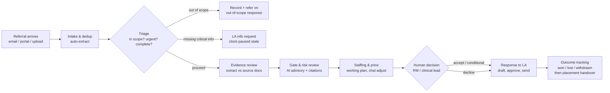
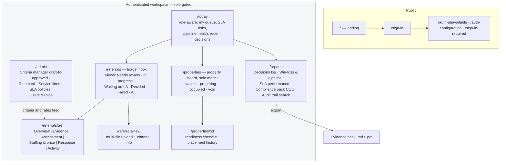
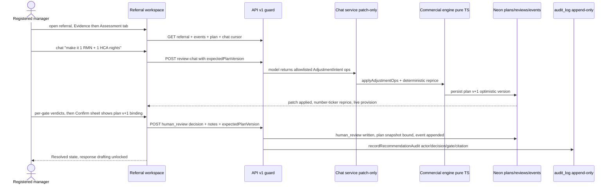
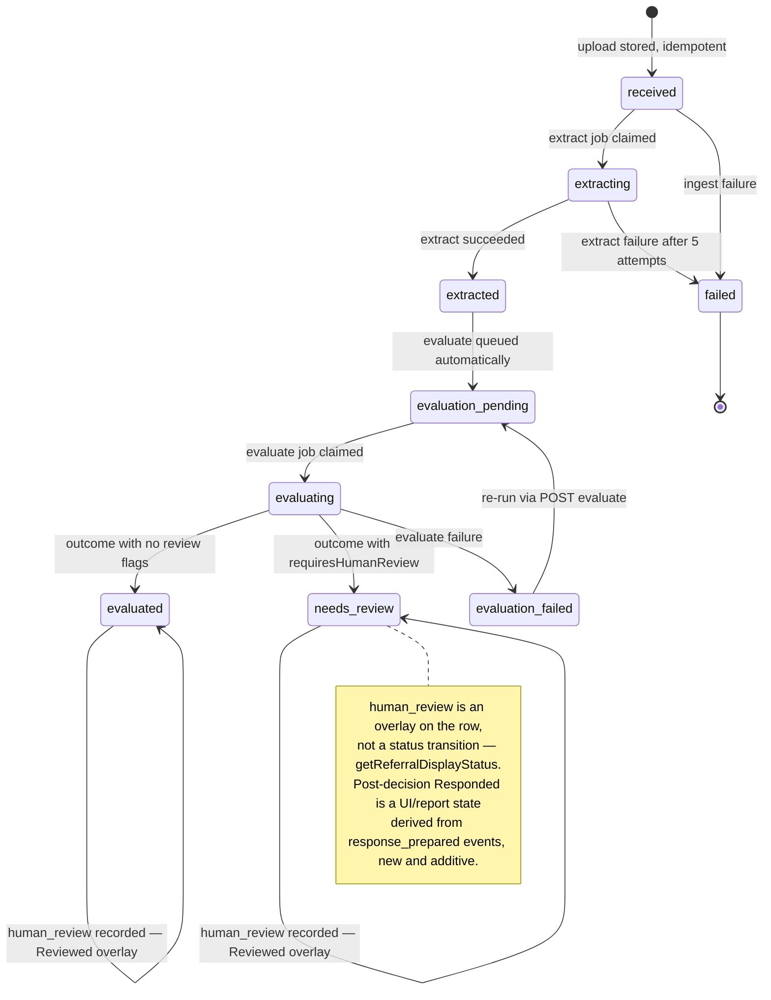
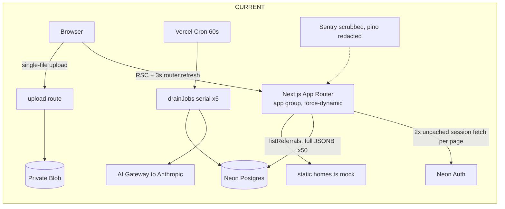
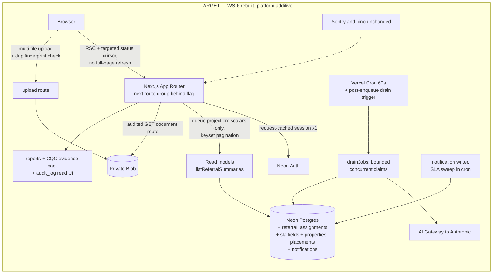

# Service-Referral UI Rebuild & App Optimization Plan

**Task:** sr-plan-f3 (independent draft F3 — parallel-planner protocol)
**Date:** 2026-07-13
**Repo:** `service-referral` @ `7cd2d10` (detached worktree)
**Author:** Claude crewmate (planning task — no product code was changed)

---

## 0. Executive summary

The current UI is a competently-built implementation of the wrong product surface. It renders pipeline state and AI output; it does not support the *job* — a regulated care provider deciding, quickly and defensibly, whether to take a placement referral, at what staffing model, and at what price. The audit below (14 annotated screenshots) shows the queue cannot prioritise, the detail page asks reviewers to confirm decisions **without ever showing them the evidence** (extracted record, source document, or the 22 provenance anchors it advertises), an out-of-scope Ofsted children's referral gets the same "confirm Accept-conditional" UI as an in-scope adult one, and a zero-confidence stub is rendered as a green **Accept** — a textbook automation-bias trap. The occupancy board models multi-bed group homes, which is not Muve's business: Muve places people into **one-bedroom (or two-bedroom person + staff) solo settings**, a captain-confirmed constraint that also invalidates the current semantics of at least one decision gate.

**The recommendation, in one paragraph.** Rebuild WS-6 from scratch as an evidence-first *decision workspace* (working name: **Clearline**) in a new route group behind a cookie flag, on **shadcn/ui + Tailwind v4 + Radix** with an OKLCH token system, person-first records, a triage inbox with SLA and claim/assign semantics, a three-pane referral detail that finally uses the `sources[]` provenance contract to show evidence next to every gate, a decision rail engineered against rubber-stamping (calibrated confidence bands, no pre-selected verdicts), a per-property occupancy board built for solo placements, and a WS-8 reporting surface aligned to the CQC assessment framework. Everything below WS-6 (contracts, evaluation, jobs, security, audit) stays frozen; the backend work in this plan is additive (read-model projection, pagination, properties tables, SLA fields, notifications). Phase 1 proves the design direction on the triage inbox + referral detail in ~3 weeks of PR-sized increments with visual regression from day one.

**Ten highest-leverage findings** (detail in §1 and §8):

| # | Finding | Severity | Evidence |
|---|---------|----------|----------|
| 1 | Reviewers confirm decisions without seeing the extracted record or source document; provenance is a dead-end count ("Source count 22") | Critical (trust/safety) | `04/05/07-*.png`, §1.2 |
| 2 | Zero-confidence human-review stub renders as a green **Accept** badge with "Accept" pre-selected in the confirm form | Critical (automation bias) | `14-referral-accept-testla.png` |
| 3 | Queue has no prioritisation that works: no SLA, identical "Review recommendation" action on every row, unreadable 7-dot spine, no filters/search/pagination (silent 50-row cap) | Critical (workflow) | `03-queue-desktop.png`, `src/lib/db/referrals.ts:420-456` |
| 4 | Occupancy models multi-bed homes; Muve's model is solo one-bed placements (staff bedroom ≠ capacity). At least one gate ("capacity", "compatibility/matching") has wrong semantics for this model | Critical (product truth) | `09-occupancy.png`, captain note 2026-07-13 |
| 5 | Out-of-scope (Ofsted/children's) referrals dominate the queue visually co-equal with in-scope work; same confirm flow offered | High | `03-queue-desktop.png`, `04-*.png` |
| 6 | Infrastructure jargon leaks to end users ("Neon-backed job queue", "private Blob", "occupancy data lands via WS-1/WS-5") | High (trust) | `08/10-*.png` |
| 7 | `listReferrals()` ships full `extract`+`recommendation` JSONB per row for a page needing ~10 scalars; 3s `router.refresh()` polling storm re-runs it for every open tab | High (perf/cost) | Explore agent map §5/§8 |
| 8 | Session is fetched from Neon Auth upstream **twice per page render**, uncached | High (perf) | `src/app/(app)/layout.tsx:49` + per-page calls |
| 9 | Upload is single-file only despite `sources[]` contract and a pipeline that already handles multiple documents; real referrals arrive as email + attachments | High (product) | `upload/route.ts:92`, Explore §9 |
| 10 | Multi-service-line is blocked on content + product model, not schema: criteria corpus has 14 rules, all `placementType: null`; domiciliary/supported-living referrals evaluate against the same 7 generic rules as complex care | High (strategy) | `src/lib/criteria/corpus.json`, Explore §7 |

**What I did (method).** Read the WS-6 surface, contracts, evaluation engine, service-line config and both migration roots directly; dispatched a read-only Explore agent for a full backend map (lifecycle, schema, job pipeline, N+1s — cited as "Explore §n" throughout); fetched the dev env from 1Password, ran the dev server on :3001, signed in and walked every screen **view-only** in an isolated browser session (no mutations; shared dev DB untouched), capturing 14 screenshots to `/Users/leebarry/firstmate/data/sr-plan-f3/screenshots/`; researched care-sector UX (Birdie, Log my Care, Nourish), review-queue and human-in-the-loop oversight patterns, and the CQC assessment framework via Exa; verified Tailwind v4/shadcn theming via Context7; loaded and applied the four design-craft skills (emil-design-eng, apple-design, improve-animations, animation-vocabulary).

**Note for cross-review:** where I make a judgement call I say so and give the rejected alternative. The three decisions most worth attacking in critique: (a) dropping the serif "Civic Slate" display face for a single-family sans system, (b) tab-based referral detail instead of one long scroll, (c) keeping Vercel Cron (with an on-demand drain trigger) instead of moving to Vercel Queues.

---

## 1. UI audit — what is actually wrong, with evidence

All screenshots live in `/Users/leebarry/firstmate/data/sr-plan-f3/screenshots/`. Dev server `localhost:3001`, admin session, 1440×900 and 375×812, light + dark. The current UI implements the "Civic Slate" direction in `docs/ui-redesign.md` — this audit treats that as the baseline being replaced, not a straw man.

### 1.1 Queue (`03-queue-desktop.png`, `13-queue-dark.png`, `11-queue-mobile.png`)

The queue is the operational heart and it fails at triage — the one thing it is named for:

- **No real prioritisation.** Sort order is "time-critical first, then insertion order" (`queue/page.tsx:110-115`). With zero time-critical rows, the order is arbitrary. There is no SLA clock, no age indicator beyond a `13/07/2026` date, no risk ranking. A referral "needed by ASAP" (free-text `dateRequired`) looks identical to a routine one.
- **The "Required action" column is dead weight.** All six rows read "Review recommendation / Needs human review". A column that says the same thing on every row carries zero information — it exists because the *status machine* has states, not because the *user* has different actions. The review-queue pattern literature is explicit that rows must expose *why this item is queued* and *what makes it different* (uxpatternsguide.com/patterns/review-queue: claim, assign, skip, escalate, SLA-at-risk, stale states — none of which exist here).
- **The Evidence Spine is illegible at queue size.** Seven 10px dots, six green one blue, identical on every row (`evidence-spine.tsx` compact mode). It reads as decoration. Signature elements must earn their space; this one communicates nothing a status chip wouldn't.
- **Out-of-scope work is visually co-equal.** Five of six rows are **Ofsted children's referrals** (ages 16–17) under a banner that says "Active service line: adult complex care (CQC)". They carry the same action badge and the same "Open →  confirm" affordance as in-scope work. The only Ofsted demotion exists on the detail page as a banner. The queue must segregate or de-rank out-of-scope intake (see §5.1).
- **Duplicate blindness.** Four rows are "Essex County Council · MH · age 16" — almost certainly the same referral uploaded four times (the upload form already computes a SHA-256 fingerprint per file, `upload-form.tsx:66-78`, but nothing surfaces "possible duplicate of…"). A triage surface that can't see duplicates creates double-work and double-responses to the same LA.
- **Stat cards are noise.** Five cards; four read 0. On mobile (`11-queue-mobile.png`) they push the first actual referral ~2.5 screens down. Stats that are almost always zero belong in an overflow/analytics surface, not above the fold of the work queue.
- **Silent truncation.** `listReferrals()` caps at 50 with no pagination anywhere in UI or API (Explore §5). The 51st referral is unreachable and, worse, *invisible* — no "showing 50 of N".
- **Identity is dehumanised and inconsistent.** "Referral 8cdba448" vs "MH - age 16". These are people. Person-first, privacy-aware naming (initials + age + LA, with a stable human reference like `MUV-0142`) is both kinder and more scannable than UUID fragments.

### 1.2 Referral detail — the evidence gap (`04`, `05`, `06`, `07`, `08`, `12`, `14`)

- **The evidence is missing from the "Referral evidence" page.** The page shows the AI's *conclusions* (summary, gates, staffing, price) but never the *inputs*: no extracted-record view (clinical needs, risk/behaviour, staffing signals, funding — all in `ReferralExtract`), no document viewer, no way to open the PDF the decision came from. "Provenance" is three dead-end metrics — `Source count: 22` with no way to see any of the 22 (`07-*.png`). The contract carries `sources[]` with `documentId`/`page`/`field` per extracted value precisely so the UI can anchor claims to evidence — it is unused. Every serious HITL oversight pattern treats evidence anchors as the antidote to hallucination and the basis of trust (Sentinel/Probabilistic-UI: "every claim either anchors to an EvidenceLink… or renders *No source cited*"; Springer "meaningful oversight": verification must be cheaper than re-solving the task). Today a conscientious reviewer must re-read the source PDF outside the product — the tool saves them nothing.
- **Rubber-stamp mechanics.** The confirm form pre-selects the AI's decision in the dropdown, reviewer name is a free-text box, and nothing requires having looked at a single gate before pressing the primary blue "Confirm review". Research is blunt about this failure mode: approve/reject must be structurally neutral, and finalisation should require having encountered the supporting evidence (reloadux HITL patterns; versions.com "optical honesty" Tier-3 deliberate states; Human Layer Architecture override-with-cognitive-forcing). Worse —
- **The stub-Accept trap (`14-referral-accept-testla.png`).** For a referral where evaluation short-circuited ("Insufficient information to evaluate — human review required", confidence 0%, every gate `not_assessed`), the UI still shows a green **Accept** chip and pre-selects **Accept** in the confirm form. That is the engine's internal stub leaking into the UI as advice. `RecommendationResult` has no "needs review" decision by design — the UI is required to gate on `requiresHumanReview` (CLAUDE.md, workstreams.md) and materially fails the spirit of that rule here. This one screen could produce a wrongly-confirmed acceptance of an un-assessable referral.
- **Layout squeezes the content and duplicates chrome.** At 1440px: 248px nav rail + 220px lifecycle/gates rail + 340px action rail leaves a ~500px centre column for the actual work (`05-*.png`). The left rail repeats the lifecycle (all-green, zero information post-completion) and repeats the gate list that the main column *also* renders as a table. The commercial answer — "2 HCA, £8,813.08/wk" — the best moment on the page (`06-*.png`) — is ~2,500px below the fold.
- **Ofsted referrals get the standard confirm flow.** An out-of-scope 17-year-old's referral shows an amber banner, then offers the exact same "Confirmed decision: Accept - conditional / Confirm review" flow as in-scope work (`04-*.png`). Out-of-scope should have its own terminal action ("Record as outside service line / refer on / decline as out-of-scope"), not the standard accept path.
- **Debug and jargon strings in the UI.** "[DRAFT/UNVERIFIED - synthetic skill-mix policy] Parsed ratio…" as visible workings (`06`); "No home of this regime is set up yet - occupancy data lands via WS-1/WS-5" in the LA response drafter (`08`); "The document is stored and queued for extraction through the Neon-backed job queue" as user-facing status copy. Users are registered managers, not the WS-5 crew. (Log my Care's design team calls this exactly: copy must "describe the outcome for their staff, not the mechanism behind it".)
- **Unknowns rendered as loudly as knowns.** "GROSS CONTRIBUTION —", "LOSS-MAKING Unknown", "OFFERED FEE Not supplied" get equal-weight metric tiles (`06`). Missing-information display should recede; the ten "missing information" boxes (`07`) are inert — no grouping by gate, no "add to LA request" action, no link to the response drafter that exists two cards below.
- **Citation display is inspection-hostile.** "Children's Homes (England) Regulations 2015, reg. 12 (protection of children)" wraps over six lines in a cramped table cell; there is no link, no rule text on hover, no way to see the rule the criteria corpus actually matched (`05`).

### 1.3 Occupancy (`09-occupancy.png`) — wrong model, mock data

- Occupancy is a static in-memory mock (`src/lib/referrals/homes.ts:23`, "ponytail" comment) rendered as capacity bars: "6 / 8", "20 / 20 · 0 vacancies". **This models group residential homes.** Per the captain (mid-task note, 2026-07-13): Muve's placements are usually **one-bedroom homes**; two-bedroom homes exist so **staff** have a bedroom — the second bedroom is *never* a second placement. A percent-full bar is meaningless when every unit is 0-or-1 people; and a "capacity" gate that reasons about "registered maximum number of children and current bed vacancy" (visible in gate rationale, `05-*.png`) is reasoning about the wrong world. §5.5 designs the property-first board; §8.3 and §10 handle the gate-semantics change the captain asked for ("some kind of gate in the system we need to remove").
- The same "Modelled fit only. Confirm live occupancy…" sentence repeats as a table column on every row — a column with one value is a caption, not a column.
- Fake CQC "Location ID 1-987654321" invites false confidence; mock names should be unambiguous fixtures.

### 1.4 Upload (`10-upload.png`) and shell

- **Single file only** — the input has no `multiple`, the route reads exactly one `formData.get("file")` (Explore §9). Real LA referrals are an email + 2–5 attachments; the WS-2 funnel and `sources[]` contract already support multi-document. This is the single biggest ingestion product gap.
- "Accepted file types are checked by the upload route" — copy written from the code's point of view.
- The shell: three nav items + a "New referral" button in a 248px rail (nav is ~15% utilised); Q/U/O letter-block markers read as placeholder art; the amber Advisory banner renders on **every** page in the group, permanently, competing with actual amber warnings ("banner blindness" — by the third page it is invisible; on the detail page it stacks with a *second* amber banner for Ofsted).
- Dark mode (`13-queue-dark.png`) holds structurally (token-paired), though several tinted chips fall below AA contrast and the dark surface hue drifts green.

### 1.5 Motion & feel (improve-animations recon, applied to `globals.css` + components)

The motion layer is minimal and mostly sane (160ms `settle-in`, honest indeterminate progress, `prefers-reduced-motion` kill-switch at `globals.css:240-253`). Issues, in the audit format the skill prescribes:

| # | Severity | Location | Finding | Fix summary |
|---|----------|----------|---------|-------------|
| 1 | HIGH | `globals.css:240` | Reduced-motion nukes **all** transitions to 0.01ms including opacity fades that aid comprehension | Replace transform/motion animations with 150–200ms cross-fades; keep opacity/color transitions (apple-design §14) |
| 2 | MED | `.motion-pulse` on current spine step | 1.8s infinite pulse on every queue row's "current" dot ≈ ambient noise ~0.55Hz across a 50-row table | Pulse only on the focused/hovered row's spine, or drop for a static "current" treatment |
| 3 | MED | Buttons (`primitives.tsx`) | No `:active` press feedback anywhere | `transform: scale(0.97)` 100–160ms ease-out on all pressables (emil §buttons) |
| 4 | MED | `review-chat.tsx` sheet | Mobile bottom sheet has no drag-to-dismiss, no spring, appears/disappears | Gesture-driven sheet (Vaul or Radix Dialog + `motion` springs, damping 0.8/response 0.3), velocity dismissal |
| 5 | LOW | `transition` (bare) on nav links | Un-scoped `transition` property | Scope to `transition: background-color, border-color, color 150ms ease-out` |
| 6 | LOW | Fee/price values | Values swap with no continuity when chat repricing patches the plan | Number-ticker on `--font-data` tabular-nums (animation-vocabulary: *Number ticker*), 200ms |

There are near-zero animations today, which is better than bad animations — the rebuild adds a *small* purposeful vocabulary (§4.5), not more motion.

### 1.6 Accessibility spot-check (against WCAG 2.2 AA)

Genuine strengths to keep: skip-link, `:focus-visible` halo, 44px touch floors, `aria-current` on nav/steps, `sr-only` spine labels, tabular-nums for data. Gaps: amber-on-tint chips ~3.2:1 contrast (fails 1.4.3); spine/status meaning carried by colour alone at compact size (1.4.1); no `aria-live` announcements when `ProcessingRefresh` mutates status (4.1.3); review form lacks error summary/focus management on failed submit (3.3.1/2.4.3); table headers not `scope`d; the 3s `router.refresh()` re-render can yank scroll position mid-read (2.2.2 adjacent). The rebuild bar is §4.6.

---

## 2. Users and journeys

### 2.1 Who touches a referral

| Persona | Role (RBAC today) | Jobs-to-be-done | Frequency |
|---|---|---|---|
| **Triage coordinator** (office/referrals team) | `reviewer` | Get new referrals in (email/portal/upload), spot duplicates, chase missing info, keep SLA clocks green, route to the right manager | All day, every day |
| **Registered manager (RM)** | `reviewer`/`manager` | Judge fit against registration + team capability, confirm/override decision, own the CQC-defensible rationale | Several/week, deep sessions |
| **Clinical lead / nurse assessor** | `reviewer` | Assess acuity, nursing tasks, DoLS/restraint implications; validate staffing model (esp. complex care) | Complex-care referrals |
| **Area / ops manager** | `manager` | Cross-service view: which property/team can take this; occupancy strategy; staffing headroom across services | Daily glance, weekly deep |
| **Finance / commissioning** | *(no role today — gap)* | Rate adequacy, margin, top-up fragility, framework vs spot; win/loss and pipeline value reporting | Weekly + per high-value referral |
| **Director / nominated individual** | `viewer`+ | Portfolio view: conversion, declines by reason, regulatory exposure, evidence packs | Monthly, inspection-time |
| **Admin** | `admin` | Users/roles, criteria & rate-card management, service-line config | Rare |

Open question for the captain (§10): finance today would need `viewer` (sees everything incl. clinical detail) — a dedicated `finance` role seeing commercial + metadata but not full clinical narrative is a plausible data-minimisation win.

### 2.2 The three service lines are different products wearing one contract

All three lines are **CQC** (the `regime` axis distinguishes CQC vs Ofsted, *not* the business lines — `placementType` does). This is the pivotal modelling insight for multi-service-line: the UI and criteria must become **placement-type-aware**, not regime-aware.

| | **Domiciliary care** | **Supported living** | **Complex care** (active today) |
|---|---|---|---|
| Referral shape | Hours/visits: "4 visits/day, 45 min, double-up mornings" | Tenancy + support package: core hours + background/on-call, housing status | High-acuity package: 2:1, waking nights, nursing tasks, DoLS |
| Unit of capacity | **Rota headroom** in a geographic run | **Property readiness** (tenancy, furnishing, compliance) + core team | **Property + specialist team** (solo, 1-bed model) |
| Commercial | £/hour by visit type; travel; ECM compliance | Weekly core + commissioned hours; housing benefit split | Weekly package fee vs staffing cost build-up (current engine) |
| Key gates emphasis | scope, capability, **staffing headroom (rota)**, funding | scope, **property/capacity**, compatibility (shared settings only), funding | scope, capability (acuity), **staffing headroom**, funding |
| Decision speed | Hours–days | Weeks (property pipeline) | Days (often urgent/crisis) |

### 2.3 Critical path (all lines): referral → response



Per-line variants (what changes, not re-drawn): domiciliary inserts **rota feasibility check** between E and F and its response includes start-date/run assignment; supported living inserts **property match & readiness** (void → preparing → ready) which can hold G open for weeks — needs a "conditional on property" state; complex care is the current flow plus clinical-lead co-sign for high-acuity (two-person confirm — roadmap §9, phase 4).

### 2.4 Where the current UI fights each journey

- Triage coordinator: no claim/assign (two people open the same referral invisibly), no duplicate flags, no LA-chase workflow (missing-info list is inert), no SLA.
- RM: cannot see evidence (§1.2); cannot delegate "get me the rota position"; confirm binds plan version (good!) but the binding is invisible fine print.
- Clinical lead: no clinical view — needs/risk/meds are locked inside an extract JSONB never rendered.
- Area manager: occupancy page is fiction (§1.3).
- Finance: nothing — pricing lives only inside each referral; no pipeline value/win-loss anywhere.

---

## 3. Information architecture

### 3.1 Principles

1. **The inbox is the home** for daily users; a role-aware "Today" panel summarises only what needs *me*, now (never five stat cards of zeros).
2. **One referral = one workspace** with stable tabs (Overview / Evidence / Assessment / Staffing & price / Response / Activity) — not one 6,000px scroll.
3. **Service line is a first-class filter**, not a hardcoded brand ("Complex-care referrals" header dies; Muve runs three lines).
4. **Properties (not "occupancy %") are the capacity surface** — solo placements, binary states.
5. **Reporting and admin exist** (WS-8 has no UI today; criteria/rate-card management has no UI today).

### 3.2 Sitemap



Global chrome: left rail (Today / Referrals / Properties / Reports / Admin), **service-line switcher** (All · Complex care · Supported living · Domiciliary) pinned above the rail, **⌘K command palette** (jump to referral by ref/LA/initials, actions), notification bell (SLA breaches, assignments, pipeline failures). Mobile: bottom tabs Today / Referrals / Properties + overflow.

### 3.3 Navigation model & role-based views

| Route | viewer | reviewer | manager | admin | finance (proposed) |
|---|---|---|---|---|---|
| /today, /referrals, detail read | ✓ | ✓ | ✓ | ✓ | metadata + commercial only |
| Confirm decision, chat, plan edit | — | ✓ | ✓ | ✓ | — |
| /referrals/new (upload) | — | ✓ | ✓ | ✓ | — |
| /properties write | — | — | ✓ | ✓ | — |
| /reports | own scope | ✓ | ✓ | ✓ | ✓ (commercial) |
| /admin criteria & rates | — | — | criteria | ✓ | rates read |
| /admin users | — | — | — | ✓ | — |

Role gating reuses `requirePermission()`/`can()` unchanged; the two parallel guard implementations (pages vs API) get consolidated behind one helper during the rebuild (Explore §10).

The nav rail also carries the **environment truth strip** (replaces the every-page amber banner): a one-line, low-contrast footer in the rail — "Advisory tool · human decisions only" — with the *contextual* advisory notice moving into the decision rail where it is load-bearing (§5.3).

---

## 4. Design system from the ground up — "Clearline"

A named, replaceable system. Working name **Clearline**: the product's one promise is a clear line from evidence to decision. Civic Slate's genuine strengths are retained as *decisions*, not leftovers: light-first, token-paired dark mode, tabular-nums data, evidence-forward identity. What changes: warm-paper + serif "registry" styling gives way to a cooler, quieter clinical surface with weight-driven hierarchy — the current serif display + beige reads municipal rather than premium-clinical, and the emotional goal of this tool is *calm competence under scrutiny*.

> Rejected alternative: evolving Civic Slate in place (keep serif display, re-tune ambers). Rejected because the captain's verdict is a ground-up rebuild, the serif/paper pairing is the most identifiable "old UI" trait, and a rebuild that looks 80% the same will not read as one. The Evidence Spine *concept* survives (§4.7) — reborn at sizes where it can actually communicate.

### 4.1 Foundations: color (OKLCH, token-paired light/dark)

Authored as shadcn-convention CSS variables, exposed through Tailwind v4 `@theme inline` (verified pattern: shadcn/ui Tailwind-v4 docs — `:root`/`.dark` OKLCH vars + `@theme inline` registration; components ship React-19-ready with `data-slot` attributes). Class-based `.dark` (next-themes) replaces `prefers-color-scheme`-only so users get a toggle; system remains the default.

**Neutrals (surface system)** — cool gray ramp, oklch hue ~250, chroma ≤0.01:

| Token | Light | Dark | Use |
|---|---|---|---|
| `--background` | `oklch(0.985 0.002 250)` | `oklch(0.16 0.01 250)` | page |
| `--surface` | `oklch(1 0 0)` | `oklch(0.205 0.01 250)` | cards, table shells |
| `--surface-raised` | white + shadow | `oklch(0.24 0.012 250)` | popovers, rails |
| `--foreground` | `oklch(0.21 0.015 255)` | `oklch(0.96 0.005 250)` | primary text |
| `--muted-foreground` | `oklch(0.50 0.015 255)` | `oklch(0.72 0.01 250)` | secondary text |
| `--border` | `oklch(0.90 0.005 250)` | `oklch(0.32 0.01 250)` | hairlines |

**Brand/action:** `--primary: oklch(0.51 0.13 255)` (confident clinical blue, ~#2F5FA8 lineage of Registry Blue, AA on white); dark: `oklch(0.72 0.11 255)`.

**Semantic families — each a triple (solid / tint / on-tint) so chips can pass AA (fixes §1.6):**

| Family | Hue anchor (light solid) | Meaning |
|---|---|---|
| `--accept` | `oklch(0.52 0.10 165)` green | accept, complete, property ready |
| `--conditional` | `oklch(0.60 0.12 75)` amber | conditional, needs review, draft/unverified |
| `--decline` | `oklch(0.53 0.16 25)` red | decline, failed, breach |
| `--info` | primary-tinted | pipeline/in-progress |
| `--risk-1..4` | stepped 75→25 hue ramp | risk: low / medium / high / critical |
| `--confidence-high/likely/unsure/low` | green→amber→red + **pattern** | calibrated bands (§5.3); `unsure/low` additionally carry a dot/hatch glyph so meaning never rides on colour alone |

**Domain palettes:** service lines — complex care `oklch(0.50 0.10 255)` indigo-blue, supported living `oklch(0.55 0.09 195)` teal, domiciliary `oklch(0.58 0.10 130)` green-cyan; Ofsted/out-of-scope stays plum but only ever appears on out-of-scope chrome. CQC five key questions (reporting surface only): Safe teal / Effective blue / Caring rose / Responsive amber / Well-led violet — used as category accents in the compliance pack, never as status colours (avoids collision with decision semantics).

### 4.2 Type

- **UI + display: Inter (variable, OFL)** via `next/font` — one family, hierarchy from weight/size/tracking (apple-design §15: tighten large sizes, body ~0; respect user text-size by using rem everywhere). Display roles use `font-feature-settings: "ss01"` off, `-0.02em` at ≥24px.
- **Data: IBM Plex Mono stays** (continuity; excellent tabular figures) — all money, refs, timestamps in `font-data` with `font-variant-numeric: tabular-nums`.
- Scale (rem): 12 caption · 13 dense-table · 14 body · 16 emphasis · 18 h3 · 22 h2 · 28 h1 · 36 hero-number. Line-heights 1.5 body, 1.2 headings, 1.1 hero numbers.

> Rejected: keeping Source Serif 4 display (municipal register aesthetic — deliberate break, above); Geist (fine, but Inter's UK healthcare familiarity and grade range win on neutrality).

### 4.3 Space, radius, elevation

4px base grid; component paddings 8/12/16/24; page gutters 16 (mobile) / 24 / 32. Radius: 6 control · 10 card · 14 sheet · 999 pill (slightly tighter than today = more instrument, less bubble). Elevation: hairline-first (borders carry structure), two shadow steps only (`--shadow-1` subtle, `--shadow-2` overlay) — translucency + `backdrop-blur` reserved for sticky chrome and sheets (apple-design §12: translucent functional layers; never stacked).

### 4.4 Component foundation — the concrete recommendation

**shadcn/ui on Tailwind v4 + Radix primitives**, installed via CLI into `src/components/ui`, themed entirely by Clearline tokens; `new-york` style baseline; `sonner` for toasts; TanStack Table headless under a `DataTable` for the inbox (sorting/filtering/column visibility/virtualised rows); `cmdk` command palette; **Vaul** for the mobile decision/chat sheet (gesture-driven, spring-based, the one place true gesture physics matters); `motion` (Motion One successor) only where CSS can't express intent (sheet springs, number ticker); Recharts (shadcn charts recipes) for reports/occupancy visuals — chart styling to follow the `dataviz` skill at build time.

Why: repo is already Tailwind v4 + React 19 (shadcn's current target — OKLCH theming, `data-slot`, no forwardRef); code-ownership model (components live in-repo — matches the project's contracts-first, no-magic culture); Radix a11y baseline is the fastest route to the §4.6 bar; zero runtime CSS-in-JS.

> Rejected: **Base UI** (younger catalog; we'd hand-roll table/command/date pieces shadcn already has); **Mantine/HeroUI/MUI** (design-language lock-in, heavier runtime, harder to make feel bespoke); **extending the 9 bespoke primitives** (no dialog/popover/select/tooltip/command/tabs today; re-deriving Radix-grade a11y by hand is weeks of undifferentiated work).

### 4.5 Motion language (emil-design-eng + apple-design applied)

Vocabulary is small, purposeful, and codified as tokens: `--ease-out: cubic-bezier(0.23,1,0.32,1)`, `--ease-in-out: cubic-bezier(0.77,0,0.175,1)`, `--dur-fast: 120ms`, `--dur-base: 180ms`, `--dur-sheet: 280ms`.

| Moment | Treatment | Why (frequency-governed) |
|---|---|---|
| Row hover / nav | color/bg 120ms `ease` only | seen 100s×/day → near-zero motion |
| Press feedback | `scale(0.97)` 120ms ease-out on all pressables | feedback, not decoration |
| ⌘K palette, tab switches | **no animation** | keyboard-initiated = instant (emil hard rule) |
| Popover/dropdown | 150ms ease-out, `scale(0.97)→1` + fade, origin-aware from trigger | spatial anchoring |
| Decision sheet (mobile) | Vaul spring, damping ~0.8/response 0.3, drag-dismiss w/ velocity projection | gesture-driven surface deserves physics |
| Gate rows on first evaluation reveal | 30–50ms stagger, opacity+4px rise, **once per referral** | the "evidence settles in" signature — rare, meaningful |
| Fee/price change (chat repricing) | number ticker, 200ms, tabular-nums | continuity for the most-watched value |
| Lifecycle progress | width 240ms ease-out on real stage change; indeterminate shimmer while running | honest progress, kept from today |
| Status transitions (row moves list) | 180ms cross-fade + height collapse | prevents jarring disappear |
| Reduced motion | cross-fades only; zero transforms; springs → fades | apple-design §14 done properly (not the current nuke-all) |

### 4.6 Accessibility bar — WCAG 2.2 AA as acceptance criteria

Every rebuild PR ships against this checklist: text/UI contrast 4.5:1/3:1 including chip tints (token pairs pre-validated); target size ≥24px always, ≥44px touch; visible focus (2px ring + halo, never suppressed); status = colour + icon/text everywhere (spine, chips, bands); `aria-live="polite"` region announces pipeline stage changes and chat repricing; full keyboard path: inbox roving-tabindex, `o` open / `c` claim / `/` search / `⌘K` palette; forms: error summary + `aria-describedby` + focus-to-first-error; no scroll hijack on background refresh (targeted revalidation replaces `router.refresh()` where focus/scroll could move); dialogs/sheets trap + restore focus (Radix default); e2e axe pass (`@axe-core/playwright`) on the five key screens in CI.

### 4.7 Identity: the Evidence Spine, reborn

The segmented-spine brand idea survives where it can breathe: (a) the BrandMark stays; (b) referral detail header carries a **full-width five-segment spine** (Received → Extracted → Evaluated → Decided → Responded) with labels, replacing both duplicated rails; (c) queue rows get a **single status chip + SLA ring** instead of seven dots — the ring (a 16px circular arc that depletes as the SLA clock runs) becomes the new at-a-glance signature: evidence *and* urgency in one glyph.

---

## 5. Key screens, specified

Component trees name shadcn/ui pieces (`ui/*`) and new product components (`app/*`). Wireframes are desktop-first; every screen has a defined 375px stack (noted briefly).

### 5.1 Triage inbox — `/referrals`

**Purpose:** answer "what needs a human now, in what order?" in <5 seconds; give coordinators claim/assign; keep out-of-scope and duplicates from polluting attention.
**Trust goal:** *command* — the calm of a well-run control room; nothing hidden, nothing shouting.

```
┌ Toolbar ──────────────────────────────────────────────────────────────────┐
│ [Needs review 6] [In progress 2] [Waiting on LA 3] [Decided] [Failed 1]   │
│ views (counts live)              [Line: All ▾] [LA ▾] [Urgency ▾] [🔍 /]  │
├────────────────────────────────────────────────────────────────────────────┤
│ ⬤SLA  Person & LA           Line        Needed by   Recommendation  Owner │
│ ◔ 4h  JD · 34 · Denbighshire CQC·Complex  ASAP ⚠     Conditional ·68% —claim│
│ ◑ 2d  MH · 16 · Essex        Out of scope —           needs referral  KB   │
│ ◕ 6d  TL · —  · Test LA      Complex      —           ⚠ No recommendation │
│   ↑ risk-ranked: SLA remaining × urgency × acuity; out-of-scope demoted    │
│   [possible duplicate ×3 — review together] grouped row                    │
├────────────────────────────────────────────────────────────────────────────┤
│ showing 1–25 of 143 · [load more]                  last sync 09:41:22 ⟳    │
└────────────────────────────────────────────────────────────────────────────┘
```

Definitive behaviours: **views** are queryable states, not stat cards (counts in the tabs); default sort = SLA-remaining ascending within urgency band (risk-ranked triage per uxpatternsguide review-queue pattern: SLA-at-risk, claim, assign, escalate as first-class); **SLA ring** per §4.7 with `--risk-*` colouring and absolute time in tooltip; **claim/assign** (`app/OwnerCell`: avatar or "claim" ghost button; optimistic, `referral_assignments` additive table §8.2); **out-of-scope** rows demoted to bottom of every view with plum left-edge and "record outside service line" as their only action; **duplicate grouping** by upload fingerprint (`possible duplicate` chip expands a group row); **no recommendation** states show amber "⚠ needs human review — insufficient information", never a decision badge (kills §1.2 stub-Accept at the queue level too); pagination is real (keyset, §8.1); mobile = card stack of the same row model, views as horizontal chips, FAB upload.

Component tree (sketch):

```
app/ReferralsInboxPage (RSC)
├─ app/InboxViews (ui/tabs + live counts)
├─ app/InboxFilters (ui/select ×3, ui/input search, ui/command "/" affordance)
├─ app/ReferralTable (client; TanStack + ui/table)
│  ├─ app/SlaRing (svg arc + tooltip)
│  ├─ app/PersonCell (initials·age·LA, ref MUV-xxxx, dup chip)
│  ├─ app/LineBadge · app/RecBadge (calibrated: decision+band or "needs review")
│  ├─ app/OwnerCell (claim/assign, ui/avatar, ui/dropdown-menu)
│  └─ app/RowActions (open, escalate, request-info)
└─ app/LoadMore (keyset cursor)
```

### 5.2 Referral detail — `/referrals/[ref]` (the flagship)

**Purpose:** one workspace where a RM can *verify* the AI instead of re-doing its work (solve–verify asymmetry, Springer meaningful-oversight framing) — evidence, assessment, staffing and response in stable tabs with the decision rail always present.
**Trust goal:** *defensibility* — "I could show this page to a CQC inspector."

```
┌ Header ────────────────────────────────────────────────────────────────────┐
│ JD · 34 · Denbighshire CC        MUV-0142 · Complex care · ⚠ ASAP · ◔ 4h   │
│ Spine: Received ✓ — Extracted ✓ — Evaluated ✓ — Decided ● — Responded ○    │
├──────────────┬──────────────────────────────────────────┬─────────────────┤
│ TABS         │  (tab content)                           │ DECISION RAIL   │
│ Overview     │  Overview: person snapshot · needs/risk  │ Advisory:       │
│ Evidence     │  headlines · funding ask · working plan  │  Conditional    │
│ Assessment   │  hero (2 HCA · £8,813/wk DRAFT) ·        │  band: Unsure   │
│ Staffing &   │  missing-info chips (n=10 → actions)     │  68% on hover   │
│   price      │                                          │ triggering gate │
│ Response     │  Evidence: extract fields, each value    │  + citation →   │
│ Activity     │  with [source] chip → opens DocViewer    │ rule popover    │
│              │  split-pane at page N, quote highlighted │ ─────────────── │
│              │  Assessment: 7 gate cards, status,       │ [Review gates]  │
│              │  rationale, citation→rule text popover,  │ verdict per     │
│              │  evidence anchors per gate               │ gate ✓/✗ then   │
│              │  Staffing: §5.4 advisor                  │ [Confirm…] ──►  │
│              │  Response: §5.6 drafter                  │ sheet w/ plan   │
│              │  Activity: timeline + audit entries      │ binding shown   │
└──────────────┴──────────────────────────────────────────┴─────────────────┘
```

Layout: `minmax(0,1fr)` content + 360px rail; tabs are URL-addressable (`?tab=evidence`) so links in chat/notifications deep-link; left duplicated rails from today are deleted. The **Evidence tab is the new capability**: renders the full `ReferralExtract` grouped exactly as the contract groups it (metadata / person / placement request / clinical needs / risk & behaviour / staffing signals / matching / funding), every extracted value carrying a `[p.4]`-style source chip from `sources[]`; clicking opens `app/DocViewer` (private-Blob fetch via a new authorised, audited `GET /api/v1/referrals/:id/document` route — additive) split-pane with the quote highlighted. Bidirectional: hovering a gate's evidence anchor highlights the extract field it used (Probabilistic-UI evidence-anchor pattern). Ofsted/out-of-scope: the decision rail is replaced by the out-of-scope action card (record + referral-on note), standard confirm not rendered.

Processing states: while `status ∈ {received…evaluating}`, tabs render skeletons + the header spine is the honest progress surface (events cursor polling per §8.1 — no full-page refresh). `evaluation_failed` → rail carries the re-run action with reason code.

### 5.3 Human review & decision flow (the anti-rubber-stamp)

**Purpose:** confirmation that *requires* engagement proportional to consequence, produces an inspection-grade record, and never lets an engine stub read as advice.
**Trust goal:** *accountability without ceremony*.

Mechanics (each maps to a researched pattern):

1. **Calibrated bands, not raw %:** `High / Likely / Unsure / Low` chips (`--confidence-*`), exact number on hover (Sentinel: "calibrated language over percentages; the 73% is one hover away"). Bands derive from `confidence` + `reviewReasons` count.
2. **Optical honesty states:** recommendation card renders as `Draft` (pipeline running), `Reviewable` (evaluated; sources visible), `Resolved` (human-confirmed) variants — visibly different composure (versions.com Draft/Reviewable/Resolved + certainty tokens).
3. **No pre-selected verdict.** Decision control starts empty; "agree with advisory" is one tap but an explicit one. Accept/decline equal visual weight (reloadux: structurally neutral review UI).
4. **Stub honesty:** when `requiresHumanReview` && `confidence === 0` (or reason `regime_missing` etc.), the UI headline is "**No recommendation — insufficient information**" with the reason-code chips; no decision badge exists anywhere on the page (fixes `14-*.png`).
5. **Gate-verdict pass before confirm** for non-accept or `Unsure/Low` bands: the rail walks the 7 gates as a checklist; each needs a ✓ (agree) / ✗ (contest, with note). "Confirm" enables when all gates have a verdict (Sentinel verdict-rail: *accept-all disabled until every claim has a verdict*). For `High`-band accepts, one attestation checkbox suffices — proportional oversight (reloadux; EU-AI-Act-shaped Human Layer Architecture: cognitive forcing at the interface layer).
6. **Plan binding made visible:** the confirm sheet shows exactly what will be bound — "Decision: Accept-conditional · Plan v3 · 1 RMN + 1 HCA · £11,204/wk (DRAFT)" — turning today's fine print into the contract of the act. Stale `expectedPlanVersion` renders an inline diff and re-ask, not a 409 toast.
7. **Override = first-class:** choosing differently from the advisory requires a reason (existing rule) and records `reviewer_decision ≠ advisory` distinctly — feeding §8.5 disagreement telemetry (RAIR/RSR-style trust calibration).
8. **Audit surfacing:** every confirm/override appears in the Activity tab from `audit_log` (WS-7 write path unchanged; a read UI finally exists, §5.7).



### 5.4 Staffing & price advisor (tab)

**Purpose:** turn "2 HCA · £8,813.08/wk" from a static card into an explorable model the RM/finance can trust — provision grid, cost build-up, price sensitivity — while the engine stays deterministic and the model patch-only.
**Trust goal:** *numerical honesty* — every figure decomposable to its formula.

```
┌ Provision (v3 DRAFT) ────────────────┐ ┌ Weekly price build-up ───────────┐
│ Day   ██ 2× HCA        07:00–21:00   │ │ staff cost      £7,491.12 ▸      │
│ Night ██ 1× HCA (wake) 21:00–07:00   │ │  = Σ role·hrs·rate·oncost·abs    │
│ + nursing oversight: none            │ │ property         £412.00 ▸       │
│ [edit mix] [what-if]                 │ │ other             £0.00          │
│ ratio source: "2:1" (LA, p.3) ⚓      │ │ ────────────────────────         │
│                                      │ │ direct cost     £7,903.12        │
│ Chat: "charge 6500 and pay HCA 14"   │ │ fee to go in at £8,813.08        │
│ [chips: set margin · add property…]  │ │ margin 10.3% · not loss-making   │
└──────────────────────────────────────┘ └──────────────────────────────────┘
```

Definitive: shift-pattern visual (day/night bars) replaces the bare "2× concurrent" list; every money line expands (`▸`) to its formula with the DRAFT rate-card values named (kills the debug-string workings of `06-*.png`); ratio provenance anchored to source; chat docks here (desktop) with patch chips, `Vaul` sheet on mobile; unknowns recede into a single "incomplete inputs: offered fee not supplied" ribbon rather than co-equal tiles; per-service-line variants later render visit-run (domiciliary: visits/week × duration × rate) or core+commissioned (supported living) build-ups from the same engine seam (§8.3).

### 5.5 Property board — `/properties` (replaces "Occupancy")

**Purpose:** the real capacity question per the captain's model: *which solo settings can take someone, when*. Binary occupancy, readiness pipeline, staffing bedroom acknowledged.
**Trust goal:** *ground truth* — no modelled fiction, states someone maintains.

```
┌ [All lines ▾]  vacant 3 · preparing 2 · occupied 11 · void 1 ──────────────┐
│ ┌ 12 Meadow View ─────────┐ ┌ 7 Harbour Ct ──────────┐ ┌ Cedar Lodge ────┐ │
│ │ ● VACANT · ready         │ │ ● OCCUPIED since 03/24 │ │ ◐ PREPARING     │ │
│ │ 1-bed · staff room ✓     │ │ 1-bed · staff room ✓   │ │ readiness 4/7 ▸ │ │
│ │ SL · team: Riverside     │ │ CC · JD (MUV-0101)     │ │ target 21/07    │ │
│ │ [match to referral ▾]    │ │ placement summary →    │ │ checklist →     │ │
│ └──────────────────────────┘ └────────────────────────┘ └─────────────────┘ │
└──────────────────────────────────────────────────────────────────────────────┘
```

States: `vacant-ready / preparing (readiness checklist: tenancy, furnishing, compliance, staffing) / occupied / void`. Card = property, not bed; "2-bed (staff)" is a *feature badge*, never capacity 2. "Match to referral" pre-filters vacant-ready by line + location constraints (`avoidLocations` honoured) — feeding the capacity gate context that today's rationale says is missing. Data model is new + additive (§8.2); until it lands, the board ships behind the flag reading a seeded table (never the static mock — the mock dies with the old UI). Domiciliary line shows a different lens: **run/rota headroom** panel (hours available per geographic run per week) — stub in phase 4 until rota data exists (§10 open question).

### 5.6 Response to LA (tab)

Draft generation stays client-side templating (no AI send-path), but becomes decision-aware: accept/conditional/decline templates pull the bound plan (provision label, fee, conditions from conditional gates, missing-info asks), show a **"what will be included" checklist**, copy/download `.md`/`.eml` stub, and log a `response_prepared` event. Missing-info chips from Overview insert directly as numbered asks. (Emailing from the product is deliberately out of scope until DPIA review — §10.)

### 5.7 Reporting & compliance — `/reports` (WS-8 surface)

**Purpose:** make the audit/evidence layer visible: decisions log (filter by line/LA/decision/reviewer, export CSV), win/loss & pipeline value (finance), SLA performance, **compliance pack** — a generated evidence bundle per period mapping decisions to the CQC assessment framework (5 key questions; the pack cites quality-statement categories, e.g. "Governance" under Well-led, and the six evidence categories: people's experience, feedback, observation, processes, outcomes) built on `src/lib/evidence/report.ts` + `audit_log`; **audit trail search** (read-only UI over `audit_log`, actor/date/referral filters). CQC sources: assessment-framework pages (5 KQs, 34 quality statements, 6 evidence categories; scoring 1–4) — the pack mirrors *their* vocabulary so an RM hands an inspector something shaped like the framework.
**Trust goal:** *inspection-readiness as a product feature* (the Birdie/Nourish lesson: evidencing compliance is a headline capability, not an export afterthought).

### 5.8 Settings/admin — `/admin`

Criteria manager: corpus rules listed per regime × gate × placement-type with `draft_unverified → approved` workflow (approve = named clinical lead + timestamp; writes `status` — the flip the whole system waits on); placement-type-scoped rule authoring for the multi-line path (§8.3). Rate card: role rates with `draft_unverified` labelling and effective-dates. Service lines: enable/disable lines (feeds switcher + evaluation scoping). SLA policies: response-time targets per urgency band. Users & roles: Neon Auth remains identity source; this screen maps/audits app roles only.

### 5.9 Upload — `/referrals/new`

Multi-file dropzone (email + attachments as one referral, `sources[]` per file — route change §8.1); channel + LA quick-fields (optional, pre-seeds extract); duplicate pre-check on fingerprints with "looks like MUV-0139 — continue anyway?"; progress = per-file then unified "tracking at MUV-0142" handoff into the inbox row. The "what happens next" panel speaks user language ("We read the documents and draft an assessment for your review — usually within a few minutes").


---

## 6. System views (diagrams)

### 6.1 Referral lifecycle state machine (as implemented — UI must mirror this exactly)

From `src/lib/db/referrals.ts:24-63` + `lifecycle.ts` (Explore §1). The rebuild renders these 9 statuses through one shared presenter (killing today's two divergent label maps, `REFERRAL_STATUS_LABELS` vs `PROGRESS_STATUS_LABELS`).



### 6.2 End-to-end user flow per service line

```mermaid
flowchart TD
    subgraph CC [Complex care — active line]
        c1["Referral: high-acuity package<br/>2:1, waking nights, DoLS"] --> c2["Triage: urgency + acuity rank"]
        c2 --> c3["Evidence review: needs and risk<br/>vs source docs"]
        c3 --> c4["Gates: capability and<br/>staffing headroom emphasised"]
        c4 --> c5["Staffing advisor: shift grid,<br/>nurse role, price build-up"]
        c5 --> c6{"RM + clinical lead<br/>confirm"}
        c6 --> c7["LA response: package offer,<br/>conditions, missing info"]
        c7 --> c8["Won: property match<br/>and placement start"]
    end
    subgraph SL [Supported living — enablement phase 4]
        s1["Referral: tenancy + support,<br/>core hours + background"] --> s2["Triage"]
        s2 --> s3["Evidence review"]
        s3 --> s4["Gates: property availability<br/>and funding split emphasised"]
        s4 --> s5["Property match: vacant-ready<br/>or preparing with target date"]
        s5 --> s6{"RM confirm,<br/>conditional on property"}
        s6 --> s7["LA response incl.<br/>housing and support split"]
        s7 --> s8["Tenancy start pipeline"]
    end
    subgraph DOM [Domiciliary — enablement phase 4]
        d1["Referral: visit runs,<br/>4 visits of 45min/day, double-ups"] --> d2["Triage: run geography"]
        d2 --> d3["Evidence review"]
        d3 --> d4["Gates: rota headroom and<br/>travel feasibility emphasised"]
        d4 --> d5["Run and rota check:<br/>hours available on run"]
        d5 --> d6{"Coordinator + RM confirm"}
        d6 --> d7["LA response: visit schedule<br/>+ hourly rates"]
        d7 --> d8["Rota assignment and start"]
    end
```



### 6.3 System architecture — current vs target





---

## 7. Rebuild strategy — ground-up, safely

### 7.1 Parallel route group behind a flag (old UI untouched until parity)

- **Mechanism:** new route group `src/app/(next)/…` implementing §5 screens at the *same URL paths*. A tiny `proxy.ts` (Next 16's middleware successor; none exists today so this is additive) checks a signed `sr-ui` cookie: `next` → serve `(next)` tree, otherwise legacy `(app)` tree. Internal staff opt in via `/try-new` toggle (sets cookie); flag default flips per §9 phase 6; legacy group deleted only after two clean weeks.
- Why not path prefixes (`/v2/queue`): duplicate URLs leak into links/bookmarks/notifications and make cutover a link-rewrite project. Why not env-var switch: no per-user rollout, no instant rollback. Cookie+proxy gives per-user, per-request reversibility.
- **Login/landing pages** are restyled last (lowest risk, shared by both trees during transition).

### 7.2 What is frozen vs touched vs added

| Layer | Status in rebuild |
|---|---|
| Contracts (`ReferralExtract`, `RecommendationResult`, `DECISION_GATES`, `EvaluationOutcome`, working-plan, chat) | **Frozen.** No `CONTRACT_VERSION` bump required by the UI rebuild. The §8.3 gate-semantics work is the *only* candidate contract change and is its own decision (§10 Q1) |
| WS-2/3/4/5 pipeline, queue, evaluation, criteria retrieval | **Frozen** (WS-5 explicitly: "don't change the pipeline/queue/state-machine code"). Additive: post-enqueue drain trigger, bounded concurrency inside `drainJobs` (§8.1) |
| WS-7 security (guards, redaction, audit write path, safety middleware) | **Frozen.** All new routes use `requirePermission()`; new document route added *with* audit events |
| API `/api/v1/*` | **Frozen + additive only:** new `GET /referrals/summaries` (projection+pagination), `GET /referrals/:id/document`, `POST /referrals/:id/assign`, notifications endpoints. Nothing existing changes shape |
| `(app)` UI, `src/components/**` | **Replaced** at end of life; untouched during build (shared primitives are *not* refactored under the old UI's feet — `(next)` gets its own `components/next/` + `ui/` space) |
| DB | **Additive migrations only** (assignments, SLA, properties, notifications, projection indexes). No destructive change while both UIs live |

### 7.3 Quality gates from day one

1. **Visual regression:** Playwright screenshot suite for `(next)` from the first PR — 5 key screens × {375, 768, 1440} × {light, dark} with masked dynamic regions; stored baselines; PR diffs must be approved. (Existing `e2e/mobile.spec.ts` pattern extends.)
2. **A11y:** `@axe-core/playwright` assertions per screen (§4.6 checklist as test IDs).
3. **Seeded fixture referrals:** dev/preview seeds covering the six archetypes (accept/conditional/decline × complex care; out-of-scope Ofsted; stub-no-recommendation; evaluation_failed) so every state in §5 is demo-able and screenshot-tested — the current dev DB (five Ofsted + one stub) can't even exercise the active line.
4. **Feel-check ritual:** per the improve-animations protocol, motion PRs reviewed frame-by-frame + next-day fresh-eyes pass; real-device pass for the Vaul sheet.
5. **Data-safety rule for the shared dev DB:** UI work uses read-only walks + seeded fixtures; no destructive ops (this task followed the same rule).

### 7.4 Migration & cutover

Phase-gated (see §9): each phase ends with the *new* screen at parity+ for its slice, measured by: task success on 3 scripted jobs (triage a new referral; confirm a conditional; produce an LA response) beating the old UI on time-to-value (Log my Care's metric — "time from the task in your head to done in the app"); zero Sev-1 a11y; visual baselines green. Cutover order: inbox+detail (staff opt-in) → default-on for reviewers → all roles → delete `(app)`, promote `(next)` to `(app)`, remove proxy branch. Rollback at every step = cookie flip.

---

## 8. App optimization & improvement (beyond pixels)

### 8.1 Performance & data efficiency (quick wins, mostly independent of the redesign)

| # | Change | Detail / evidence | Effort |
|---|---|---|---|
| P1 | **Queue projection + keyset pagination** | New `listReferralSummaries()` selecting ~12 scalars via `jsonb_path` (LA, initials, age, regime, placementType, urgency, decision, band, missing-count, status, owner, updatedAt) + `(created_at,id)` cursor; replaces `SELECT r.*` (full extract+recommendation JSONB ×50, Explore §5). Add composite index to match. Payload ↓ ~10–50× | S |
| P2 | **Request-cache the session** | Wrap `getAppSession()` in React `cache()`; layout + page currently each do a live Neon Auth fetch (2 upstream round-trips/nav, `layout.tsx:49` + every page). Optionally short-TTL (30s) server cache keyed by cookie hash | XS |
| P3 | **Cursor-poll, don't full-refresh** | `ProcessingRefresh` already hits an endpoint that supports `?after=` (`events/route.ts:33`) but never sends it and `router.refresh()`es the whole RSC tree every 3s per open tab (Explore §8). New: status-cursor endpoint returns `{status, terminal, newEvents}`; client patches state; adaptive backoff 2s→10s; document.hidden pause kept | S |
| P4 | **Parallelise detail fetches** | `getReferral` then `Promise.all(events, plan, chat)` → single `Promise.all` incl. session (pattern already correct in `review-chat/route.ts:35`) | XS |
| P5 | **Drain concurrency** | `drainJobs` claims 5 then processes strictly serially (`pipeline.ts:753-817`); five slow AI calls serialise inside a 300s window. Process claims with bounded `Promise.allSettled` (concurrency 3), per-job abort budgets already exist | S |
| P6 | **Post-enqueue drain trigger** | Upload/evaluate enqueues wait ≤60s for the next cron tick (observed: extract queued→started 52s, `08-*.png`). After enqueue, fire `waitUntil(fetch(cron-url, CRON_SECRET))` guarded by a `recent-drain` row lock → p50 upload→extract latency from ~60s to ~2s without touching queue semantics. Rejected alternative: migrate to Vercel Queues — real product, but replaces a working, leased, idempotent Neon queue and violates the WS-5 freeze for latency we can buy with one trigger | S |
| P7 | **`failure_stage` via LATERAL** | Correlated subquery per row in list queries (Explore §5) → one LATERAL join, or persist `failure_stage` on transition | XS |
| P8 | **Static/ISR where honest** | `occupancy` today is static data behind `force-dynamic` (Explore §8). The new property board is dynamic-but-cacheable: RSC with 30s revalidate; landing/auth pages fully static. Evaluate Cache Components/PPR for the shell (static chrome + dynamic islands) in phase 5 — not before, to keep the flag-proxy simple |
| P9 | **Reconcile confidence thresholds** | `EVAL_CONFIDENCE_THRESHOLD` 0.65 (engine) vs hardcoded 0.6 in `jobs/evaluate.ts:118` — one config, one meaning (silent drift risk) | XS |
| P10 | **Upload size guard** | No app-level max-size check exists (Explore §9); platform limit will produce an opaque failure on big scanned PDFs. Client+route check (e.g. 15MB/file) with friendly error | XS |

### 8.2 Additive data model (enables §5 screens)

```sql
-- referral_assignments: claim/assign (5.1)
referral_id uuid FK, assignee_user_id text, assigned_by, assigned_at, released_at
-- referral SLA (5.1): computed on ingest/extract from urgency + dateRequired + policy
alter table referrals add column sla_due_at timestamptz, add column sla_policy text;
-- properties & placements (5.5) — solo model
properties(id, name, line, bedrooms int, staff_bedroom bool, status text
  check (status in ('vacant_ready','preparing','occupied','void')),
  readiness jsonb, location, team, notes)
placements(id, property_id FK, referral_id FK nullable, person_ref text,
  started_at, ended_at)
-- notifications (8.4)
notifications(id, user_id, kind, referral_id, payload jsonb, created_at, read_at)
-- response events reuse referral_events (stage='respond') — no new table
```

All additive; nothing the legacy UI reads changes. `audit_log.referral_id` staying `text` (not FK, Explore §2) is noted as intentional (audit outlives referral rows) — document rather than "fix".

### 8.3 Multi-service-line enablement path (the strategic unlock)

1. **Model truth first:** all three lines are CQC; the discriminator is `placementType` (`domiciliary | supported_living | residential/…`). No `regime` widening, no `CONTRACT_VERSION` bump for this.
2. **Criteria content:** corpus has 14 rules, one per regime×gate, all `placementType: null` (Explore §7) — retrieval infra for placement-scoping already exists (`repository.ts:130-147` matches `placement_type = $x OR IS NULL`). Work = *authoring* placement-scoped rule sets (7 gates × 3 lines) with clinical-lead sign-off via the §5.8 criteria manager. `assertDecisionGateCoverage` (`repository.ts:94-111`) already enforces full-gate coverage per combo — add a seed-time check so a partial rule set can't brick retrieval.
3. **Gate semantics for the solo model (the captain's "gate we need to remove"):** for `placementType ∈ {supported_living, domiciliary}` and solo complex care, `compatibility_matching` (peer/group dynamics) is largely vacuous and `capacity` means *property availability / rota headroom*, not bed vacancy. Recommendation: **do not remove the gate from `DECISION_GATES`** (that's a `CONTRACT_VERSION` bump rippling through every workstream); instead (a) author placement-scoped rules that redefine what each gate *checks* per line — the rule text drives the model's assessment and the citation — and (b) have the evaluation prompt + UI label gates per line ("Capacity → Property availability"; compatibility auto-passes with rationale "solo setting — no peer-matching risk" when `soloVsGroup: solo`). This achieves the captain's intent (the gate stops blocking/asking for bed-vacancy data) without a contract migration. The alternative — a v2 contract with per-line gate sets — is catalogued as the eventual clean fix (§10 Q1) once a second line is live and the shape is proven.
4. **Per-line commercial:** engine seam (`src/lib/commercial`) gains visit-run pricing (domiciliary: visits × duration × rate class) and core+commissioned split (supported living) as new pure modules behind the same working-plan versioning; rate card gets per-line role rates. Model stays patch-only.
5. **Service-line switcher + line-scoped views** land in phase 1 UI (with only complex care active); enabling a line is then config + content, not code.
6. **Ofsted stays evaluable-but-forced-review** exactly as today (product chrome never offers it the standard confirm — §5.2).

### 8.4 SLA & notifications strategy

- SLA policy table (per urgency band; defaults: crisis 4h, same_day EOD, urgent 24h, routine 5 working days — **confirm with captain**, §10) → `sla_due_at` computed at ingest, re-computed if urgency edited. Inbox ring + `/today` "at risk" list read it.
- Notifications v1 = **in-app only** (bell + `/today`), written by the cron sweep (SLA breach/at-risk, assignment, pipeline failure, decision recorded). Email digests deferred: sending referral-adjacent content off-platform triggers DPIA review (data-residency posture) — flagged §10. Rejected for v1: web push (permission friction for a desk tool).

### 8.5 AI evaluation quality & confidence UX

- **Surface `reviewReasons` as first-class chips** (machine codes already exist per reason, `pipeline.ts:443-482`) — the reloadux finding: "Review required is not enough; say *why* in ten seconds."
- **Calibrated bands** (§5.3) computed from confidence + reason severity; never a bare percentage in primary UI.
- **Disagreement telemetry:** log advisory vs human decision (+ per-gate contests from the verdict pass) to a small `review_outcomes` table → `/reports` panel: agreement rate, overrides by gate/reason (the RAIR/RSR trust-calibration idea operationalised). This is also the eval-quality flywheel: contested gates and their citations become regression fixtures.
- **Eval regression set:** goldens from anonymised decided referrals run against engine changes (`evaluateReferral` is injectable — `options.retrieveCriteria` — so goldens run without AI Gateway in CI where possible; model-in-the-loop runs stay manual/preview).
- **Prompt-injection surfacing:** `safety_prompt_injection_suspected` renders as a distinct hatched banner (not a generic amber) — visually unmistakable from ordinary low confidence (Probabilistic-UI cross-hatch pattern).

### 8.6 Audit / compliance reporting improvements

`audit_log` is write-only today (no UI). §5.7 adds: search UI (guarded `audit:read` → manager+), CSV export, and the CQC-framework-shaped compliance pack (period → decisions, overrides+reasons, SLA stats, criteria version in force, reviewer coverage) rendered via `evidence/report.ts`. Add `response_prepared` + `document_viewed` events (the latter = evidence-engagement trace: versions.com's "log the fact of engagement, not its content" — supports demonstrating meaningful human review under Art. 22 posture without storing referral content).

### 8.7 Operational cost notes

Current burn drivers: cron every 60s (~43k invocations/mo — fine; each tick is cheap when queue empty, `pipeline.ts` short-circuits on no claims); AI calls = extraction (Sonnet-class) + escalation (Opus-class ≤1×/referral) + evaluation (Opus-class) — the per-referral marginal cost is dominated by evaluation; review-chat calls are small (patch-op schema). Levers (no quality loss): keep extraction on the extraction role (don't "upgrade" it); cache criteria retrieval per (regime, placementType, version) in-process for the drain window; batch queue-status polling through the single cursor endpoint (P3) to cut RSC re-render compute; Sentry stays error-only (tracing off per posture). A visible per-referral cost line (tokens × published rates) in `/reports` keeps this honest. No infra migration is warranted by cost at current volume.


---

## 9. Phased roadmap — PR-sized, with acceptance criteria

Effort: XS ≤ ½ day · S ≈ 1 day · M ≈ 2–3 days · L ≈ 1 wk. Sequencing assumes one focused crew; phases 0–1 prove the direction before anything broadens. "AC" = acceptance criteria.

### Phase 0 — Enablers (~1 wk)
| PR | Scope | AC | Deps |
|---|---|---|---|
| 0.1 (S) | Clearline tokens: `globals.css` OKLCH vars + `@theme inline`, next-themes class dark mode, Inter/Plex fonts | Token contrast table validated (script) AA; both themes render on a bare page | — |
| 0.2 (S) | shadcn init + base kit (button, badge, card, tabs, dialog, sheet, dropdown, select, tooltip, command, table, sonner) themed by 0.1 | `pnpm-free` npm install clean; kit page renders; no legacy component touched | 0.1 |
| 0.3 (M) | `(next)` route group + `proxy.ts` cookie flag + `/try-new` toggle; `(next)/referrals` placeholder | Cookie on → new tree at same URLs; off → legacy untouched; instant rollback proven | — |
| 0.4 (M) | Playwright visual-regression + axe harness for `(next)` (3 widths × 2 themes) + **seeded fixture referrals** (6 archetypes incl. CQC-adult accept/conditional/decline, stub, failed, Ofsted) | Baselines committed; CI red on visual/axe diff; fixtures seedable into dev/preview | 0.3 |
| 0.5 (XS) | P2 session request-cache; P4 parallel detail fetches | Auth upstream calls per nav: 2→1 (log-verified); no behavior change | — |

### Phase 1 — Prove the direction: inbox + detail read path (~2–3 wks)
| PR | Scope | AC | Deps |
|---|---|---|---|
| 1.1 (M) | P1 `listReferralSummaries` projection + keyset pagination + composite index; additive `GET /api/v1/referrals/summaries` | Queue payload ↓ ≥10×; 51st+ referral reachable; legacy list route untouched | 0.3 |
| 1.2 (L) | **Triage inbox** (§5.1): views+counts, SLA ring (static policy defaults until 4.2), risk-ranked sort, out-of-scope demotion, duplicate grouping, search/filters, load-more | Scripted triage task ≤ half the clicks of legacy queue; zero-state and 143-row state both designed; axe+visual green | 1.1, 0.4 |
| 1.3 (L) | **Referral detail shell + Overview/Assessment tabs** (§5.2): header spine, decision rail (read), calibrated bands, stub-honesty ("No recommendation") state | `14-*.png` scenario shows no Accept badge anywhere; gate cards cite rules with popover text; visual+axe green | 0.4 |
| 1.4 (M) | **Evidence tab**: full extract render grouped per contract, source chips wired to `sources[]` | Every extracted value shows provenance or explicit "no source"; hover-anchor linking works | 1.3 |
| 1.5 (M) | `GET /referrals/:id/document` (guarded, audited) + **DocViewer** split-pane (pdf/image; docx/eml as text) | Document opens at cited page; `document_viewed` event recorded; RBAC-denied path tested | 1.4 |
| 1.6 (S) | P3 status-cursor endpoint + client patching (kills 3s full refresh in `(next)`) | No `router.refresh()` in new tree; scroll/focus preserved during pipeline updates | 1.3 |

**Phase-1 exit review with captain:** inbox + detail side-by-side vs legacy on the three scripted jobs; direction sign-off before phase 2. *(Optional: run `running-bug-review-board` against the flagged preview as an independent QA pass — view-only env.)*

### Phase 2 — Decide & respond (~2 wks)
| PR | Scope | AC | Deps |
|---|---|---|---|
| 2.1 (L) | **Decision flow** (§5.3): gate-verdict pass, neutral confirm sheet w/ visible plan binding, override-reason, stale-version diff re-ask | Cannot confirm `Unsure/Low` without per-gate verdicts; audit entry visible in Activity tab; a11y error-summary pattern | 1.3 |
| 2.2 (M) | **Staffing & price tab** (§5.4): shift grid, expandable build-up, unknowns ribbon | Every £ figure expands to formula; DRAFT labelling consistent; no debug strings | 1.3 |
| 2.3 (M) | **Review chat** re-skin docked in 5.4 + Vaul mobile sheet + number-ticker repricing | Sheet drag-dismiss w/ velocity; reduced-motion = fades; chat cannot express decisions (unchanged server rule) | 2.2 |
| 2.4 (M) | **Response tab** (§5.6) decision-aware templates + missing-info insertion + `response_prepared` event | Draft includes bound plan figures; event visible in Activity + reports later | 2.1 |
| 2.5 (M) | **Upload v2** (§5.9): multi-file route+form (N sources), dup pre-check, size guard (P10) | Email+2 attachments → one referral with 3 `sources[]`; idempotency preserved; legacy single-file API still accepted | 1.1 |
| 2.6 (S) | Out-of-scope action card (record/refer-on) replaces standard confirm for Ofsted | Ofsted fixture shows no accept path; event code reused (`outside_active_service_line`) | 2.1 |

### Phase 3 — Capacity, reports, admin (~2–3 wks)
| PR | Scope | AC | Deps |
|---|---|---|---|
| 3.1 (M) | Properties/placements migrations + seed + admin CRUD (manager+) | Solo model enforced (`bedrooms`, `staff_bedroom`, binary occupancy); mock `homes.ts` unreferenced in `(next)` | 0.3 |
| 3.2 (L) | **Property board** (§5.5) + match-to-referral pre-filter + readiness checklist | Board reflects seeded truth; match honours line + avoid-locations; ISR 30s | 3.1 |
| 3.3 (M) | `/today` role-aware home + notifications v1 (in-app bell; SLA sweep in cron) | At-risk list matches SLA math; zero-noise for roles with nothing due | 1.2 |
| 3.4 (M) | SLA policy admin (4.2 defaults captain-confirmed) + `sla_due_at` backfill | Ring/aging driven by policy table; changing policy re-computes open referrals | 1.2 |
| 3.5 (L) | **/reports** (§5.7): decisions log + win/loss + SLA + agreement-rate panel (`review_outcomes`) | CSV export; finance view respects role gates; numbers reconcile to audit_log | 2.1 |
| 3.6 (M) | **Compliance pack** generator (CQC framework shape) + audit-trail search UI | Pack renders per period, cites criteria version; audit search read-only, guarded | 3.5 |
| 3.7 (M) | Criteria manager + rate-card admin (§5.8) w/ draft→approved sign-off flow | Approve flips `status` w/ named approver; coverage check blocks partial rule sets | 0.3 |

### Phase 4 — Multi-service-line + hardening (~2–3 wks, content-gated)
| PR | Scope | AC | Deps |
|---|---|---|---|
| 4.1 (content, L) | Placement-scoped criteria authoring for supported living + domiciliary (clinical lead) via 3.7; per-line gate labels + solo auto-pass rationale (§8.3.3) | 7-gate coverage per line asserted; captain/clinical sign-off recorded | 3.7, §10 Q1 |
| 4.2 (L) | Per-line commercial modules (visit-run, core+commissioned) + per-line rate card | Pure-TS goldens; chat ops still allowlisted; DRAFT labels | 2.2 |
| 4.3 (M) | Service-line switcher live with ≥2 lines; line-scoped inbox/board/reports | Enabling a line = config+content only (no code); Ofsted still forced-review | 4.1 |
| 4.4 (M) | P5 drain concurrency + P6 post-enqueue trigger + P7 LATERAL + P9 threshold unify | Upload→extract p50 < 10s in preview; queue semantics/lease tests unchanged | — |
| 4.5 (S) | Two-person confirm for high-acuity complex care (clinical co-sign) — *if captain confirms* | Second sign-off recorded distinctly in audit | 2.1, §10 Q6 |

### Phase 5 — Cutover (~1 wk)
| PR | Scope | AC |
|---|---|---|
| 5.1 | Flag default → new UI for reviewers, then all roles; legacy read-only banner | Rollback = cookie flip, rehearsed |
| 5.2 | Landing/sign-in restyle; PPR/Cache-Components evaluation for shell | Static entry pages; no auth regression (`doctor:auth`, prod-login smoke) |
| 5.3 | Delete `(app)` legacy tree + old primitives; promote `(next)`; remove proxy branch | Zero references to legacy components; bundle diff reported; docs/ui-redesign.md superseded by Clearline doc |

---

## 10. Risks & open questions for the captain

**Decisions needed (blocking marked ⛔):**

1. ⛔ **Gate semantics for the solo model** (your "gate we need to remove"): my recommendation is *re-scope, don't remove* — placement-scoped criteria redefine `capacity` as property/rota availability and auto-pass `compatibility_matching` with recorded rationale for solo settings (§8.3.3), avoiding a `CONTRACT_VERSION` bump across every workstream. Confirm: (a) is it the capacity gate, the compatibility gate, or both that's blocking in practice? (b) is auto-pass-with-rationale acceptable to your clinical lead as inspection evidence, or do you want the contract change (bigger, cleaner, later)?
2. ⛔ **Service-line rollout order** for phase 4: supported living first (closer to complex care commercially) or domiciliary first (highest referral volume)? The criteria-authoring effort differs (~7 rules × line + rate card each).
3. ⛔ **SLA policy values** (§8.4 defaults are my invention): crisis 4h / same-day EOD / urgent 24h / routine 5wd — correct targets? Are they LA-contractual anywhere?
4. **Role model:** add a `finance` role (commercial + metadata, no clinical narrative)? And should `viewer` exist at all once roles are real (least-privilege)?
5. **Branding:** "Clearline" is a working name and the palette is healthcare-neutral. Any Muve brand constraints (logo, colours, name of the tool staff will say out loud)?
6. **Two-person integrity** for high-acuity complex-care decisions (RM + clinical lead co-sign) — want it (phase 4.5)?
7. **Person identifiers:** initials-only stays the default display. OK to show full name (when extracted) to `reviewer+` on the detail page only? Affects privacy posture and usefulness.
8. **Email notifications/digests** require DPIA review (off-platform data). In-app-only v1 acceptable?
9. **Property data ownership:** who maintains property states/readiness (ops manager?) — the board is only as truthful as its upkeep; needs a named owner to avoid becoming mock #2.
10. **LA response sending** stays out-of-product (copy/download only) pending DPIA — confirm.

**Risks:**

| Risk | Mitigation |
|---|---|
| Two UIs drift during the build window | Frozen contracts + additive-only APIs; legacy tree untouched; weekly flag-flip smoke of both trees |
| Criteria/gate re-scoping mis-lands clinically | Everything stays `draft_unverified` until the §5.8 sign-off flow; golden fixtures for each line before enablement |
| Dev-data poverty hides states (today: zero CQC-adult referrals) | Phase 0.4 seeded archetypes are a hard dependency for every screen PR |
| Rebuild stalls mid-way (worst outcome: three UIs) | Phase 1 exit review is a genuine kill/continue gate; phases sized so each landed phase is independently valuable |
| Polling/notification changes regress the shared dev DB | All new writes additive; SLA sweep idempotent; load-tested against seeded 500-row queue |
| A second planner's draft diverges on fundamentals | This draft flags its three most attackable calls (§0) for the cross-review to converge on |

---

## 11. Appendix

### 11.1 Screenshot index (`/Users/leebarry/firstmate/data/sr-plan-f3/screenshots/`)

| File | What it evidences |
|---|---|
| `01-landing.png` | Public landing (restyle last, §9 5.2) |
| `02-sign-in.png` | Sign-in page |
| `03-queue-desktop.png` | Queue: no prioritisation, dead action column, Ofsted co-equal, dup rows, zero-stat cards |
| `04-referral-detail-top.png` | Detail: UUID title, dual amber banners, Ofsted gets standard confirm, 45% flat confidence |
| `05-referral-detail-gates.png` | Squeezed centre column, duplicated rails, cramped citations, "not assessed" chips |
| `06-referral-detail-workingplan.png` | Hero numbers buried below fold; debug workings; unknowns as loud tiles |
| `07-referral-detail-missing-provenance.png` | Inert missing-info list; dead-end "Source count 22" |
| `08-referral-detail-ladraft-timeline.png` | WS-jargon leak in LA drafter; pipeline timeline (real latency: ingest 09:06:28 → evaluated 09:12:03) |
| `09-occupancy.png` | Multi-bed capacity-bar model (wrong for solo placements); mock IDs; repeated caption column |
| `10-upload.png` | Single-file only; infra jargon; wasted canvas |
| `11-queue-mobile.png` | 375px: four zero stats before first referral (~2.5 screens) |
| `12-detail-mobile.png` | 375px: banners + all-green lifecycle before content |
| `13-queue-dark.png` | Dark tokens hold structurally; chip contrast issues |
| `14-referral-accept-testla.png` | **Stub-Accept trap:** 0% confidence, all gates not assessed, green Accept + pre-selected Accept |

### 11.2 Key code evidence (file:line)

Queue sort `queue/page.tsx:110-115` · list over-fetch/limit `src/lib/db/referrals.ts:420-456` · poll storm `processing-refresh.tsx:18,116-195` · dual session fetch `(app)/layout.tsx:46-49` + per-page guards · single-file upload `upload/route.ts:92-123`, `upload-form.tsx:187,342-353` · serial drain `jobs/pipeline.ts:753-817` · cron 60s `vercel.json:6-9` · thresholds 0.65 vs 0.6 `evaluation/config.ts:19` vs `jobs/evaluate.ts:118` · corpus placement gap `src/lib/criteria/corpus.json` (14 rules, all `placementType: null`) · statuses `db/referrals.ts:24-63` · reason codes `jobs/pipeline.ts:443-482` · homes mock `referrals/homes.ts:17-23` · provenance contract `contracts/referral-extract.ts:178-182` (`sources[]` unused by UI).

### 11.3 Research inputs that shaped decisions (cited inline above)

Review-queue pattern (uxpatternsguide.com/patterns/review-queue) → §5.1 claim/SLA/escalate. Log my Care design essays (logmycare.co.uk/blog/end-of-easy-to-use; To-Do dashboard) → time-to-value metric (§7.4), outcome-not-mechanism copy (§1.2), guided steps. Birdie (calumdixon.co.uk/projects/birdie; birdie.care Pulse/analytics) → weekly aggregate views, matching filters, Q-Score-style CQC benchmark (§5.7). Nourish Insights → drill-down + export-to-evidence (§5.7). Sentinel / Probabilistic-UI (github.com/sinhaankur/Human-in-the-Loop, /Probabilistic-UI) → calibrated bands, evidence anchors, verdict rail anti-rubber-stamping, cross-hatch for injection flags (§5.3, §8.5). versions.com "The Generative Pause" → Draft/Reviewable/Resolved optical honesty + engagement telemetry (§5.3, §8.6). Springer AI & Ethics "Designing meaningful human oversight" → solve-verify asymmetry framing (§5.2). ahmad.pt Human Layer Architecture → override-at-interface, trust-calibration/RAIR-RSR (§5.3.7, §8.5). reloadux HITL patterns → exception queue first-class, why-escalated, neutral verdicts (§5.1, §5.3). CQC assessment framework + Richards review (cqc.org.uk assessment pages; 34 quality statements; 6 evidence categories) → §5.7 pack shape. shadcn/ui Tailwind-v4 docs via Context7 (`@theme inline`, OKLCH, `data-slot`, React 19, sonner, new-york default) → §4.1/§4.4. Design-craft skills applied: emil-design-eng (frequency framework, easing/duration table, press feedback), apple-design (springs/damping values, materials, reduced-motion, typography tracking), improve-animations (audit format §1.5), animation-vocabulary (naming: number ticker, stagger, rubber-banding in Vaul sheet).

### 11.4 Commands run (reproducibility)

```sh
op document get kn6m7hnw5dak2xwziuj35wx2d4 --out-file .env.local   # dev env (never committed)
npm install && npm run dev                                          # dev server → :3001 (3000 in use)
CHROME_DEVTOOLS_AXI_SESSION=sr-plan-f3 chrome-devtools-axi open …   # isolated browser session, view-only walk
# sign-in with 1Password item "Service-referral"; screenshots via chrome-devtools-axi screenshot
# backend map: read-only Explore subagent over src/, db/migrations/, migrations/, vercel.json
```

*End of plan. Draft F3 — awaiting cross-review per the parallel-planner protocol.*
