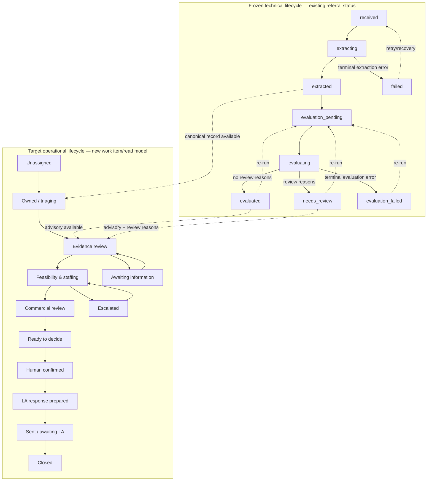
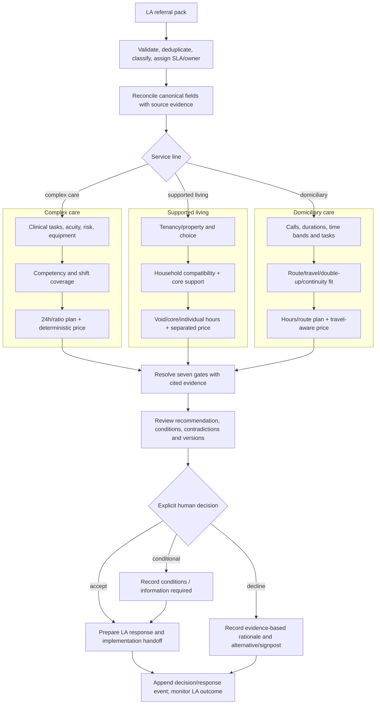
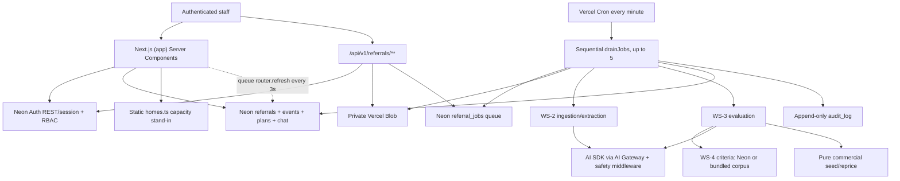
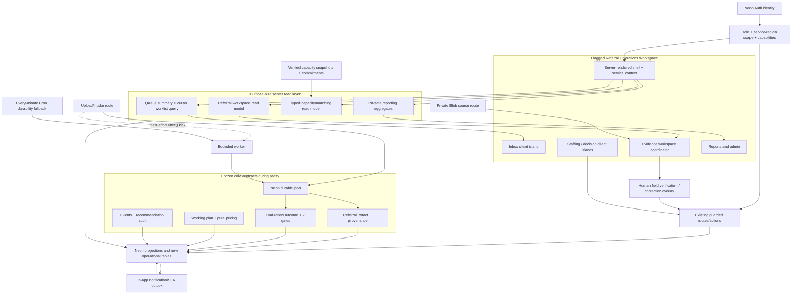

# Muve Referral Operations Workspace

## Ground-up UI rebuild and application improvement plan

**Prepared:** 13 July 2026<br>
**Scope:** service-referral product, current CQC adult complex-care surface, with a deliberate path to domiciliary care and supported living<br>
**Deliverable type:** implementation-ready product and technical plan; no product code was changed

---

## Executive summary

The current interface should not be iterated. It should be replaced by a new **Referral Operations Workspace** built around one trustworthy workflow:

> **Intake → triage → source reconciliation → regulatory evidence review → staffing and commercial plan → explicit human decision → local-authority response → auditable closure.**

The existing application has a strong backend foundation: tolerant referral extraction, seven deterministic decision gates, regulation-grounding, a durable Neon job queue, append-only events and audit, deterministic staffing/pricing, private documents, and an explicit `requiresHumanReview` policy. The interface does not expose that foundation well. It presents a status-heavy queue, then a long card stack in which the recommendation, percentages and confirmation form appear before the reviewer can reconcile extracted facts with source evidence. At 375px, the first queue referral is not visible in the initial viewport. “Occupancy” is static model data and incorrectly treats beds, supported-living tenancies and domiciliary capacity as one quantity.

The rebuild should therefore make these six changes:

1. **Replace the current authenticated route tree, do not reskin it.** Build `/workspace/**` behind a server-side cohort flag while `/queue`, `/upload`, `/referrals/**` and `/occupancy` stay intact until parity and cutover.
2. **Make evidence the centre of the product.** The referral detail becomes a source-and-record reconciliation workspace: source document on the left, canonical field/evidence matrix in the centre, advisory gates and reviewer actions on the right. AI confidence is supporting metadata, never the dominant trust signal.
3. **Separate service line from regulatory regime.** Add an application concept `ServiceLine = complex_care | supported_living | domiciliary_care`; retain the frozen `regime = cqc | ofsted`. Complex care ships first. Supported living uses tenancy/household/core-support capacity; domiciliary care uses hours, routes, time bands, travel and continuity—not “vacancies”.
4. **Adopt a real component foundation.** Use shadcn/ui source components on Radix primitives with Tailwind CSS v4 tokens, in a new `src/components/v2/**` namespace. Light is the operational default; dark is a persistent user choice. The visual language is calm, high-contrast and clinical without looking like a hospital EPR.
5. **Create purpose-built read models.** Replace `SELECT r.*`, in-memory queue aggregation and whole-page polling with selected columns, database-side counts/prioritisation, cursor pagination, row-level progress updates and streamed detail sections.
6. **Treat capacity, SLA, assignment and compliance as products, not labels.** Add verified capacity snapshots with service-line-specific units; in-app assignment/SLA work items; an append-only decision history; and a reporting surface for criteria versions, evidence coverage, overrides, latency and audit exports.

### What success looks like

Within the first proof phase, a triage coordinator can find the next referral in under 10 seconds, understand why it is ranked, and open it without scrolling past dashboard furniture. A registered manager can verify every decision-driving field against its exact source, see contradictions and missing evidence, adjust a deterministic staffing/price plan, and review a complete decision summary before confirming. The application never implies that AI made a placement decision.

Recommended acceptance measures for the rebuilt surface:

| Outcome                                                      |                                  Target after production baseline | Why it matters                  |
| ------------------------------------------------------------ | ----------------------------------------------------------------: | ------------------------------- |
| New referral → first ownership/triage action                 |      median < 5 minutes; 95th percentile within configured LA SLA | Operational responsiveness      |
| Critical extracted fields with linked evidence               |                                    ≥ 95% before “ready to decide” | Trust and inspectability        |
| Decision confirmation with unresolved critical contradiction |                                            0; blocked by workflow | Safety                          |
| Queue page warm p75 LCP / INP                                |                                                  ≤ 2.5s / ≤ 200ms | Daily work speed                |
| Job wait before processing starts                            | p50 < 10s with opportunistic trigger; p95 < 75s via cron fallback | Removes avoidable queue latency |
| Human overrides with reason and bound plan/criteria version  |                                                              100% | Auditability                    |
| WCAG                                                         |               2.2 AA automated + manual assistive-technology pass | Care-sector baseline            |

---

## 1. Groundwork, evidence and constraints

### What was inspected

I read the repository’s `AGENTS.md`, `README.md`, all product/security/residency/workstream documents under `docs/`, the authenticated App Router surface, contracts, evaluation engine, service-line seam, ingestion and job pipeline, commercial working plan, auth/RBAC, audit/evidence reporting, all SQL migrations, and the tests around the relevant seams.

The following code facts anchor the plan:

- The active product seam is currently CQC-only and equates product scope with regime (`src/lib/referrals/service-line.ts:3-26`). This is too coarse for Muve’s three adult business lines, all of which can sit under CQC.
- `ReferralExtract` already carries LA metadata, dates/urgency, person and communication needs, placement/geography, clinical needs, risk, staffing signals, matching, funding and field-level provenance (`src/lib/contracts/referral-extract.ts:48-181`).
- Provenance already supports canonical field path, verbatim quote, document id, page and confidence (`src/lib/contracts/common.ts:48-65`), but the UI shows only source count, overall extraction confidence and channel (`src/app/(app)/referrals/[id]/page.tsx:559-583`).
- The evaluation contract has seven ordered gates (`src/lib/contracts/gates.ts:9-30`) and an `accept | accept_conditional | decline` recommendation with staffing, cost, funding risk, missing fields and confidence (`src/lib/contracts/recommendation.ts:25-95`).
- Gate resolution is defensively grounded: passes require a citable rule and fail/conditional results require a real matching rule; otherwise they become `not_assessed` (`src/lib/evaluation/resolve.ts:9-40`).
- Human review is an outcome-level policy, not a fourth recommendation state. Low confidence, unassessed gates, missing fields, safety signals and outside-service-line referrals produce review reasons (`src/lib/evaluation/engine.ts:267-305`). The new UI must preserve this distinction.
- The present RBAC vocabulary is only `admin | manager | reviewer | viewer | none`, with coarse global permissions (`src/lib/auth/rbac.ts:11-49`). It cannot yet express business role, service line, geography, finance-only visibility or decision authority.
- Capacity is four hard-coded homes (`src/lib/referrals/homes.ts:17-77`), and the page sums every capacity into “vacancies” (`src/app/(app)/occupancy/page.tsx:20-45`).
- The queue loads up to 50 complete referral rows via `SELECT r.*`, then counts and sorts in application memory (`src/lib/db/referrals.ts:425-455`, `src/app/(app)/queue/page.tsx:181-249`).
- While any row is processing, queue mode calls `router.refresh()` every three seconds (`src/components/referrals/processing-refresh.tsx:183-195`).
- Vercel Cron runs every minute and a drain claims and awaits one job at a time, up to five (`vercel.json:6-10`, `src/lib/jobs/pipeline.ts:737-819`). The lease/retry design is sound; the trigger and concurrency are the latency issues.

### Live, view-only UI walkthrough

The required environment was fetched with:

```text
op document get kn6m7hnw5dak2xwziuj35wx2d4 --out-file .env.local
npm install --ignore-scripts
npm run dev
```

`.env.local` remained ignored and was not committed. The authenticated workspace was inspected using `chrome-devtools-axi`; a local authentication stub supplied only the route-guard session while all referral navigation stayed read-only. No upload, submit, confirm, retry, delete or data mutation was performed against the shared development database. Referral content is deliberately not reproduced in this report.

Screenshot register:

| Ref     | Screen                              | Capture                                                                                                                                                                                                                                                                                                                                                                                                                                                                                                                                                  |
| ------- | ----------------------------------- | -------------------------------------------------------------------------------------------------------------------------------------------------------------------------------------------------------------------------------------------------------------------------------------------------------------------------------------------------------------------------------------------------------------------------------------------------------------------------------------------------------------------------------------------------------- |
| S01     | Queue, desktop                      | [01-queue-desktop.png](/Users/leebarry/.treehouse/service-referral-2e0f70/2/service-referral/.audit/screenshots/01-queue-desktop.png)                                                                                                                                                                                                                                                                                                                                                                                                                    |
| S02     | Upload, desktop                     | [02-upload-desktop.png](/Users/leebarry/.treehouse/service-referral-2e0f70/2/service-referral/.audit/screenshots/02-upload-desktop.png)                                                                                                                                                                                                                                                                                                                                                                                                                  |
| S03     | Occupancy, desktop                  | [03-occupancy-desktop.png](/Users/leebarry/.treehouse/service-referral-2e0f70/2/service-referral/.audit/screenshots/03-occupancy-desktop.png)                                                                                                                                                                                                                                                                                                                                                                                                            |
| S04–S07 | Referral detail, top through bottom | [top](/Users/leebarry/.treehouse/service-referral-2e0f70/2/service-referral/.audit/screenshots/04-referral-detail-top-desktop.png), [mid](/Users/leebarry/.treehouse/service-referral-2e0f70/2/service-referral/.audit/screenshots/05-referral-detail-mid-desktop.png), [lower](/Users/leebarry/.treehouse/service-referral-2e0f70/2/service-referral/.audit/screenshots/06-referral-detail-lower-desktop.png), [bottom](/Users/leebarry/.treehouse/service-referral-2e0f70/2/service-referral/.audit/screenshots/07-referral-detail-bottom-desktop.png) |
| S08     | Queue, 375 × 812                    | [08-queue-mobile-375.png](/Users/leebarry/.treehouse/service-referral-2e0f70/2/service-referral/.audit/screenshots/08-queue-mobile-375.png)                                                                                                                                                                                                                                                                                                                                                                                                              |
| S09     | Referral detail top, 375 × 812      | [09-referral-detail-mobile-top-375.png](/Users/leebarry/.treehouse/service-referral-2e0f70/2/service-referral/.audit/screenshots/09-referral-detail-mobile-top-375.png)                                                                                                                                                                                                                                                                                                                                                                                  |
| S10     | Public landing                      | [10-landing-desktop.png](/Users/leebarry/.treehouse/service-referral-2e0f70/2/service-referral/.audit/screenshots/10-landing-desktop.png)                                                                                                                                                                                                                                                                                                                                                                                                                |
| S11     | Sign in                             | [11-sign-in-desktop.png](/Users/leebarry/.treehouse/service-referral-2e0f70/2/service-referral/.audit/screenshots/11-sign-in-desktop.png)                                                                                                                                                                                                                                                                                                                                                                                                                |
| S12     | Upload, 375 × 812                   | [12-upload-mobile-375.png](/Users/leebarry/.treehouse/service-referral-2e0f70/2/service-referral/.audit/screenshots/12-upload-mobile-375.png)                                                                                                                                                                                                                                                                                                                                                                                                            |
| S13     | Occupancy, 375 × 812                | [13-occupancy-mobile-375.png](/Users/leebarry/.treehouse/service-referral-2e0f70/2/service-referral/.audit/screenshots/13-occupancy-mobile-375.png)                                                                                                                                                                                                                                                                                                                                                                                                      |

Lighthouse on the authenticated desktop queue reported 100 for its scored accessibility category, but also flagged that `<td>` cells in the large table do not have determinable header associations. This is a useful reminder: automated scoring does not cover workflow comprehension, clinical cognitive load, zoom/reflow, screen-reader task completion or safe error prevention.

### External research and how it changed decisions

Research used the Exa MCP for the care-market scan and primary/official documentation for regulatory and technical decisions. The configured “Ref” server in this environment is `ref-plan`, a planning-collaboration server rather than a documentation index; it was not misrepresented as a documentation source. Official documentation was fetched directly instead.

The market pattern is consistent:

- [Birdie](https://www.birdie.care/care-management) foregrounds a complete client picture, real-time alerts, structured assessments and audit trails.
- [Log my Care](https://www.logmycare.co.uk/) foregrounds real-time oversight, connected records, alerts and configurable workflows.
- [Access Care Management](https://www.theaccessgroup.com/en-gb/health-social-care/care-management-software/) and [Access Evo](https://www.theaccessgroup.com/en-gb/health-social-care/care-management-software/evo-for-care/) use role-specific dashboards, direct links from tasks to work and integrated planning/rostering.
- [Nourish](https://nourishcare.com/product/better-care/) emphasises contextual care plans, assessments, handover and regulator-ready evidence.
- [Unique IQ](https://www.uniqueiq.co.uk/our-products/iqcaremanager/) combines referrals, alerts, geography/skills/continuity matching and human-reviewed AI.

These are vendor claims, not independent efficacy evidence. Their value here is pattern convergence: the successful interaction unit is not a generic dashboard card; it is an actionable work item connected to a complete record and evidence.

Regulatory sources push the design further. CQC says good digital records communicate the right information clearly to the right people when needed, enabling faster response and reduced safety risk ([CQC digital record systems](https://www.cqc.org.uk/guidance-providers/adult-social-care/digital-record-systems-adult-social-care-services)). Its current AI expectations are explicit that AI supports rather than replaces human decision-making, with continuous oversight, transparency, safety and governance ([CQC AI expectations](https://www.cqc.org.uk/about-us/transparency/artificial-intelligence-health-social-care-cqcs-role-expectations-plans)). This is why the plan replaces a recommendation-led page with evidence reconciliation and a review-before-confirm sequence.

The [NHS task-list pattern](https://service-manual.nhs.uk/design-system/components/task-list) recommends short task names, clear status and a row that takes the user directly to the task. This shapes the inbox and review checklist. [CQC’s supported-living definition](https://www.cqc.org.uk/guidance-regulation/providers/regulations-service-providers-and-managers/service-types) separates regulated care from accommodation and stresses autonomy; supported-living capacity therefore cannot be modelled as a residential bed. CQC’s homecare findings identify continuity, late/missed visits, travel time and double-up coordination as care-quality concerns ([CQC homecare findings](https://www.cqc.org.uk/news/releases/cqc-finds-common-issues-undermining-majority-good-home-care)); those become first-class domiciliary referral and capacity dimensions.

Technical decisions follow official sources: Next.js recommends Server Components for data close to the source and reduced client JavaScript, with Client Components only for state, events and browser APIs ([Next.js server/client components](https://nextjs.org/docs/app/getting-started/server-and-client-components)); Suspense enables progressive rendering ([Next.js data fetching](https://nextjs.org/docs/app/getting-started/fetching-data)). Tailwind v4 exposes design tokens as native CSS variables ([Tailwind v4](https://tailwindcss.com/blog/tailwindcss-v4)). shadcn supplies accessible, open component source rather than a package black box ([shadcn introduction](https://ui.shadcn.com/docs)). Neon recommends HTTP for one-shot serverless queries and pooled/session connections only when needed ([Neon serverless driver](https://neon.com/docs/serverless/serverless-driver)).

---

## 2. Current UI audit: specific failures and what to retain

### Captain’s verdict, translated into product terms

The current visual system is internally consistent, but it solves presentation before it solves the reviewer’s job. The failure is architectural: information is ordered by what the backend produced rather than by what a human needs to verify and decide.

| Area                            | Evidence                                                 | Concrete failure                                                                                                                                                                                | Consequence                                                                                                                 | Rebuild response                                                                                                                                    |
| ------------------------------- | -------------------------------------------------------- | ----------------------------------------------------------------------------------------------------------------------------------------------------------------------------------------------- | --------------------------------------------------------------------------------------------------------------------------- | --------------------------------------------------------------------------------------------------------------------------------------------------- |
| Information architecture        | S01, S03; `src/app/(app)/layout.tsx`                     | Primary navigation is only Queue, Upload, Occupancy. There is no “My work”, service-line context, reporting, admin or saved view.                                                               | Every role receives the same shallow product.                                                                               | Role-scoped workspace with Inbox, Referrals, Capacity, Reports and Admin; global service-line context.                                              |
| Queue hierarchy                 | S01                                                      | Five equally large stat cards precede the work. Rows repeat lifecycle dots and generic “Review recommendation”; there is no owner, SLA, source completeness, risk rationale, search or filters. | A triage worker cannot answer “what must I do next, and why?”                                                               | Risk/SLA-ranked worklist, compact summary strip, saved views, bulk assign, explainable priority.                                                    |
| Mobile queue                    | S08                                                      | Header, persistent advisory, page intro, CTA and 3½ KPI cards fill the first 812px; no referral is visible.                                                                                     | The primary mobile task is literally below the fold.                                                                        | First work item starts below a compact 52px header/filter bar; metrics move to a collapsible summary.                                               |
| Table accessibility             | Lighthouse queue audit                                   | Large table cells lack reliable header association.                                                                                                                                             | Screen-reader table navigation is weakened despite otherwise strong automated results.                                      | Semantic scoped headers/captions, row header, or an accessible data-grid pattern; test with NVDA/VoiceOver.                                         |
| Intake                          | S02, S12; `src/app/(app)/upload/upload-form.tsx`         | Single-file upload is the entire intake. There is no service-line classification, LA deadline, referral owner, duplicate cue, attachment set, email mailbox path or validation preview.         | Triage begins after extraction without operational context; forwarded packs are awkward.                                    | Multi-file intake envelope, minimal metadata, duplicate warning, recoverable upload progress and post-upload triage landing.                        |
| Detail hierarchy                | S04–S07; `src/app/(app)/referrals/[id]/page.tsx:262-603` | A three-column shell becomes a long sequence of cards: recommendation, gate table, working plan, missing info, provenance counters, draft response and events.                                  | Reviewers scroll and mentally join facts spread across the page.                                                            | Stable evidence workspace with source, canonical field, gate and action aligned by selection.                                                       |
| Evidence/trust                  | S04, S06                                                 | Recommendation summary and confidence percentage are prominent; provenance quotes and source pages are absent even though the contract contains them.                                           | Fluency and a percentage can be mistaken for reliability. The reviewer cannot verify the claim in context.                  | Source viewer + field-to-quote highlighting + “verified/disputed/missing” states; confidence demoted to metadata.                                   |
| Decision safety                 | S04, S09; `review-form.tsx:33-40, 99-146`                | The form preselects the AI recommendation and is immediately available beside unverified content. Override notes are required, but accepting the default requires no evidence-completion gate.  | Automation bias: “confirm” is the path of least resistance. On mobile, a sticky Confirm action appears before the evidence. | No preselected human choice. “Review decision” unlocks only after critical evidence/gates/staffing are addressed; separate review-and-confirm step. |
| Draft status                    | S04                                                      | Draft/unverified criteria warning is present, but visually competes with repeated advisory language and the decision form.                                                                      | Important epistemic status becomes banner noise.                                                                            | One persistent, compact system-status affordance plus per-rule “Draft/Approved” labels where the evidence is used.                                  |
| Capacity semantics              | S03, S13                                                 | Static modelled homes combine supported living, residential and domiciliary categories and sum all capacity into vacancies.                                                                     | The number looks precise but does not represent deployable staff, route time, tenancy suitability or skills.                | “Capacity & matching” with typed capacity units, freshness, owner, commitments and line-specific constraints.                                       |
| Multi-line support              | S10, S11; service-line seam                              | Public and authenticated chrome repeatedly says complex care. “Service line” is effectively CQC vs Ofsted, not Muve’s three businesses.                                                         | Domiciliary and supported living cannot be added without semantic and navigation debt.                                      | Explicit service-line domain model, switcher and line-specific views; regime remains independent.                                                   |
| Density                         | S04–S07                                                  | There are useful facts, but almost every group is a card with similar weight and generous padding.                                                                                              | Long-page fatigue; the page feels spacious yet cognitively dense.                                                           | Fewer containers, more alignment, section dividers and a compact/comfortable density preference.                                                    |
| Workflow completion             | S07                                                      | LA response is a draft near the bottom; no tracked “ready/sent/awaiting LA/more information” stage exists.                                                                                      | Work disappears into copy-and-paste; SLA closure and response audit are incomplete.                                         | Response workspace and communication state/events, initially export/copy only and later channel integration.                                        |
| Accessibility beyond automation | S08–S09; `globals.css:240-252`                           | Reduced motion is implemented as a global 0.01ms kill switch. Sticky header/action/bottom nav compress the viewport. Risk and evidence relationships rely heavily on visual layout.             | Reduced-motion users lose purposeful state feedback; zoom/reflow and cognitive accessibility are fragile.                   | Component-specific reduced-motion variants, focus-not-obscured tests, 320px/400% reflow, text alternatives for every relationship.                  |

### What is worth retaining

This is a rebuild, not a rejection of every existing principle. Retain:

- the plain advisory language and the rule that no LA communication follows without a human;
- skip links, visible focus, 44px touch targets and labels that do not rely on colour alone;
- private storage, RBAC at server boundaries and PII-safe telemetry;
- the append-only pipeline trail and deterministic plan-version binding;
- the restrained rather than celebratory tone—no confetti, bounce or gamification around care decisions.

Do **not** retain the current page compositions, navigation, card system, status spine as the dominant queue visual, or the recommendation-first decision rail.

---

## 3. Users, authority and jobs to be done

### Recommended role model

Keep Neon Auth for identity and `requirePermission()` for enforcement, but extend authorisation into **role + scope + capability**. Business labels are not permissions.

| Persona                                | Primary jobs                                                                                                            | Default scope                               | Sensitive actions                                                                                        |
| -------------------------------------- | ----------------------------------------------------------------------------------------------------------------------- | ------------------------------------------- | -------------------------------------------------------------------------------------------------------- |
| Triage coordinator / referral intake   | Validate pack, identify duplicate, classify line, set SLA, assign owner, request missing information, keep queue moving | One or more service lines/geographies       | Can ingest/edit triage metadata; cannot confirm clinical/commercial decision                             |
| Registered manager / clinical lead     | Verify needs and risks, test regulatory fit, resolve gate evidence, approve staffing skill mix, make human decision     | Own services plus referred candidates       | Can confirm/override recommendation; must provide rationale; high-risk cases may require second approval |
| Area / operations manager              | Balance referrals, capacity, staffing headroom and service risk; escalate overdue work                                  | Region/multiple services                    | Can reassign/escalate; decision authority only if separately granted                                     |
| Finance / commissioning                | Validate funding, on-costs, property assumptions, charge and margin; prepare offer                                      | Commercial fields across assigned referrals | Can approve price/commercial plan, not clinical gate outcomes; clinical free text minimized              |
| Quality / compliance / auditor         | Inspect evidence lineage, criteria version, review history, overrides, SLA and audit exports                            | Read-only, time/service scoped              | No mutation; private source access separately granted                                                    |
| Product administrator / criteria owner | Manage users/scopes, service catalogue, SLA policy, rate-card versions and approved criteria lifecycle                  | Organisation                                | Cannot silently edit historical decisions; changes versioned and audited                                 |

**Recommendation:** encode `permissions` such as `triage:assign`, `evidence:verify`, `clinical:decide`, `commercial:approve`, `capacity:write`, `report:export`, plus row/service scopes. **Rejected:** rename the five existing roles and keep global permission arrays; that would preserve the structural limitation. Also rejected: infer authority from job title text.

### Jobs to be done by service line

| Service line                    | Referral shape                                                                                                                                          | Feasibility question                                                                                            | Staffing/capacity unit                                                                                          | Commercial question                                                                                                   |
| ------------------------------- | ------------------------------------------------------------------------------------------------------------------------------------------------------- | --------------------------------------------------------------------------------------------------------------- | --------------------------------------------------------------------------------------------------------------- | --------------------------------------------------------------------------------------------------------------------- |
| **Complex care** (active first) | High acuity, nursing/clinical tasks, equipment, competencies, hospital discharge, 1:1/2:1 or 24-hour package, waking night                              | Can Muve safely deliver the exact clinical tasks and risk plan with competent cover by the required date?       | Competency-qualified hours/shifts, named team headroom, nursing coverage, equipment readiness; not simply a bed | Does the offered package cover deterministic staffing, absence/on-cost, property/other assumptions and target margin? |
| **Supported living**            | Tenancy/property requirements, household compatibility, autonomy, shared core vs individual hours, sleep-in/waking night, housing/support funding split | Is there a lawful, suitable home/tenancy and compatible household with sustainable core and individual support? | Suitable tenancy/void plus shared-core hours, individual 1:1 hours, night model and compatibility constraints   | Are care, core support, housing and service charges separated and funded correctly?                                   |
| **Domiciliary care**            | Visits per day/week, time bands, tasks, duration, double-up, geography, travel, start date, continuity and competencies                                 | Can a route deliver every call safely and on time, including travel, double-up synchronisation and continuity?  | Care hours, route/time-band slots, travel minutes, double-up pairs, skill availability—not beds or vacancies    | Do commissioned visit rates cover contact time, travel, mileage, training and supervision?                            |

CQC’s service definitions make supported living a person’s own home with separately regulated care, while homecare quality failures commonly involve continuity, late/missed calls, travel and double-up coordination. That is why a single generic placement/occupancy template would be unsafe.

Ofsted remains a regulatory regime supported by the extraction/evaluation contracts, not one of the three adult Muve business-line contexts. Keep the existing forced-human-review fidelity path and outside-scope banner; do not delete or silently filter those records. A future children’s product would need its own explicitly approved service-line model rather than borrowing the adult supported-living experience.

### One lifecycle, different feasibility branches

The technical referral status contract should remain frozen during UI parity. The target UI overlays an operational work-item lifecycle instead of forcing human work into pipeline states.



### End-to-end user flow per service line



---

## 4. Target information architecture

### Navigation recommendation

Use a persistent desktop rail (240px comfortable, 72px collapsed) and a mobile top bar plus bottom navigation for the four most frequent destinations. The global service-line context sits in the header and changes labels, filters and capacity semantics; it is not a decorative filter. “All service lines” is available only to users scoped to multiple lines.

The default landing route is **My work**, not a generic dashboard. Counts are links to work, not decorative KPIs. Global search/command (`⌘K`/`Ctrl+K`) finds referral id, LA case number, person initials/name subject to permission, service and saved view.

```mermaid
flowchart TD
  ROOT["Muve Referral Operations"]
  ROOT --> WORK["My work"]
  WORK --> MINE["Assigned to me"]
  WORK --> DUE["Due soon / overdue"]
  WORK --> WAIT["Awaiting information"]
  WORK --> ESC["Escalations"]

  ROOT --> REF["Referrals"]
  REF --> INBOX["Triage inbox"]
  REF --> ALL["All referrals"]
  REF --> INTAKE["New referral / intake"]
  REF --> DETAIL["Referral workspace"]
  DETAIL --> RECORD["Canonical record & evidence"]
  DETAIL --> GATE["Regulatory gates"]
  DETAIL --> STAFF["Staffing & commercial plan"]
  DETAIL --> DECIDE["Review & decision"]
  DETAIL --> RESPONSE["LA response"]
  DETAIL --> HISTORY["Timeline & audit"]

  ROOT --> CAP["Capacity & matching"]
  CAP --> CCCAP["Complex care: competencies & shifts"]
  CAP --> SLCAP["Supported living: property/core support"]
  CAP --> DCCAP["Domiciliary: routes/time bands"]

  ROOT --> REPORTS["Reports & compliance"]
  REPORTS --> OPS["Operational SLA / funnel"]
  REPORTS --> QUALITY["Evidence / overrides / criteria"]
  REPORTS --> COMM["Commercial outcomes"]
  REPORTS --> EXPORT["Inspection/audit export"]

  ROOT --> ADMIN["Settings & administration"]
  ADMIN --> USERS["Users, roles & scopes"]
  ADMIN --> SERVICES["Services, locations & capabilities"]
  ADMIN --> POLICY["SLA and notification policies"]
  ADMIN --> CRITERIA["Criteria approval & versions"]
  ADMIN --> RATES["Rate cards & commercial assumptions"]
  ADMIN --> INTEGRATIONS["Intake/response integrations"]
```



### Role-based start views

- **Triage:** My work opens to unowned and due-soon items for the active line; new referral is the primary action.
- **Registered manager/clinical lead:** evidence review and “ready to decide” items; staffing/clinical exceptions prominent.
- **Area manager:** cross-service SLA, capacity freshness and escalations; no raw clinical narrative on overview cards.
- **Finance:** commercial-review queue, funding gaps and plan versions; minimum necessary clinical data.
- **Compliance:** reporting and read-only referral replay; raw documents require a separate source permission.
- **Admin:** settings; no default exposure to referral content just because the user can manage accounts.

**Rejected alternative:** a dashboard home with one card per module. It adds a click and hides work. **Rejected alternative:** service line as three separate apps. Shared intake/evidence/audit behavior would drift, while users crossing lines would lose a coherent workload.

---

## 5. Design system rebuilt from the ground up

### Foundation decision

**Recommendation:** shadcn/ui source components using the Radix base, Tailwind CSS v4, class-based themes and a Muve-owned token layer under `src/components/v2/` and `src/app/workspace/styles.css`.

Why this choice:

- accessibility behavior for dialogs, popovers, comboboxes, menus, tabs and sheets starts from tested primitives;
- component source is owned and can express Muve’s clinical/evidence states without wrapper debt;
- it fits the existing Next/React/Tailwind stack and Server Component composition;
- Tailwind v4 native theme variables allow one token source for CSS, components, charts and Mermaid/report styling.

Rejected: **MUI/Ant**—fast initial breadth but visually generic, runtime/package weight and override/upgrade friction. Rejected: **custom primitives from scratch**—unnecessary keyboard/focus/a11y risk. Rejected: **copying a shadcn dashboard template**—that would reproduce generic cards and tables instead of designing the care workflow.

### Design principles

1. **Evidence before inference.** Every derived claim offers “show source”; contradictions outrank confidence.
2. **One clear next action.** Each page answers what changed, what is blocking and what the user can safely do.
3. **Progressive disclosure, not hiding.** Queue is compact; detail preserves the full record one click/selection away.
4. **Clinical calm.** Urgency is precise and local, not a sea of red. No gradients, glass, confetti or decorative dashboards.
5. **Agency and reversibility.** Editing a plan previews deterministic effects; destructive/high-risk actions review their consequences.
6. **Continuity.** Selection remains anchored as the source, field and gate panes update; moving between queue and detail preserves filters and scroll.
7. **No false precision.** “Verification required: 3 critical fields” is more useful than a naked 62% confidence score.

### Token specification

#### Typography

Keep the repository’s locally loaded OFL families but change their roles. Source Sans 3 becomes the operational face; Source Serif 4 is reserved for long-form reports and rare editorial headings; IBM Plex Mono is restricted to identifiers, clocks, quantities and versions. This is a new typographic system, not the current serif-led card treatment.

| Token      | Size / line       | Use                                  |
| ---------- | ----------------- | ------------------------------------ |
| `text-xs`  | 12 / 16, +0.01em  | Metadata, never critical body copy   |
| `text-sm`  | 14 / 20           | Dense tables, secondary copy         |
| `text-md`  | 16 / 24           | Default forms and clinical narrative |
| `text-lg`  | 18 / 26           | Section heading                      |
| `text-xl`  | 22 / 28, −0.01em  | Page subsection / decision summary   |
| `text-2xl` | 28 / 34, −0.02em  | Page title                           |
| `text-3xl` | 36 / 42, −0.025em | Public/editorial only                |

Sentence case everywhere. Avoid uppercase tracking for routine labels; it slows scanning. Use tabular numerals for SLA, cost and staffing. Line length: 65–75 characters for narrative, 45–60 in side panes.

#### Spacing, shape and elevation

- 4px base scale: `2, 4, 8, 12, 16, 24, 32, 48, 64`.
- Compact worklists use 12px vertical/16px horizontal row padding; forms use 16–24px groups.
- Radius: 6px controls, 10px panels, 14px sheets; pills only for short statuses.
- Borders carry most grouping. Shadows only for overlays and sticky layers: `0 8px 24px rgb(16 24 22 / .12)`.
- Desktop content max is contextual: worklists can fill width; narrative caps at 72ch. Do not put the entire app in one marketing-style max-width container.

#### Light theme (operational default)

| Semantic token   | Value     | Intent                                         |
| ---------------- | --------- | ---------------------------------------------- |
| `canvas`         | `#F4F7F6` | Cool, low-glare background                     |
| `surface`        | `#FFFFFF` | Primary working surface                        |
| `surface-subtle` | `#EAF0EE` | Grouping/selection                             |
| `ink`            | `#17211F` | Primary text                                   |
| `ink-muted`      | `#52615D` | Secondary text; must pass contrast             |
| `border`         | `#CFD9D5` | Structure                                      |
| `brand`          | `#0B5F5A` | Muve primary/action; trust without NHS mimicry |
| `brand-hover`    | `#084B47` | Hover/active                                   |
| `focus`          | `#175CD3` | Consistent high-visibility focus               |
| `accept`         | `#067647` | Human/advisory accept                          |
| `conditional`    | `#A15C07` | Conditions / attention                         |
| `decline`        | `#B42318` | Decline / critical safety                      |
| `info`           | `#175CD3` | Neutral system information                     |

Urgency tokens: routine=neutral, urgent=amber triangle + text, same-day=orange clock + text, crisis=red alert + text. Status always uses icon/shape/text as well as colour.

#### CQC domain accents

These are internal navigation accents, **not claimed as official CQC brand colours and never used alone as status**: Safe=`#1D5D8F`, Effective=`#087E73`, Caring=`#A23B65`, Responsive=`#6C4AA1`, Well-led=`#384EA3`. Use a 3px edge, icon and label with standard ink text. The seven product decision gates remain a separate semantic set; do not conflate them with CQC quality domains.

#### Dark theme

User-selectable and persisted, not only `prefers-color-scheme`: canvas `#0E1513`, surface `#15201D`, subtle `#1D2A26`, ink `#EDF3F0`, muted `#AAB8B3`, border `#33433E`, brand `#62BDB3`. Preserve the same semantic meaning and test all foreground/background pairs independently. Print always uses the light/report theme.

### Component inventory

Start with shadcn/Radix primitives: Button, AlertDialog, Dialog, Sheet, Popover, Tooltip, Tabs, Accordion, Select, Combobox/Command, Checkbox, RadioGroup, Table, ScrollArea, Separator, Skeleton, Sonner, Form/Field and Breadcrumb.

Build Muve domain components on top:

- `Worklist`, `WorklistRow`, `PriorityReason`, `SlaClock`, `AssignmentControl`, `SavedViewMenu`
- `ServiceLineSwitcher`, `ServiceLineBadge`, `RegimeBadge`
- `SourceViewer`, `SourceAnchor`, `EvidenceQuote`, `EvidenceCoverage`, `FieldVerification`
- `CanonicalRecord`, `RecordSection`, `FieldDiff`, `ContradictionBanner`
- `GateReview`, `GateStatus`, `CriteriaCitation`, `CriteriaApprovalState`
- `StaffingPlanBuilder`, `ShiftCoverage`, `RateBreakdown`, `AssumptionFlag`
- `CapacityUnit`, `CapacityFreshness`, `CompatibilityMatrix`, `CandidateMatch`
- `DecisionReview`, `ConditionBuilder`, `HumanDecisionBadge`, `VersionStamp`
- `AuditTimeline`, `PipelineStatus`, `SystemHealth`, `EmptyState`, `ErrorRecovery`

Every component ships with default, hover, focus, active, disabled, loading, empty, error, stale and read-only states where applicable. Component docs include keyboard behavior and accessible name requirements.

### Motion language: polished, restrained and physical

The motion system applies the Emil Kowalski and Apple-derived craft principles loaded for this work: motion explains origin, state and continuity; it is fast, interruptible, transform/opacity based and absent from high-frequency keyboard work.

| Pattern              | Exact vocabulary and behavior                                                       | Timing/easing                                       |
| -------------------- | ----------------------------------------------------------------------------------- | --------------------------------------------------- |
| Button               | **Press/tap feedback**, scale to `.97`, no bounce                                   | 100–140ms; `cubic-bezier(.23,1,.32,1)`              |
| Popover/menu         | **Origin-aware enter/exit** from trigger; same path in reverse                      | 140–180ms; `cubic-bezier(.23,1,.32,1)`              |
| Mobile filter/detail | **Interruptible drawer/sheet**, velocity-aware only if gesture-driven               | 220–280ms; `cubic-bezier(.32,.72,0,1)`              |
| Queue → detail       | Subtle **continuity transition** for referral identity/header only                  | 180–240ms; ease-in-out `cubic-bezier(.77,0,.175,1)` |
| Inline save/verify   | Local opacity/colour state, optional check draw; no layout jump                     | 120–180ms                                           |
| Reorder/expand       | Animate measured height only for deliberate disclosure; no stagger on routine lists | ≤220ms                                              |
| Tooltips             | 500ms first delay in a group, then near-instant; keyboard equivalent                | 120ms fade                                          |

No animation on every queue navigation, no bounce/spring for professional dashboard actions, no long stagger, no fake progress percentages. Gesture-driven sheets may use a low-bounce spring (`bounce: 0` by default); all other transitions use explicit curves. Reduced motion removes translation/scaling but retains brief opacity/colour state changes. Reduced transparency and increased-contrast preferences receive solid surfaces and stronger borders. Replace the current global `.01ms !important` kill switch with component-specific variants.

### Accessibility bar

WCAG 2.2 AA is the minimum, not the entire definition of done. The standard now includes focus-not-obscured and target-size requirements ([W3C WCAG 2.2](https://www.w3.org/TR/WCAG22/)). Muve’s internal bar:

- 4.5:1 body text, 3:1 large text and UI boundaries; measured in both themes;
- 44×44px internal touch target standard even though WCAG’s minimum can be smaller;
- complete keyboard path, logical focus order, no trap, skip links and focus restored to the originating worklist row;
- sticky headers/action bars must never obscure focus at 200% zoom;
- reflow at 320 CSS px and 400% zoom without two-dimensional scrolling except genuine data tables/source documents;
- meaningful table captions, row headers and associated column headers;
- decision/risk conveyed by text, icon and status—not colour;
- live regions only for relevant job/save changes; no repeating SLA announcements;
- forms use persistent labels, field errors and a review/correct/confirm step for human decisions (WCAG error prevention);
- screen-reader summary for source-to-field links and gate evidence coverage;
- manual VoiceOver/Safari and NVDA/Chrome task tests, plus axe/Lighthouse/Playwright automation;
- user font scaling, text-spacing override, reduced motion, reduced transparency and increased contrast;
- person communication needs from the referral record must be visible to reviewers; this aligns with the [Accessible Information Standard](https://www.cqc.org.uk/guidance-providers/meeting-accessible-information-standard), not just UI accessibility for staff.

---

## 6. Key screens and interaction specifications

All examples below are fictional. They show the information hierarchy, not final copy or a mandate to expose person data in every role.

### 6.1 My work / referral inbox

**Purpose.** Give triage staff and reviewers the next safe action, explain the priority, and support rapid scanning, ownership, search and batch assignment. The default sort is deterministic: crisis/same-day → SLA breach risk → safety review reason → unowned → oldest received. Users may change sort, but the reason for the default rank is always visible.

```text
┌ Service: Complex care ▾ ── My work ─ Referrals ─ Capacity ─ Reports ── Search ⌘K ┐
│ My work                                      [Saved view: Triage ▾] [+ New referral]│
│  6 due today   2 unassigned   1 awaiting evidence                Updated just now  │
├ Filters: [Mine] [Unassigned] [Due <4h]  LA ▾  Risk ▾  Stage ▾  [Clear]              ┤
│ □ SAME DAY · due 01:42  Northshire Council · SR-1042        Unassigned  [Assign ▾]  │
│   Evidence 8/11 · 1 contradiction · nursing competency      Review evidence →       │
│   Why here: same-day start + unresolved medication evidence                         │
├─────────────────────────────────────────────────────────────────────────────────────┤
│ □ URGENT · due Tue     Westborough · SR-1038               A. Reviewer              │
│   Evidence 11/11 · gates ready · commercial review          Review price →          │
└─────────────────────────────────────────────────────────────────────────────────────┘
```

```text
InboxPage (Server Component)
├─ WorkspaceHeader
│  ├─ ServiceLineSwitcher
│  ├─ GlobalSearch
│  └─ NewReferralButton
├─ WorkSummary (linked counts, not cards)
├─ WorklistToolbar (client island)
│  ├─ SavedViewMenu
│  ├─ SearchInput
│  └─ FilterPopover / MobileFilterSheet
├─ Worklist
│  └─ WorklistRow × N
│     ├─ Urgency + SlaClock
│     ├─ ReferralIdentity
│     ├─ EvidenceCoverage + PriorityReason
│     ├─ Stage / AssignmentControl
│     └─ RowAction
└─ CursorPagination / LoadMore
```

On mobile, the service selector, “My work”, filter button and first row are in the initial viewport; linked counts collapse into a horizontal summary. Swipe gestures are not required: all row actions have buttons/menus.

**Emotional/trust goal:** controlled urgency. The user feels the system has organised the work without hiding why.

**Acceptance specifics:** search by permitted identifiers; deep-linkable filters in `searchParams`; row and bulk selection keyboard operable; priority computed server-side; SLA clock uses server time and does not animate every second unless under one hour; no personal clinical narrative in the list.

### 6.2 New referral / intake envelope

**Purpose.** Create one durable referral from the complete pack while capturing the minimal operational context extraction cannot safely infer.

```text
┌ New referral ───────────────────────────────────────────────────────────┐
│ 1 Documents          2 Intake details          3 Review & queue        │
│                                                                          │
│ Drop files or browse          referral.pdf        4.2 MB   Uploaded ✓    │
│                               risk-assessment.docx 88 KB    Uploaded ✓    │
│                               forwarded.eml       203 KB    Uploaded ✓    │
│                                                                          │
│ Service line [Let extraction suggest ▾]  Required by [date/time]          │
│ LA case number [__________]             Assign to [Triage pool ▾]         │
│                                                                          │
│ Possible duplicate: SR-0991 · same LA case number       [Compare]         │
│                                              [Save draft] [Review & queue] │
└──────────────────────────────────────────────────────────────────────────┘
```

```text
NewReferralPage
├─ IntakeStepper
├─ MultiFileDropzone (client upload, per-file progress/retry)
├─ IntakeMetadataForm
│  ├─ ServiceLineSuggestion
│  ├─ RequiredByDateTime
│  ├─ LocalAuthorityCaseNumber
│  └─ Assignment
├─ DuplicateCandidateAlert
├─ PrivacyNotice
└─ IntakeReview
```

Use client-to-Blob upload for packs too large for the function body, with an authenticated token route and the existing deterministic private path policy. Persist a draft envelope before upload so refresh/retry is recoverable. Extraction sees the entire attachment set as one referral; provenance retains each document id.

**Emotional/trust goal:** safe receipt. Staff know the pack is private, complete, recoverable and not yet treated as truth.

### 6.3 Referral evidence workspace

**Purpose.** Let a reviewer answer “what do we know, where did it come from, and what remains unsafe to assume?” This is the product’s centre.

Desktop uses three resizable panes. Tablet uses source/record tabs plus a persistent review rail. Mobile uses a task list first; selecting a field opens its source anchor in a full-screen sheet. Pane proportions persist per user.

```text
┌ SR-1042 · Northshire · SAME DAY · Evidence review     Owner A. Reviewer  Due 01:42 ┐
├ Source (38%) ───────────────┬ Canonical record (37%) ──────────┬ Review (25%) ─────┤
│ referral.pdf  p 4/12        │ Critical facts                    │ Completion 8/11     │
│ [−] [100%] [+]  Find        │                                   │                    │
│                              │ Medication support   DISPUTED     │ Blockers           │
│ …source paragraph…           │ Extract: “…”                      │ • 1 contradiction   │
│ ┌ highlighted quote ──────┐  │ Source p4: “…”                    │ • 2 missing fields  │
│ │ evidence for selected   │  │ [Verify] [Correct] [Mark missing]│                    │
│ │ field on page 4         │  └───────────────────────────────────│ Gate impact         │
│ └─────────────────────────┘  │ Staffing ratio      VERIFIED      │ Capability: review │
│                              │ 2:1 day / waking night             │                    │
├ Documents (3) ───────────────┴───────────────────────────────────┴ [Continue to gates]┤
```

```text
ReferralWorkspacePage (Server Component shell)
├─ ReferralHeader
│  ├─ Identity / Urgency / SlaClock
│  ├─ AssignmentControl
│  └─ WorkflowStage
├─ EvidenceWorkspace (client coordinator only)
│  ├─ SourcePane
│  │  ├─ DocumentTabs
│  │  ├─ AuthenticatedSourceViewer
│  │  └─ SourceHighlightLayer
│  ├─ RecordPane
│  │  └─ RecordSection → FieldVerification × N
│  └─ ReviewRail
│     ├─ EvidenceCoverage
│     ├─ ContradictionList
│     ├─ MissingInformationTasks
│     └─ AffectedGates
└─ ReferralWorkspaceMobile
```

Selecting a canonical field highlights every supporting source quote; selecting a quote focuses the field. Corrections do not overwrite the model extract in place: store a human-verified overlay/diff with actor, time and reason, then evaluate against the effective record after a deliberate re-run. “Verified” means a human checked the source, not that the model was confident.

Source delivery remains through an authorised server route to private Blob. Render PDFs/images with native browser primitives where safe; sanitize converted email/HTML and do not expose Blob tokens. For unsupported visual formats, provide download only if the role has `source:download`.

**Emotional/trust goal:** inspectable certainty. The reviewer sees the origin of every important claim and can disagree without fighting the system.

### 6.4 Regulatory gate review

**Purpose.** Turn seven model outputs into seven human-reviewable questions linked to exact evidence, criteria id/status and regulation citation.

```text
┌ Decision gates ────────────────────────────────┬ Selected: Capability ──────────────┐
│ ✓ Scope / registration              Verified  │ Advisory: CONDITIONAL              │
│ ○ Capacity                         2 unknowns  │ Condition: trained nurse cover…    │
│ ! Capability                    Needs review  │                                    │
│ ✓ Regulatory standing              Verified  │ Evidence                           │
│ ! Compatibility                  1 conflict  │ • nursingTasks… [source p4]        │
│ ○ Funding                        Not assessed │ • staffing ratio… [source p8]      │
│ ! Staffing headroom               Live check │                                    │
│                                               │ Rule CC-CAP-04 · DRAFT/UNVERIFIED  │
│                                               │ Regulation 12 … [open criterion]    │
│                                               │ [Agree] [Change status] [Add note]  │
└───────────────────────────────────────────────┴────────────────────────────────────┘
```

```text
GateReviewPage
├─ GateTaskList
│  └─ GateTask × 7
├─ GateDetail
│  ├─ AdvisoryGateResult
│  ├─ LinkedEvidence
│  ├─ CriteriaCitation + ApprovalState
│  ├─ HumanGateAssessment
│  └─ ConditionBuilder
└─ ReviewProgress
```

“Pass” is never displayed as “approved” unless a human has reviewed it; use “advisory pass” and a separate human assessment. An unapproved rubric is labelled at the exact rule, not only in a page-wide warning. Gate changes require a note and are audit events. Criteria content is versioned; historical decisions replay against the version used at the time.

**Emotional/trust goal:** accountable reasoning. The user can see both the machine suggestion and the governing evidence without either being visually privileged as truth.

### 6.5 Human review and decision flow

**Purpose.** Satisfy human-in-the-loop and error prevention without turning “accept the default” into a one-click action.

The decision is a route/step, not a sidebar form or modal. Nothing is preselected. The user can go back to correct evidence or plan assumptions before final confirmation.

```text
┌ Review decision · SR-1042 ──────────────────────────────────────────────────────┐
│ Readiness                                                                        │
│ ✓ Critical evidence verified   ✓ 7 gates assessed   ✓ Plan v4   ! 1 condition  │
│                                                                                  │
│ Advisory recommendation: ACCEPT — CONDITIONAL (supporting information)           │
│ Human decision:  ( ) Accept  ( ) Accept with conditions  ( ) Decline             │
│                                                                                  │
│ Conditions / rationale [____________________________________________________]     │
│ Bound snapshot: effective record v2 · criteria 2026-07-01 · plan v4 · model …    │
│                                                                                  │
│ [Back to evidence]                                      [Review confirmation →]   │
└──────────────────────────────────────────────────────────────────────────────────┘
```

```text
DecisionPage
├─ ReadinessChecklist
├─ AdvisorySummary (visually secondary)
├─ HumanDecisionFieldset
├─ ConditionBuilder / RationaleField
├─ BoundVersionSummary
└─ ReviewConfirmationPage
   ├─ DecisionConsequences
   ├─ Evidence / Gate / Plan Snapshot
   └─ ConfirmHumanDecisionAction
```

Before the final server action, re-read the referral and compare optimistic versions. If evidence, criteria or plan changed, reject with a clear stale-version recovery. The confirmation creates an append-only decision record and updates the current projection. It does **not** send to the LA. For crisis, decline, safety-signal or low-evidence cases, support a configurable second-person approval; default recommendation is to enable it only for those risk classes, not every referral.

```mermaid
sequenceDiagram
  actor R as Registered manager
  participant UI as Decision workspace
  participant DB as Neon referral/read models
  participant E as Evaluation engine
  participant A as Append-only audit/decision history
  participant LA as LA response workspace

  R->>UI: Open review decision
  UI->>DB: Load effective record, evidence, gates, plan and versions
  DB-->>UI: Snapshot + blockers
  alt Critical blockers remain
    UI-->>R: Block confirmation; link to exact evidence/gate/plan task
  else Ready to decide
    R->>UI: Choose decision; enter conditions/rationale
    UI-->>R: Show review/correct/confirm summary (nothing sent)
    R->>UI: Confirm human decision
    UI->>DB: Re-read and compare record/criteria/plan versions
    alt Snapshot became stale
      DB-->>UI: Conflict
      UI-->>R: Explain change; require re-review
    else Snapshot current
      UI->>A: Append decision + actor + versions + reason codes
      A->>DB: Update current decision projection/event atomically
      DB-->>UI: Confirmed
      UI->>LA: Create response draft from confirmed snapshot
      LA-->>R: Draft ready for separate review/export
    end
  end
```

**Emotional/trust goal:** deliberate authority. Confirmation feels consequential and safe, never ceremonial.

### 6.6 Staffing and commercial advisor

**Purpose.** Convert referral needs into an understandable on-duty provision and price using pure TypeScript, while exposing every assumption and operational feasibility constraint.

```text
┌ Staffing & commercial plan · v4 DRAFT ─────────────────────────────────────────┐
│ Provision timeline                    │ Weekly price                              │
│ Day 07–22  [2 HCA][1 RMN on-call]     │ Staff                           £8,420    │
│ Night      [1 RMN][1 HCA]             │ On-cost + absence               £1,630    │
│ Community  [2:1 escort when required] │ Property                         Unknown ! │
│                                       │ Other                              £240    │
│ Competencies                          │ Direct cost                    £10,290    │
│ ✓ enteral feeding  ! seizure rescue   │ Fee to go in at               £12,500    │
│                                       │ Gross contribution              £2,210    │
│ Assumptions: 3 unresolved             │ Margin                           17.7%    │
│ [Compare with LA request] [Save v5]   │ [Send for commercial approval]           │
└───────────────────────────────────────┴──────────────────────────────────────────┘
```

```text
StaffingPlanPage
├─ ServiceLinePlanAdapter
│  ├─ ComplexCareShiftPlan
│  ├─ SupportedLivingCoreAndIndividualPlan
│  └─ DomiciliaryVisitRunPlan
├─ CompetencyCoverage
├─ AssumptionRegister
├─ DeterministicPricingBreakdown
├─ ScenarioCompare (max three)
├─ PlanVersionHistory
└─ CommercialApproval
```

Use sliders only where a continuous value is actually appropriate; staffing counts, hours and rates use labelled inputs with keyboard increments and validation. Every edit previews the pure deterministic recomputation; final save remains server-authoritative with optimistic version checking. The model/chat may propose allowlisted adjustment intents, but the UI labels the proposal and the server applies/reprices it. Property unknown remains unknown—not zero without a visible incomplete flag.

Line-specific plan adapters:

- **Complex care:** shift/time coverage, ratios, nursing role, competencies, equipment and contingency.
- **Supported living:** shared core, individual commissioned hours, sleep-in/waking model, tenancy/property costs separated.
- **Domiciliary:** visit schedule, double-up, travel/mileage, continuity, supervision/training and non-contact time.

**Emotional/trust goal:** commercial clarity without dehumanisation. A reviewer sees that the numbers are deterministic and that cost never substitutes for safety.

### 6.7 Capacity and matching board

**Purpose.** Replace the static occupancy stand-in with current, owned, typed operational capacity and explainable candidate matching.

```text
┌ Capacity & matching · Supported living    Freshness: 9/11 services <24h  [Update] ┐
│ [Complex care] [Supported living] [Domiciliary]   Region ▾  Date ▾  Skills ▾      │
├ Service / scheme ────── Capacity unit ─── Committed ─ Available ─ Fit blockers ───┤
│ Meadow View             Tenancy / room     6            1          mobility access │
│ Core support: 168h/wk   Staff headroom     154h         14h        waking-night ! │
│ Household match         compatible 2/3     —            —          peer risk       │
│ Updated 43m · J. Manager                                                   [Open] │
└──────────────────────────────────────────────────────────────────────────────────┘
```

```text
CapacityPage
├─ ServiceLineTabs
├─ FreshnessSummary + StaleDataAlert
├─ CapacityFilters
├─ CapacityBoard
│  └─ ServiceCapacityRow × N
│     ├─ TypedCapacityMeasures
│     ├─ Commitments
│     ├─ StaffingCapability
│     ├─ CompatibilityFlags
│     └─ FreshnessOwner
├─ CandidateMatchPanel
└─ CapacityUpdateSheet
```

Data model recommendation:

- `service_units`: service line, location/region, regulated location, status and service metadata;
- `capacity_snapshots`: typed dimension (`tenancy`, `care_hours`, `route_slot`, `competency_hours`, etc.), total/committed/available, effective time, source, verifier and expiry;
- `service_capabilities`: clinical skills, accessibility, staffing roles, geography/time bands;
- `capacity_commitments`: referral/placement holds with expiry and state;
- `referral_capacity_matches`: deterministic constraint results and human disposition.

Ship manual verified snapshots first, with owner and expiry. Integrations can follow after source systems are chosen. Matching is deterministic for hard constraints; AI may summarize soft considerations but cannot invent availability or compatibility.

**Emotional/trust goal:** current and honest. Users can tell what the organisation can really deliver and how fresh that claim is.

### 6.8 Multi-service-line context

**Purpose.** Let scoped staff switch business context without pretending the workflows are identical.

```text
┌ Service context ───────────────────────────────────┐
│ ✓ Complex care       12 open · 3 due today        │
│   Supported living    8 open · 2 awaiting property│
│   Domiciliary care   21 open · 4 route conflicts  │
│ ────────────────────────────────────────────────── │
│   All service lines  41 open                      │
└────────────────────────────────────────────────────┘
```

```text
ServiceLineSwitcher
├─ ScopedServiceLineOption × N
│  ├─ Name
│  ├─ WorkCount
│  └─ LineSpecificExceptionSummary
└─ AllLinesOption (only for multi-line scope)
```

Changing context updates saved views, inbox columns, capacity units, staffing adapter and terminology. It preserves the route when the destination exists; otherwise it navigates to that line’s My work with a polite explanation. Context is encoded in the URL (`/workspace/complex-care/...`) for deep links and audit/debug clarity, not hidden only in local storage.

**Emotional/trust goal:** orientation. Users always know which operating model and data scope they are using.

### 6.9 Reporting and compliance

**Purpose.** Expose WS-8 operational/compliance value without leaking referral narrative into dashboards.

```text
┌ Reports · Quality & compliance                 Range: last 30 days  Service: All ┐
│ Decision funnel        Evidence quality       Human oversight      Operations     │
│ 84 received            91% critical linked   38% required review  p50 ready 18m   │
│ 72 evaluated           7 contradictions      16% overrides        6 SLA breaches  │
│ 51 confirmed           4 draft-rule uses     100% reason captured 2 stale capacity│
├ Trends / breakdowns ──────────────────────────────────────────────────────────────┤
│ [By service line] [By gate] [By criteria version] [By LA]                        │
├ Inspection export ────────────────────────────────────────────────────────────────┤
│ Referral-level replay: effective record, sources, rules, plan, decisions, events │
│ [Generate redacted evidence report] [Export audit manifest]                      │
└──────────────────────────────────────────────────────────────────────────────────┘
```

```text
ReportsPage
├─ ReportFilters
├─ MetricDefinitions
├─ FunnelAndSlaCharts
├─ EvidenceQualityTable
├─ HumanOversightReport
├─ CriteriaUsageAndApproval
├─ CostAndLatencyReport
└─ InspectionExportBuilder
```

Every metric has a definition, numerator/denominator, freshness and privacy classification. Charts link to permitted record lists. Add model/prompt/criteria/rate-card versions, gate coverage, review reason codes, override direction and response time. Do not put raw notes, chat or referral narrative into analytics, logs or exports by default. Provide an inspector/auditor read-only profile and time-bounded export access; CQC explicitly expects timely access to digital records during inspection ([CQC points to consider](https://www.cqc.org.uk/guidance-providers/adult-social-care/digital-record-systems-adult-social-care-services/points-to-consider)).

**Emotional/trust goal:** defensible governance. Leadership can demonstrate oversight rather than merely claim it.

### 6.10 Settings and administration

**Purpose.** Make organisational rules explicit, versioned and scoped.

```text
┌ Settings ─ Users & access | Services | SLA | Criteria | Rates | Integrations ┐
│ Criteria versions                                                            │
│ CQC adult complex care · 2026-07-01 · DRAFT · 14 rules     [Review version]   │
│ CQC supported living · not configured                       [Start setup]     │
│ Domiciliary care · not configured                           [Start setup]     │
│                                                                              │
│ Publishing an approved version requires Clinical Lead role and records diff. │
└──────────────────────────────────────────────────────────────────────────────┘
```

```text
AdminLayout
├─ SettingsTabs
├─ UsersAndScopes
├─ ServiceCatalogueAndCapabilities
├─ SlaPolicyVersions
├─ CriteriaLifecycle
├─ RateCardVersions
├─ NotificationPolicy
├─ IntegrationHealth
└─ AuditOfConfigurationChanges
```

No admin edit silently changes historical outcomes. Criteria, rate cards, SLA policies and service capabilities are effective-dated/versioned. Dangerous publication uses `AlertDialog`, shows the diff and affected future evaluations, and is permission gated. Admins do not automatically receive source-document permission.

**Emotional/trust goal:** governed control. Configuration feels explicit, reviewable and reversible.

---

## 7. System architecture: current and target

### Current architecture

The backend is intentionally cohesive; the primary issues are the absence of operational read models and the UI’s inability to display the evidence already present.



Strengths to preserve: private provenance, safety-wrapped AI, Neon queue leases/claim tokens, deterministic gate decision, pure pricing, optimistic plan versions, event/audit records and route-level permission enforcement.

### Target architecture



The opportunistic `after()` worker is an optimisation, never the durability mechanism. Vercel documents that background promises share the function timeout and are cancelled when it expires ([Vercel `waitUntil`/`after`](https://vercel.com/docs/functions/functions-api-reference/vercel-functions-package)); the Neon row and minute Cron remain the source of truth and recovery path.

### Boundary policy

| Workstream/seam              | During v2 parity                                                               | Later additive work                                                                                                         |
| ---------------------------- | ------------------------------------------------------------------------------ | --------------------------------------------------------------------------------------------------------------------------- |
| WS-0 contracts               | Freeze `regime`, `DECISION_GATES`, current shapes                              | Add a separately modelled `ServiceLine`; any persisted contract shape change requires a coordinated `CONTRACT_VERSION` bump |
| WS-2 extraction              | Preserve pipeline and safety wrappers                                          | Add service-line-specific structured groups only with versioned extraction/evaluation fixtures                              |
| WS-3 evaluation              | Preserve `EvaluationOutcome`, deterministic decision and `requiresHumanReview` | Add line-specific evaluators/rubrics; expose calibrated quality metrics, not a new autonomous state                         |
| WS-4 criteria/staffing       | Preserve retrieval, draft status and pure formulas                             | Approved supported-living/domiciliary corpora and typed staffing adapters after clinical sign-off                           |
| WS-5 jobs/API                | Preserve Neon queue, leases, route guards and existing mutations               | Add read endpoints/projections, bounded concurrency, SLA/outbox and capacity storage                                        |
| WS-6 UI                      | Replace via `/workspace/**`                                                    | Becomes primary surface at cutover; old routes removed after rollback window                                                |
| WS-7 security/audit          | Preserve auth, redaction, audit writes and EU posture                          | Append-only decision revisions, scoped source permission, least-privilege DB role, dependency remediation                   |
| WS-8 observability/reporting | Preserve PII-safe logging and evidence report                                  | Add aggregate reporting UI, metric definitions and inspection export orchestration                                          |

---

## 8. Safe rebuild, migration and cutover strategy

### Route and flag strategy

Build the new application at explicit URLs:

```text
src/app/(workspace-v2)/workspace/
├─ [serviceLine]/page.tsx                    # My work
├─ [serviceLine]/referrals/page.tsx          # Inbox/all referrals
├─ [serviceLine]/referrals/new/page.tsx
├─ [serviceLine]/referrals/[id]/page.tsx
├─ [serviceLine]/referrals/[id]/evidence/page.tsx
├─ [serviceLine]/referrals/[id]/gates/page.tsx
├─ [serviceLine]/referrals/[id]/staffing/page.tsx
├─ [serviceLine]/referrals/[id]/decision/page.tsx
├─ [serviceLine]/referrals/[id]/response/page.tsx
├─ [serviceLine]/capacity/page.tsx
├─ reports/**
└─ settings/**
```

A route group alone cannot provide parallel old/new URLs because route groups do not change the URL. `/workspace/**` can. Gate it in the server layout using `REFERRAL_UI_V2_ENABLED` plus an allowlisted user/cohort table; never rely on client-only hiding. The old UI remains the default and every v2 page has a safe “Return to current workspace” escape during pilot.

**Rejected:** rebuild existing `/queue` and detail files in place. A half-migrated clinical workflow is difficult to roll back and visually compare. **Rejected:** a long-lived client-side feature flag around components on the same route; it mixes bundles, tests and state paths and can leak unfinished UI.

### Code structure

- `src/components/v2/ui/**`: owned shadcn/Radix primitives and Muve token variants.
- `src/components/v2/referrals/**`: worklist/evidence/gates/decision domain components.
- `src/lib/referrals/read-models/**`: server-only DTOs; return minimum necessary fields.
- `src/lib/service-lines/**`: line registry, terminology, plan/capacity adapters and route validation.
- `src/lib/capacity/**`: typed capacity domain and repository.
- `src/lib/work-items/**`: assignment, SLA, stage and notification policy.
- `src/app/api/v1/referrals/**`: existing mutation contracts retained; additive `/worklist`, `/workspace`, `/source` endpoints only where client islands cannot call server functions.

Mark DB/Blob/auth modules `server-only`. Initialise external clients lazily, preserving build safety. Pages/layouts remain Server Components by default; put `'use client'` at `WorklistToolbar`, evidence pane coordinator, plan editor, chat and decision fieldset—not at page roots.

### Data migration sequence

1. Add nullable/additive tables and indexes only; no status enum or existing column changes.
2. Backfill derived work items from referral status/event/human review in idempotent batches.
3. Dual-write assignment/SLA/decision projections from v2 mutations; old routes continue to work.
4. Compare new read-model counts and referral snapshots against legacy queries in shadow telemetry using ids/counts only.
5. Pilot on synthetic and consented development data, then a small staff cohort in production.
6. Cut over links/landing after functional, a11y, audit and operational parity.
7. Keep old routes available behind an admin rollback flag for at least two release cycles; then remove old UI code, not backend contracts.

Proposed additive tables/migrations:

- `referral_work_items` — referral, line, stage, owner/team, priority, due_at, waiting reason, version;
- `referral_field_reviews` — field, source/effective value hash or structured patch, verification state, actor, reason, version;
- `referral_decisions` — append-only decision revisions, supersedes id, bound extract/effective-record/criteria/plan versions, actor and reason codes;
- `service_units`, `service_capabilities`, `capacity_snapshots`, `capacity_commitments`, `referral_capacity_matches`;
- `notification_outbox`, `notification_preferences`, `sla_policy_versions`;
- supporting indexes on `(service_line, stage, due_at)`, `(assigned_user_id, stage, due_at)`, referral events `(referral_id, created_at, id)` and capacity freshness.

The current `human_review` field stays as a latest projection during migration. Append-only decision rows are the review history; `audit_log` remains the tamper-resistant audit seam.

### Visual regression and test strategy from day one

Create deterministic fixture factories for every lifecycle state, all three decisions, all review reasons, each service line, long content, empty/missing content, stale versions and failures. Never use live dev referral screenshots as golden test data.

PR acceptance includes:

- Playwright screenshot baselines at 1440×1000, 1024×768 and 375×812, light/dark, default/reduced-motion;
- component interaction tests for keyboard/focus, dialogs/sheets/comboboxes and form error recovery;
- axe/Lighthouse plus manual VoiceOver/NVDA scripts for inbox → evidence → decision;
- contract snapshots for read DTOs; DB query-count/performance tests;
- audit assertions: every recommendation write and decision revision has actor/version metadata;
- privacy assertions: list/read-model payloads omit unneeded narrative, logs and notification payloads contain ids/codes only;
- state-transition tests and optimistic concurrency conflict tests;
- browser visual review on the real dev server for every page, not only jsdom.

Avoid Storybook initially: it adds a second application/configuration surface. Use a development-only, production-inaccessible component fixture route plus Playwright. Reconsider Storybook only when multiple product teams need a publishable component catalogue.

### Cutover gates

Do not switch the default until all are true:

1. feature parity for upload, queue, detail, re-evaluation, working plan/chat, human review and LA draft;
2. complete evidence-to-source path for supported document types;
3. old/new referral counts, status and current decisions match for two weeks of shadow comparison;
4. no high/critical accessibility or security findings; manual task tests pass;
5. rollback tested in preview and production-like environment;
6. registered manager/clinical lead approves workflow language and decision controls;
7. criteria/rate-card draft status remains visible and cannot be misread as approved;
8. support/runbook and metric alerts are live.

---

## 9. Application optimisation and improvement beyond the UI

### Priority matrix

| Priority   | Change                            | Evidence/current issue                                                                                                                    | Recommendation                                                                                                                                                                                                                                                                                 | Measure                                                                                       |
| ---------- | --------------------------------- | ----------------------------------------------------------------------------------------------------------------------------------------- | ---------------------------------------------------------------------------------------------------------------------------------------------------------------------------------------------------------------------------------------------------------------------------------------------- | --------------------------------------------------------------------------------------------- |
| Quick      | Production dependency remediation | `npm audit --omit=dev` reports 1 critical and 3 moderate vulnerabilities in the Neon Auth UI/Better Auth graph; React is pinned to 19.2.3 | Update React to current 19.2.x (19.2.7 at research time); escalate Neon Auth’s pinned Better Auth 1.4.18 graph to Neon and test only a supported override/upgrade or replacement path. If no compatible patch exists, document exposure/mitigations/expiry; do not use `npm audit fix --force` | 0 known critical/high runtime advisories or a captain/DPO-approved, time-boxed exception      |
| Quick      | Queue read model                  | `SELECT r.*`, max 50, application counts/sort                                                                                             | Select list-safe fields only; SQL counts, deterministic priority, cursor pagination and filters; no clinical narrative                                                                                                                                                                         | p75 query <150ms warm; fixed query count; payload budget                                      |
| Quick      | Event polling                     | Queue `router.refresh()` every 3s; detail event endpoint reload path                                                                      | Use event `after` cursor/ETag; patch status locally; adaptive 3→10→30s with visibility and terminal stop; final RSC refresh on material transition                                                                                                                                             | ≥70% fewer queue requests during processing; no stale terminal state >10s                     |
| Quick      | Streaming/error states            | Detail waits for referral, then parallel events/plan/chat; route has no useful segment decomposition                                      | Keep initial referral header/readiness fast, stream plan/chat/timeline in Suspense boundaries with meaningful skeletons and route `error.tsx` recovery                                                                                                                                         | Header/critical blockers visible before secondary data                                        |
| Quick      | Bundle/client boundary            | Interactivity risks pulling page trees client-side as v2 grows                                                                            | RSC pages/read panels; client islands only for filters, pane selection, editor and confirmation; run route bundle analyser in CI baseline                                                                                                                                                      | Initial gzipped client JS budget agreed (provisional <170KB inbox, <230KB evidence workspace) |
| Quick      | Source evidence                   | Quotes/pages exist but are not surfaced                                                                                                   | Add authorised source route and evidence index; render quote/page alongside fields                                                                                                                                                                                                             | ≥95% critical fields link to inspectable source or explicit missing state                     |
| Structural | Job start latency                 | minute Cron; sequential claim/await                                                                                                       | Preserve queue/Cron; best-effort `after()` kick after durable enqueue; claim small batch and process bounded concurrency (start 2), respecting per-referral ordering/rate limits/deadline                                                                                                      | wait p50 <10s, p95 <75s; zero duplicate completions                                           |
| Structural | Capacity                          | static `homes.ts` and generic vacancies                                                                                                   | New typed snapshots/commitments/capabilities; manual verified source first, then integration                                                                                                                                                                                                   | 100% displayed capacity has source, owner, as-of and expiry                                   |
| Structural | Multi-line                        | active product is CQC regime, not a Muve service line                                                                                     | Separate `ServiceLine` from `Regime`; line adapters and approved criteria before activation                                                                                                                                                                                                    | No generic “vacancy/ratio” fallback for unsupported line; feature disabled until signed off   |
| Structural | SLA/assignment                    | absent from schema/UI                                                                                                                     | Work-item table, versioned policies, deterministic due dates, ownership and escalation events                                                                                                                                                                                                  | All open work has stage, owner/team and due policy; breaches observable                       |
| Structural | Decision history                  | one current human-review projection                                                                                                       | Append-only `referral_decisions`, bound versions, supersession and reason                                                                                                                                                                                                                      | Complete replay of every decision revision                                                    |

### 9.1 App Router and frontend performance

The protected referral pages need fresh, user-scoped data, so broad shared caching is inappropriate. Optimise the shape and parallelism rather than caching special-category data across users.

- Keep auth and initial data in Server Components; make provider wrappers as deep as possible.
- Use a per-request cached `getSession()`/`getReferralAccess()` to avoid duplicate auth calls in nested server components.
- Read queue aggregates and page rows in parallel. For detail, a purpose-built workspace query should fetch the referral projection and evidence index together; secondary chat/timeline/plan can stream independently.
- Do not pass the entire `ReferralExtract` or recommendation into a client coordinator. Pass selected ids/field view models; request source anchors on selection.
- Keep sensitive routes `no-store`. Cache only non-personal, approved configuration such as immutable criteria/rate-card versions using explicit tags and invalidate on publication.
- Use `loading.tsx`/Suspense boundaries that resemble the final layout; avoid spinners that obscure which section is pending.
- Use `useOptimistic` only for reversible low-risk interactions such as assignment or marking an evidence task, with visible pending/rollback. Do not optimistically render a final human decision. React documents optimistic state as temporary and converging on server state ([React `useOptimistic`](https://react.dev/reference/react/useOptimistic)).
- Measure RSC payload, client JS, query time/count, TTFB, LCP, INP and task completion in preview and production. Dev-mode Lighthouse is not a performance baseline.

### 9.2 Database and N+1 prevention

- Replace correlated latest-failure subqueries in list views with a maintained current projection or a `LATERAL`/indexed query validated by `EXPLAIN (ANALYZE, BUFFERS)` on production-like cardinality.
- Add cursor pagination `(priority_key, due_at, created_at, id)` rather than offset; preserve stable ordering.
- Aggregate work counts in one grouped query; do not fetch full rows to count.
- Build typed SQL DTOs and fail tests if a list DTO gains `extract`, raw notes, sources or chat by accident.
- HTTP queries are appropriate for one-shot reads; use `transaction()`/pooled session only when atomic multi-query behavior is required. This follows Neon’s serverless-driver guidance.
- Add a slow-query threshold and query name to PII-safe logs; capture duration/row count, not SQL parameter values.
- Load-test 10× expected referral volume and concurrent reviewers before capacity/reporting launch.

### 9.3 Queue orchestration and AI latency

The Neon-row queue is not the problem and should remain. Improve its wake-up and worker utilization:

1. After an upload/API route commits the job row, schedule a best-effort `after()` call to `drainJobs(1)` or a private single-worker function. Return to the client immediately.
2. Cron remains every minute and recovers every missed/cancelled trigger.
3. Change the drain to claim a bounded batch and run two workers initially. Claims and `claim_token` ownership still prevent duplicate completion. Never concurrently run extract and evaluate for the same referral; evaluation is only enqueued after extract commits.
4. Make concurrency, model rate limit and remaining deadline configurable. Reduce concurrency automatically after gateway 429/5xx; retain safe backoff/error codes.
5. Instrument `queued_at`, `claimed_at`, model start/end, stage end, attempts, token count/model id/cost estimate and outcome code without content.
6. Evaluate whether a successful extract can enqueue and then be claimed for evaluation in the same drain while budget remains; tests must prove fairness so one long referral cannot starve the queue.

Rejected: add a separate queue vendor now; it violates the settled architecture and creates another processor/residency/cost surface. Revisit only if measured throughput/latency cannot meet SLA with bounded Neon workers. Rejected: run extraction synchronously in upload; it reintroduces timeouts and bad retry semantics.

### 9.4 Multi-service-line enablement

Do not activate a line because the placement enum already contains `supported_living` or `domiciliary`. Activation requires a complete vertical slice:

1. Discovery and clinical/operational sign-off on line-specific intake fields, gates, staffing, capacity and terminology.
2. Add `ServiceLine` separately from regime. Initially derive/suggest from placement type but require triage confirmation when uncertain.
3. Version contract additions. Recommended additive groups:
   - `domiciliary`: visits/time bands/durations/tasks/double-up/geography/travel/continuity;
   - `supportedLiving`: housing/tenancy requirements, household/compatibility, shared-core/individual hours, sleep-in/waking and housing-care funding split;
   - `complexCare`: clinical competencies/equipment/discharge/shift coverage (formalising current free text).
4. Curate and clinically approve criteria rules. Draft/unverified rules can be tested in shadow but cannot silently become authoritative.
5. Implement pure staffing/provision/pricing adapter and fixtures; model never calculates headcount or currency.
6. Add typed capacity source and matching.
7. Run shadow evaluation on historical/synthetic referrals; measure missing-field rate, evidence coverage, gate `not_assessed`, overrides and harmful false accept/decline scenarios.
8. Pilot with line specialists; activate via service-line flag only after signed acceptance.

Recommended order after complex-care v2: **supported living, then domiciliary care**. Supported living is closer to the current placement/24-hour planning model, while domiciliary needs a genuinely different visit/route capacity system. This priority is an explicit captain decision in section 12.

### 9.5 AI evaluation quality and confidence UX

- Replace a single prominent percentage with a four-part quality panel: **evidence coverage, contradictions, unresolved gates, model confidence**.
- Use calibrated bands only after validation (“higher/lower observed reliability”), not arbitrary green/yellow/red confidence thresholds presented as probability.
- Explain every review reason as a task with a link: missing regime → classification task; unassessed funding → funding evidence; prompt-injection signal → source safety review.
- Keep advisory and human assessment visually separate in every gate and decision.
- Track evaluation quality offline: per-field extraction precision/recall on de-identified signed test sets, gate agreement by line, override rate/direction, low-confidence capture, citation validity and conditions later satisfied.
- Add a gold-set evaluation gate to criteria/prompt/model changes; compare against the previous version and require human approval for regressions in safety-critical fields.
- Source quotes may contain prompt injection; render as inert text, never HTML, and visually label document content as untrusted evidence.
- Provide “Why this changed” diffs when a re-evaluation changes a gate/decision; bind model, prompt, criteria and effective-record versions.

### 9.6 SLA and notification strategy

Start with in-app work queues and an outbox. Do not send special-category content in notification bodies.

- `sla_policy_versions` determine acknowledge/review/respond targets by service line, urgency, LA/contract and working hours.
- Store the resolved due time and policy version on the work item; do not recompute history after policy edits.
- Escalation ladder: unowned reminder → owner warning → team/manager breach. Crisis can bypass quiet hours by policy.
- Notification payload contains referral id, generic stage, due time and authenticated link only—no name, diagnosis, notes or decision.
- In-app notification centre first. Add email or Teams only after the captain selects the operational channel and a DPIA/security review defines content/retention.
- Record delivered/read/acted state and deduplicate by `(referral, policy event, recipient)`.
- Measure acknowledgement and resolution, not notification count.

### 9.7 Compliance and observability

- Turn `src/lib/evidence/report.ts` into a controlled UI export: confirmed decision, bound versions, evidence links and redaction profile; do not weaken its avoidance of unnecessary clinical narrative.
- Surface `audit_log` and referral events through read-only projections; raw audit is not an editable “activity feed”.
- Add decision revision history, criteria publication diffs, capacity freshness and SLA policy history.
- Instrument business stages in addition to technical pipeline stages: time to assign, evidence ready, decision ready, confirmed, response prepared/sent.
- Add Sentry/log fields only for ids, stage, reason code, duration, model/config version and counts. Existing redaction/scrubbing remains mandatory.
- Complete the DPIA’s least-privilege DB follow-up: application role cannot alter/drop/truncate `audit_log`; owner/migration credentials are separate.
- Add DSPT/records-retention ownership and a periodic access review. CQC’s digital-record guidance treats governance, timely access and quality assurance as part of good outcomes.

### 9.8 Operational cost controls

- Record AI token/model cost per stage/referral id and aggregate by line/outcome/retry; never include content.
- Continue early short-circuiting when regime is missing/low confidence; do not call reasoning simply to generate a nicer review stub.
- Minimise prompts to required evidence/rules and avoid resending unrelated narrative; reuse immutable criteria version text where provider caching is contractually available.
- Use the extraction model by default and reasoning escalation only for measured hard cases, as today; tune escalation from evaluation data.
- Bound parallel model calls and expose rate-limit/backlog metrics before raising concurrency.
- Stream/download private source documents; do not buffer large files unnecessarily in RSC payloads.
- Add cost budgets/alerts for AI Gateway, Blob egress/storage, Neon compute and Vercel functions. Tie alerts to volume and per-referral cost so growth is distinguishable from regression.
- Retention policies should delete expired source documents and derived personal data according to an approved schedule while preserving the minimum lawful audit manifest; this needs DPO decision, not an engineering guess.

---

## 10. Phased roadmap in PR-sized increments

Each PR must be independently deployable behind the v2 flag, include tests and avoid mixed old/new behavior on current routes.

### Phase 0 — safety rails and measured baseline (1–2 weeks)

| PR   | Scope                                                                                       | Depends on | Acceptance criteria                                                                                                                                                  |
| ---- | ------------------------------------------------------------------------------------------- | ---------- | -------------------------------------------------------------------------------------------------------------------------------------------------------------------- |
| P0.1 | Feature flag, `/workspace/[serviceLine]` route skeleton, cohort check, old-workspace escape | None       | Unauthorised/unflagged users cannot render v2; current routes unchanged; flag rollback tested                                                                        |
| P0.2 | Performance/privacy baseline and fixture factory                                            | P0.1       | Production-like queue/detail query time/count, RSC payload/JS, Core Web Vitals and job wait captured; synthetic fixtures cover all statuses/decisions/review reasons |
| P0.3 | Dependency/auth hardening                                                                   | None       | React 19.2.x current patch; Neon Auth/Better Auth advisories resolved through a supported path or a time-boxed exception; auth unit/e2e/origin/outage tests pass     |
| P0.4 | Additive `ServiceLine` registry and terminology adapter, complex-care only active           | P0.1       | `regime` and `DECISION_GATES` untouched; invalid/unscoped line fails closed; URLs deep-link correctly                                                                |

### Phase 1 — prove the design direction on inbox + evidence detail (3–5 weeks)

This is the fast proof phase. Do not broaden to reports/settings before real staff validate these two surfaces.

| PR   | Scope                                                                        | Depends on | Acceptance criteria                                                                                                                                     |
| ---- | ---------------------------------------------------------------------------- | ---------- | ------------------------------------------------------------------------------------------------------------------------------------------------------- |
| P1.1 | v2 token layer + shadcn/Radix primitives + shell                             | P0.1       | Light/dark, 375/1024/1440, focus/reduced motion/high contrast fixtures; no overwrite of legacy primitives; component states documented                  |
| P1.2 | Queue read-model SQL, indexes, cursor/filter DTO                             | P0.2, P0.4 | No `SELECT *`; stable cursor; SQL counts/priority; list DTO contains no raw narrative/sources/chat; `EXPLAIN` reviewed                                  |
| P1.3 | My work/inbox UI with saved URL filters, assignment prototype and SLA reason | P1.1, P1.2 | First row visible at 375×812; keyboard/screen-reader worklist pass; default rank reason visible; warm p75 targets met                                   |
| P1.4 | Authorised source delivery and evidence index                                | P0.3       | Permission checked per request; private Blob token not exposed; quote/page anchor DTO; unsafe content inert; audit access event if required             |
| P1.5 | Evidence workspace read-only                                                 | P1.1, P1.4 | Select field ↔ highlight source; all critical fields show source or missing; 3-pane desktop and task-first mobile; no client copy of full extract       |
| P1.6 | Pilot instrumentation and moderated task study                               | P1.3, P1.5 | 5–8 representative staff complete triage/evidence tasks; time/error/trust notes recorded without referral content; captain accepts or revises direction |

**Phase-1 proof gate:** at least 80% of pilot users identify the next work item and its priority reason without help; all find the source for a critical field in under 30 seconds; no critical accessibility/safety issue; technical budgets hold. If not, fix the interaction model before broadening.

### Phase 2 — complete complex-care decision parity (4–6 weeks)

| PR   | Scope                                                    | Depends on | Acceptance criteria                                                                                                       |
| ---- | -------------------------------------------------------- | ---------- | ------------------------------------------------------------------------------------------------------------------------- |
| P2.1 | Work item/assignment/SLA migration and dual-write        | P1.2       | Idempotent backfill; old/current routes compatible; stage/owner/due projection consistent; audit events PII-safe          |
| P2.2 | Human field verification/correction overlay              | P1.5       | Append/versioned changes; correction diff and source binding; stale-write handling; re-evaluation deliberate              |
| P2.3 | Gate review UI with rule approval/version status         | P2.2       | Seven gates exactly; cited evidence/rule; human assessment separate; `not_assessed` cannot look passed                    |
| P2.4 | v2 complex-care staffing/commercial plan + chat parity   | P1.1       | Pure calculations match existing fixtures; plan version conflict recovery; chat allowlist unchanged; responsive/a11y pass |
| P2.5 | Decision review/confirm and append-only decision storage | P2.3, P2.4 | No preselection; readiness blockers; review/correct/confirm; atomic audit/current projection; bound versions; no LA send  |
| P2.6 | LA response + timeline/re-evaluation parity              | P2.5       | Response derives from confirmed snapshot; copy/export tracked; retry paths; no free text in events/logs                   |
| P2.7 | Old/new parity and complex-care cohort expansion         | P2.1–P2.6  | Two-week shadow match; runbook/rollback; manager/clinical sign-off; v2 becomes default for complex-care cohort            |

### Phase 3 — real capacity and operational responsiveness (3–5 weeks)

| PR   | Scope                                             | Depends on | Acceptance criteria                                                                                               |
| ---- | ------------------------------------------------- | ---------- | ----------------------------------------------------------------------------------------------------------------- |
| P3.1 | Capacity schema/repository/manual verified update | P0.4       | Typed units; source/owner/as-of/expiry required; audit on change; no cross-unit sums                              |
| P3.2 | Complex-care capacity/matching UI                 | P3.1, P1.1 | Competency/shift constraints and commitments; stale data obvious; deterministic hard-constraint results           |
| P3.3 | Opportunistic worker + bounded concurrency        | P0.2       | Cron fallback tested; claim-token correctness; same-referral stage order; p50/p95 wait target; rate-limit backoff |
| P3.4 | Row-level progress and adaptive polling           | P1.3       | Cursor/ETag; request reduction target; hidden-tab stop; terminal updates <10s; no whole queue refresh loop        |
| P3.5 | In-app notifications/SLA escalation               | P2.1       | Link-only payload; dedupe/read state; versioned policy; quiet-hours/crisis tests                                  |

### Phase 4 — reporting, administration and legacy cutover (3–5 weeks)

| PR   | Scope                                                             | Depends on       | Acceptance criteria                                                                                            |
| ---- | ----------------------------------------------------------------- | ---------------- | -------------------------------------------------------------------------------------------------------------- |
| P4.1 | Operational/report aggregate read models                          | P2.5, P3.1       | Metric definitions; no raw narrative; service/role scoping; reconciles to source counts                        |
| P4.2 | Compliance/audit replay and redacted export                       | P4.1             | Exact decision/effective record/criteria/plan history; inspector read-only path; export access audited         |
| P4.3 | Settings: users/scopes, service/SLA, criteria/rates version views | P2.1, P3.1       | Publication diff + permission; historical versions immutable; admins lack implicit source access               |
| P4.4 | Complex-care default cutover and legacy UI removal                | P2.7, P3.4, P4.2 | Rollback window completed; old bookmarks redirect; legacy components/tests deleted; core APIs/contracts remain |

### Phase 5 — supported living vertical slice (4–7 weeks)

| PR   | Scope                                                        | Depends on | Acceptance criteria                                                                                   |
| ---- | ------------------------------------------------------------ | ---------- | ----------------------------------------------------------------------------------------------------- |
| P5.1 | Approved supported-living discovery/schema/criteria fixtures | P0.4       | Clinical/ops/commissioning sign-off; housing vs care separation; contract version decision documented |
| P5.2 | Extraction/evaluation/staffing adapter in shadow             | P5.1       | Gold-set thresholds; no unsupported gate silently passes; pure core/individual/night pricing          |
| P5.3 | Tenancy/core-support/compatibility capacity                  | P3.1, P5.1 | Typed property + staffing capacity; household constraints; source freshness                           |
| P5.4 | Supported-living UI activation/pilot                         | P5.2, P5.3 | Line-specific copy/fields/plan/capacity; full critical path; specialist acceptance; feature flag      |

### Phase 6 — domiciliary vertical slice (5–8 weeks)

| PR   | Scope                                                         | Depends on | Acceptance criteria                                                                    |
| ---- | ------------------------------------------------------------- | ---------- | -------------------------------------------------------------------------------------- |
| P6.1 | Approved visit/run schema and criteria fixtures               | P0.4       | Calls/time bands/tasks/double-up/travel/continuity signed off; contract versioned      |
| P6.2 | Extraction/evaluation and visit-run pricing adapter in shadow | P6.1       | Gold-set thresholds; travel/non-contact cost; no “bed/vacancy” fallback                |
| P6.3 | Route/time-band/staff availability capacity model             | P3.1, P6.1 | Feasibility accounts for travel, skill and double-up; source freshness/commitments     |
| P6.4 | Domiciliary UI activation/pilot                               | P6.2, P6.3 | Line-specific intake, worklist, evidence, run plan and capacity; specialist acceptance |

---

## 11. Opinionated decisions and rejected alternatives

| Decision               | Recommendation                                                    | Rejected alternative and why                                                       |
| ---------------------- | ----------------------------------------------------------------- | ---------------------------------------------------------------------------------- |
| Rebuild location       | New `/workspace/**` route tree behind server cohort flag          | In-place reskin: unsafe rollback and mixed workflow states                         |
| Component base         | shadcn source + Radix + Tailwind v4, Muve token layer             | MUI/Ant: generic/override debt; scratch primitives: a11y risk                      |
| Default appearance     | Light operational theme; persistent dark choice                   | Dark-first: worse for long clinical reading/printing; OS-only dark: no user agency |
| Page centre            | Evidence reconciliation                                           | Recommendation summary: increases automation bias                                  |
| Human decision control | Separate review/correct/confirm route, no preselection            | Sidebar form/modal: too little context and path-of-least-resistance default        |
| Service modelling      | Service line separate from CQC/Ofsted regime                      | “CQC = complex care”: cannot represent Muve’s adult lines                          |
| Capacity               | Typed units + freshness + commitments                             | Generic occupancy/vacancy: semantically false across lines                         |
| Queue                  | Server-ranked actionable worklist with reason                     | KPI dashboard + status table: hides the next task                                  |
| Frontend data          | RSC read models + small client islands                            | Client SPA fetching whole records: more JS and sensitive payload                   |
| Job latency            | Best-effort immediate kick + bounded Neon workers + Cron fallback | Synchronous upload or new queue vendor: timeout/durability/infrastructure cost     |
| Line order             | Complex care v2 → supported living → domiciliary                  | All three at once: prevents deep workflow validation and clinical sign-off         |
| Notifications          | In-app first, link-only outbox                                    | Referral-rich email/Teams messages: privacy and duplication risk                   |
| Visual testing         | Fixture route + Playwright from first UI PR                       | Add Storybook immediately: second config surface before component consumers exist  |
| AI quality display     | Evidence/contradiction/gate quality with confidence metadata      | Confidence traffic light: false precision                                          |

---

## 12. Risks and decisions required from the captain

These are real product decisions; recommended defaults allow planning to proceed, but the accountable business owner must confirm them before the named phase.

| Decision / risk                        | Recommended default                                                                                                                | Needed by                      | If unresolved                                           |
| -------------------------------------- | ---------------------------------------------------------------------------------------------------------------------------------- | ------------------------------ | ------------------------------------------------------- |
| **Service-line order**                 | Complex care rebuild first, supported living second, domiciliary third                                                             | Before Phase 5 discovery       | Team may build the wrong capacity/staffing foundation   |
| **Decision authority**                 | Only explicitly scoped registered-manager/clinical capability; area manager not automatically clinical approver                    | Before P2.5                    | RBAC and audit semantics remain ambiguous               |
| **Second-person approval**             | Required for decline, crisis/safety signal, low evidence or policy-defined high risk; not every case                               | Before P2.5                    | Either unsafe single confirmation or excessive friction |
| **SLA definitions**                    | Versioned by service line + urgency + LA/contract, using working hours; crisis immediate                                           | Before P2.1                    | Ranking/notifications cannot be trustworthy             |
| **Brand system**                       | Use proposed Muve Care Operations tokens/type provisionally; obtain logo/brand/accessibility guidance before P1.1 freeze           | During P0                      | Visual rework or accidental NHS/CQC brand mimicry       |
| **Capacity source of truth**           | Manual verified snapshots with named owner/expiry first; integrate later                                                           | Before P3.1                    | “Live” capacity risks being another stale mock          |
| **Commercial separation of duties**    | Finance approves charge/margin; clinical lead approves safety/staffing; one user may hold both capabilities only by explicit grant | Before P2.4                    | Inadequate control or blocked small-team workflow       |
| **What counts as LA response sent**    | Track prepared/exported/sent manually first; do not integrate mailbox until channel ownership is chosen                            | Before P2.6                    | Closure/SLA metric has no consistent endpoint           |
| **Notification channel**               | In-app first; choose Teams or email only after ops/DPIA review                                                                     | Before P3.5 external channel   | Alert fatigue or special-category data leakage          |
| **Source visibility/download**         | View permission separate from download/export; minimum necessary by role                                                           | Before P1.4                    | Over-broad access or reviewers unable to verify         |
| **Criteria approval owner**            | Named Clinical Lead publishes approved versions; draft may run only with visible review forcing                                    | Before any new line activation | UI can make draft policy look authoritative             |
| **Person identity in worklists**       | Initials + LA case ref by default; full name only for scoped users and where operationally needed                                  | Before P1.3                    | Excess data exposure or poor disambiguation             |
| **Retention/export policy**            | DPO sets line/document/decision retention and inspector export controls                                                            | Before P4.2                    | Over-retention or loss of inspection evidence           |
| **Supported-living housing boundary**  | Maintain property/tenancy and regulated care as separate domains and prices                                                        | Before P5.1                    | Product could misrepresent legal/service responsibility |
| **Domiciliary scheduling integration** | Build feasibility read model first; select rostering source after process discovery                                                | Before P6.3                    | Duplicate route planning or premature vendor coupling   |

### Principal delivery risks and mitigations

1. **A visually successful rebuild still encodes the wrong care workflow.** Mitigate with Phase-1 task studies and line-specialist sign-off, not general “looks good” review.
2. **Source evidence display increases access risk.** Use scoped server delivery, inert rendering, audit, no signed URL exposure and minimum payloads.
3. **Human verification becomes checkbox theatre.** Measure contradictions found, corrections and decision changes; sample audits; do not reward fastest confirmation.
4. **Draft criteria/staffing coefficients are mistaken for policy.** Per-rule status, global system status, forced review and publication lifecycle.
5. **Capacity becomes stale.** Every value needs as-of, owner, source, expiry and commitments; stale capacity cannot support an offer without re-verification.
6. **Three service lines collapse into generic fields.** Line adapters must fail closed; a missing adapter disables the line rather than showing complex-care defaults.
7. **Parallel worker optimisation raises model cost/rate limits.** Configurable concurrency, gateway backoff, budget monitoring and Cron durability tests.
8. **Feature flag creates a permanent second product.** Time-box pilot, publish cutover gates, delete legacy UI after rollback window.
9. **Optimistic UX hides conflicts.** High-risk decisions are never optimistic; plan/evidence edits use versions and explicit conflict recovery.
10. **Reporting leaks content.** Aggregate reason codes/counts only; referral drill-down reauthorises; exports redacted and audited.

---

## 13. Implementation principles and definition of done

A vertical slice is done only when:

- it works for its named service line and explicitly refuses unsupported semantics;
- every displayed recommendation-driving fact is linked to source evidence or marked missing;
- advisory output and human assessment are distinct in copy, visual treatment and storage;
- permission and scope are enforced on the server action/route, not merely hidden in UI;
- audit and event writes contain ids/codes/versions, not free-text referral content;
- loading, empty, stale, error, retry, conflict and read-only states are designed and tested;
- keyboard, screen reader, 375px, 400% zoom, light/dark, reduced motion and slow-network tasks pass;
- query count, response payload, client JS and job latency stay within a recorded budget;
- it includes production observability and a rollback path;
- a registered manager/clinical lead has reviewed workflow language and safety behavior.

The decisive product move is not a different colour palette. It is changing the unit of work from **“read an AI recommendation and confirm it”** to **“resolve an evidence-backed referral task, then exercise accountable human judgment.”** Everything else—the new IA, component system, source viewer, typed capacity, service-line adapters, performance read models and reporting—supports that change.

---

## Appendix A — verification log

Read-only/diagnostic commands used included:

```text
op document get kn6m7hnw5dak2xwziuj35wx2d4 --out-file .env.local
npm install --ignore-scripts
npm run dev
chrome-devtools-axi open http://localhost:3000/queue
chrome-devtools-axi screenshot ...
chrome-devtools-axi emulate --viewport '375x812x1,mobile,touch'
chrome-devtools-axi lighthouse --device desktop --output-dir .audit/lighthouse/queue-desktop
npm audit --omit=dev --json
rg / rg --files / nl -ba across docs, src and migrations
```

No mutation command, browser submission, Git push or PR operation was performed. The `op` environment file, browser captures, Lighthouse output and installed dependencies remain worktree-only/ignored or untracked and are not part of the deliverable.

## Appendix B — source index

Primary/official references used for decisions:

- [CQC: digital record systems in adult social care](https://www.cqc.org.uk/guidance-providers/adult-social-care/digital-record-systems-adult-social-care-services)
- [CQC: AI role, expectations and plans](https://www.cqc.org.uk/about-us/transparency/artificial-intelligence-health-social-care-cqcs-role-expectations-plans)
- [CQC: adult social care service types](https://www.cqc.org.uk/guidance-regulation/providers/regulations-service-providers-and-managers/service-types)
- [CQC: homecare continuity, timeliness, travel and double-up findings](https://www.cqc.org.uk/news/releases/cqc-finds-common-issues-undermining-majority-good-home-care)
- [CQC: Accessible Information Standard](https://www.cqc.org.uk/guidance-providers/meeting-accessible-information-standard)
- [NHS digital service manual: task list](https://service-manual.nhs.uk/design-system/components/task-list)
- [W3C: WCAG 2.2](https://www.w3.org/TR/WCAG22/)
- [Next.js: Server and Client Components](https://nextjs.org/docs/app/getting-started/server-and-client-components)
- [Next.js: data fetching and streaming](https://nextjs.org/docs/app/getting-started/fetching-data)
- [React: Suspense](https://react.dev/reference/react/Suspense)
- [React: useOptimistic](https://react.dev/reference/react/useOptimistic)
- [Tailwind CSS v4](https://tailwindcss.com/blog/tailwindcss-v4)
- [shadcn/ui introduction](https://ui.shadcn.com/docs)
- [Neon serverless driver](https://neon.com/docs/serverless/serverless-driver)
- [Vercel Cron jobs](https://vercel.com/docs/cron-jobs)
- [Vercel Functions background tasks](https://vercel.com/docs/functions/functions-api-reference/vercel-functions-package)

Care-market pattern sources were vendor documentation and were used only for pattern comparison: [Birdie](https://www.birdie.care/care-management), [Log my Care](https://www.logmycare.co.uk/), [Nourish](https://nourishcare.com/product/better-care/), [Access](https://www.theaccessgroup.com/en-gb/health-social-care/care-management-software/) and [Unique IQ](https://www.uniqueiq.co.uk/our-products/iqcaremanager/).
